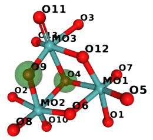
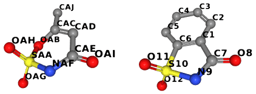
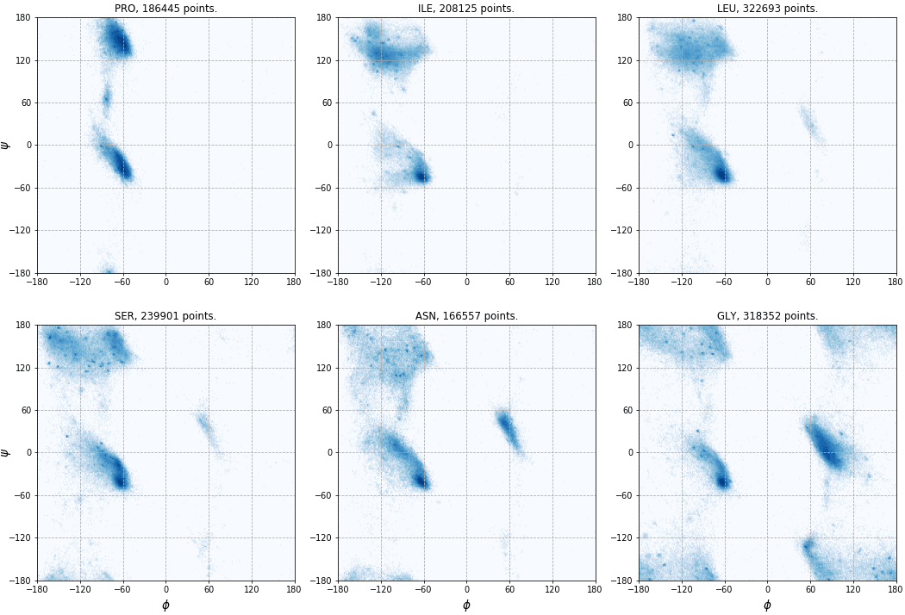

.. highlight:: cpp

.. doctest::
  :hide:

  >>> import gemmi

Structure analysis
##################

.. _niggli:

Reduced unit cells
==================

The reduction finds special bases of lattices. In practice, these bases are
found by removing lattice centering (i.e. obtaining a primitive cell)
and using a prescribed interative procedure.
As it is worded in the International Tables for Crystallography A 3.1.1.4 (2016),
"the reduction procedures employ metrical properties to develop a sequence
of basis transformations which lead to a *reduced basis* and *reduced cell*".

There are three popular unit cell reductions:

- the Minkowski-Buerger reduction, which minimizes *a*\ +\ *b*\ +\ *c*
  (in special cases multiple, up to 6 different bases have the same
  minimal sum *a*\ +\ *b*\ +\ *c*),
- the Eisenstein-Niggli reduction, which adds extra conditions
  to the previous one and makes the result unique,
- the Selling-Delaunay reduction (the second name is alternatively
  transliterated as Delone), which minimizes
  *a*:sup:`2`\ +\ *b*:sup:`2`\ +\ *c*:sup:`2`\ +\ (*a*\ +\ *b*\ +\ *c*)\ :sup:`2`.

First names here (Minkowski, Eisenstein, Selling) belong to mathematicians
working on the reduction of quadratic forms.
The second names -- to people applying this math to crystallography.
Usually, we use only the second name. The Niggli reduction is the most
popular of the three.

Niggli and Buerger reductions
-----------------------------

Gemmi implements separately the Niggli and Buerger reductions.
The procedures are iterative. Most of the unit cells from the PDB
need only 1-2 iterations to get reduced (1.3 on average, not counting
the *normalization* steps as separate iterations).
On the other hand, one can always construct a primitive cell with extremely
long basis vectors that would require hundreds of iterations.
The Buerger reduction is simpler and faster than Niggli,
but Niggli is also fast -- one iteration takes less than 1μs.

Gemmi implementation is based on the algorithms published by B. Gruber
in the 1970's: Gruber,
`Acta Cryst. A29, 433 <https://doi.org/10.1107/S0567739473001063>`_ (1973)
for the Buerger reduction, and Křivý & Gruber,
`Acta Cryst. A32, 297 <https://doi.org/10.1107/S0567739476000636>`_ (1976)
for the Niggli reduction.
Additionally, the Niggli reduction is using ε to compare numbers, as proposed
by Grosse-Kunstleve *et al*,
`Acta Cryst. A60, 1 <https://doi.org/10.1107/S010876730302186X>`_ (2004).

Gruber's algorithms use vector named G\ :sup:`6`, which is
`somewhat similar <https://dictionary.iucr.org/Metric_tensor>`_
to the metric tensor. G\ :sup:`6` has six elements named:
A, B, C, ξ (xi), η (eta) and ζ (zeta), which correspond to:

    (**a**:sup:`2`, **b**:sup:`2`, **c**:sup:`2`, 2\ **b**\ ⋅\ **c**, 2\ **a**\ ⋅\ **c**, 2\ **a**\ ⋅\ **b**)

Gemmi has a class named GruberVector that contains these six numbers
and reduction algorithms implemented as methods.
This class can be initialized with UnitCell and SpaceGroup:

.. doctest::

  >>> cell = gemmi.UnitCell(63.78, 63.86, 124.40, 90.0, 90.0, 90.0)
  >>> sg = gemmi.SpaceGroup('I 2 2 2')
  >>> gv = gemmi.GruberVector(cell, sg)

or with 6-tuple corresponding to G\ :sup:`6` of a primitive cell:

.. doctest::

  >>> g6_param = gv.parameters  # obtain such a tuple
  >>> gemmi.GruberVector(g6_param)
  <gemmi.GruberVector((5905.34, 5905.34, 5905.34, -7742.79, -7732.57, 3664.69))>

We can check if G\ :sup:`6` already corresponds to a Buerger and Niggli cell:

.. doctest::

  >>> gv.is_niggli()
  False
  >>> gv.is_buerger()
  False

We can access the G\ :sup:`6` parameters as a tuple:

.. doctest::

  >>> gv.parameters
  (5905.337, 5905.337, 5905.337, -7742.7856, -7732.5744, 3664.686)

and obtain the corresponding cell parameters (with angles in degrees):

.. doctest::
  :skipif: sys.platform == 'win32'  # the last digit differs with MSVC

  >>> gv.cell_parameters()  # primitive cell
  (76.84619053668177, 76.84619053668177, 76.84619053668177, 130.96328311485175, 130.89771578326727, 71.92353702711762)

And most importantly, we can reduce the cell.
``niggli_reduce()`` performs the Niggli reduction on G\ :sup:`6`,
returning the number of iterations it took:

.. doctest::

  >>> gv.niggli_reduce()
  3

Now G\ :sup:`6` contains smaller numbers:

.. doctest::

  >>> gv
  <gemmi.GruberVector((4067.89, 4078.10, 5905.34, -4078.10, -4067.89, -0.00))>

To create a new UnitCell with reduced parameters do:

.. doctest::

  >>> gemmi.UnitCell(* gv.cell_parameters())
  <gemmi.UnitCell(63.78, 63.86, 76.8462, 114.551, 114.518, 90)>

or use a helper method:

.. doctest::

  >>> gv.get_cell()
  <gemmi.UnitCell(63.78, 63.86, 76.8462, 114.551, 114.518, 90)>

Similarly, we can perform the Buerger reduction:

.. doctest::

  >>> gv = gemmi.GruberVector(g6_param)
  >>> gv.buerger_reduce()
  3

In this case both functions gave the same result.

.. doctest::

  >>> gv.is_niggli()
  True
  >>> gv.get_cell()
  <gemmi.UnitCell(63.78, 63.86, 76.8462, 114.551, 114.518, 90)>

Functions ``niggli_reduce``, ``is_niggli`` and ``is_buerger`` can take optional
parameter ``epsilon`` (default: 1e-9) that is used for comparing numbers.
Additionally, ``niggli_reduce`` can take ``iteration_limit`` (default: 100).
To check how the computations would work without ε we can set it to 0:

.. doctest::

  >>> gv.is_buerger(epsilon=0)
  True
  >>> gv.is_niggli(epsilon=0)
  False
  >>> gv.niggli_reduce(epsilon=0, iteration_limit=100)
  6
  >>> gv.get_cell()
  <gemmi.UnitCell(63.78, 63.86, 76.8462, 114.551, 114.518, 90)>

Here, the Niggli conditions were initially found not fulfilled, because
one expression that should be non-negative was about -5e-13.
A few extra iterations sorted it out (without any real changes),
but it's not always the case -- that's why we have ``iteration_limit``
to prevent infinite loop.

Selling-Delaunay reduction
--------------------------

Gemmi implementation is based on

- section `3.1.2.3 <https://onlinelibrary.wiley.com/iucr/itc/Ac/ch3o1v0001/>`_
  "Delaunay reduction and standardization" in the Tables vol. A (2016),
- Patterson & Love (1957), "Remarks on the Delaunay reduction",
  `Acta Cryst. 10, 111 <https://doi.org/10.1107/S0365110X57000328>`_,
- Andrews *et al* (2019),
  "Selling reduction versus Niggli reduction for crystallographic lattices",
  `Acta Cryst. A75, 115 <https://doi.org/10.1107/S2053273318015413>`_.

Similarly to the GruberVector, here we have a class named SellingVector
that contains the six elements of S\ :sup:`6` -- the inner products
among the four vectors **a**, **b**, **c**
and **d**\ =–(\ **a**\ +\ **b**\ +\ **c**\ ):

    *s*\ :sub:`23`\ =\ **b**\ ⋅\ **c**,
    *s*\ :sub:`13`\ =\ **a**\ ⋅\ **c**,
    *s*\ :sub:`12`\ =\ **a**\ ⋅\ **b**,
    *s*\ :sub:`14`\ =\ **a**\ ⋅\ **d**,
    *s*\ :sub:`24`\ =\ **b**\ ⋅\ **d**,
    *s*\ :sub:`34`\ =\ **c**\ ⋅\ **d**.

SellingVector can be initialized with UnitCell and SpaceGroup:

.. doctest::

  >>> sv = gemmi.SellingVector(cell, sg)

or with a tuple of six numbers S\ :sup:`6`:

.. doctest::

  >>> sv.parameters
  (-3871.3928, -3866.2872, 1832.343, -3871.3928, -3866.2872, 1832.343)
  >>> gemmi.SellingVector(_)
  <gemmi.SellingVector((-3871.39, -3866.29, 1832.34, -3871.39, -3866.29, 1832.34))>

Similarly as in the previous section, we can check if S\ :sup:`6`
already corresponds to a Delaunay cell:

.. doctest::

  >>> sv.is_reduced()
  False

Each reduction step decreases Σ\ **b**\ :sub:`i`:sup:`2`
(**b**\ :sub:`1`, **b**\ :sub:`2`, **b**\ :sub:`3` and **b**\ :sub:`4`
are alternative symbols for **a**, **b**, **c** and **d**).
The sum Σ\ **b**\ :sub:`i`:sup:`2` can be calculated with:

.. doctest::

  >>> sv.sum_b_squared()
  23621.348

Similarly to ``niggli_reduce()``, the Selling reduction procedure takes
optional arguments ``epsilon`` and ``iteration_limit``
and returns the iteration count:

.. doctest::

  >>> sv.reduce()
  2

Now we can check the result:

.. doctest::

  >>> sv
  <gemmi.SellingVector((-2033.94, -2033.94, -1832.34, -2039.05, -2039.05, 0.00))>
  >>> sv.is_reduced()
  True
  >>> sv.sum_b_squared()
  19956.662

Now, the corresponding four vectors can be in any order.
We may sort them so that *a*\ ≤\ *b*\ ≤\ *c*\ ≤\ *d*:

.. doctest::

  >>> sv.sort()
  >>> sv
  <gemmi.SellingVector((-2039.05, -2033.94, 0.00, -2033.94, -2039.05, -1832.34))>

Finally, we can get the corresponding UnitCell:

.. doctest::

  >>> gemmi.UnitCell(* sv.cell_parameters())
  <gemmi.UnitCell(63.78, 63.86, 76.8462, 114.551, 114.518, 90)>
  >>> sv.get_cell()  # helper function that does the same
  <gemmi.UnitCell(63.78, 63.86, 76.8462, 114.551, 114.518, 90)>

S\ :sup:`6` can be used to calculate G\ :sup:`6`, and the other way around:

.. doctest::

  >>> sv.gruber()
  <gemmi.GruberVector((4067.89, 4078.10, 5905.34, -4078.10, -4067.89, 0.00))>
  >>> _.selling()
  <gemmi.SellingVector((-2039.05, -2033.94, 0.00, -2033.94, -2039.05, -1832.34))>

TBC

Neighbor search
===============

Fixed-radius near neighbor search is usually implemented using
the `cell lists <https://en.wikipedia.org/wiki/Cell_lists>`_ method,
also known as binning, bucketing or cell technique
(or cubing -- as it was called in an
`article <https://web.stanford.edu/class/sbio228/public/readings/Molecular_Simulation_I_Lecture4/Levinthal_SCIAM_66_Protein_folding.pdf>`_ from 1966).
The method is simple. The unit cell (or the area where the molecules are
located) is divided into small cells. The size of these cells depends
on the search radius. Each cell stores the list of atoms in its area;
these lists are used for fast lookup of atoms.

In Gemmi the cell technique is implemented in a class named ``NeighborSearch``.
The implementation works with both crystal and non-crystal system and:

* handles crystallographic symmetry (including non-standard settings with
  origin shift that are present in a couple hundreds of PDB entries),
* handles strict NCS (MTRIX record in the PDB format that is not "given";
  in mmCIF it is the _struct_ncs_oper category),
* handles alternative locations (atoms from different conformers are not
  neighbors),
* can find neighbors any number of unit cells apart; surprisingly,
  molecules from different and not neighboring unit cells can be
  in contact, either because of the molecule shape (a single chain can be
  :ref:`longer then four unit cells <long_chain>`) or because of
  the non-optimal choice of symmetric images in the model
  (some PDB entries have even links between chains more than
  10 unit cells away which cannot be expressed in the 1555 type of notation).

Note that while an atom can be bonded with its own symmetric image,
it sometimes happens that an atom meant to be on a special position
is slightly off, and its symmetric images represent the same atom
(so we may have four nearby images each with occupancy 0.25).
Such images will be returned by the NeighborSearch class as neighbors
and need to be filtered out by the users.

The NeighborSearch constructor divides the unit cell into bins.
For this it needs to know the maximum radius that will be used in searches,
as well as the unit cell. Since the system may be non-periodic,
the constructor also takes the model as an argument -- it is used to
calculate the bounding box for the model if there is no unit cell.
It is also stored and used if ``populate()`` is called.
The C++ signature (in ``gemmi/neighbor.hpp``) is::

  NeighborSearch::NeighborSearch(Model& model, const UnitCell& cell, double max_radius)

Then the cell lists need to be populated with items either by calling::

  void NeighborSearch::populate(bool include_h=true)

or by adding individual atoms::

  void NeighborSearch::add_atom(const Atom& atom, int n_ch, int n_res, int n_atom)

where ``n_ch`` is the index of the chain in the model, ``n_res`` is the index
of the residue in the chain, and ``n_atom`` is the index of the atom
in the residue.

An example in Python:

.. doctest::

  >>> import gemmi
  >>> st = gemmi.read_structure('../tests/1pfe.cif.gz')
  >>> ns = gemmi.NeighborSearch(st[0], st.cell, 3).populate()

If we'd like to choose which atoms to add, for example to ignore hydrogens,
we could use ``add_atom()`` instead of ``populate()``:

.. doctest::

  >>> ns = gemmi.NeighborSearch(st[0], st.cell, 3)
  >>> for n_ch, chain in enumerate(st[0]):
  ...     for n_res, res in enumerate(chain):
  ...         for n_atom, atom in enumerate(res):
  ...             if not atom.is_hydrogen():
  ...                 ns.add_atom(atom, n_ch, n_res, n_atom)
  ...

NeighborSearch has a couple of functions for searching.
The first one takes atom as an argument::

  std::vector<Mark*> NeighborSearch::find_neighbors(const Atom& atom, float min_dist, float max_dist)

.. doctest::

  >>> ref_atom = st[0].sole_residue('A', gemmi.SeqId('3')).sole_atom('P')
  >>> marks = ns.find_neighbors(ref_atom, min_dist=0.1, max_dist=3)
  >>> len(marks)
  6

``find_neighbors()`` checks altloc of the atom and
considers as potential neighbors only atoms from the same
conformation. In particular, if altloc is empty all atoms are considered.
Non-negative ``min_dist`` in the ``find_neighbors()`` call prevents
the atom whose neighbors we search from being included in the results
(the distance of the atom to itself is zero).

The second one takes position and altloc as explicit arguments::

  std::vector<Mark*> NeighborSearch::find_atoms(const Position& pos, char altloc, float radius)

.. doctest::

  >>> point = gemmi.Position(20, 20, 20)
  >>> marks = ns.find_atoms(point, '\0', radius=3)
  >>> len(marks)
  7

Additionally, in C++ you may use a function that takes a callback
as the last argument (usage examples are in the source code)::

  template<typename T>
  void NeighborSearch::for_each(const Position& pos, char altloc, float radius, const T& func)

Cell-lists store ``Mark``\ s. When searching for neighbors you get references
(in C++ -- pointers) to these marks.
``Mark`` has a number of properties: ``x``, ``y``, ``z``,
``altloc``, ``element``, ``image_idx`` (index of the symmetry operation
that was used to generate this mark, 0 for identity),
``chain_idx``, ``residue_idx`` and ``atom_idx``.

.. doctest::

  >>> mark = marks[0]
  >>> mark
  <gemmi.NeighborSearch.Mark O of atom 0/7/3>
  >>> mark.x, mark.y, mark.z
  (19.659000396728516, 20.248884201049805, 17.645000457763672)
  >>> mark.altloc
  '\x00'
  >>> mark.element
  <gemmi.Element: O>
  >>> mark.image_idx
  11
  >>> mark.chain_idx, mark.residue_idx, mark.atom_idx
  (0, 7, 3)

The references to the original model and to atoms are not stored.
``Mark`` has a method ``to_cra()`` that needs to be called with ``Model``
as an argument to get a triple of Chain, Residue and Atom::

  CRA NeighborSearch::Mark::to_cra(Model& model) const

.. doctest::

  >>> cra = mark.to_cra(st[0])
  >>> cra.chain
  <gemmi.Chain A with 79 res>
  >>> cra.residue
  <gemmi.Residue 8(DC) with 19 atoms>
  >>> cra.atom
  <gemmi.Atom O5' at (-0.0, 13.8, -17.6)>

``Mark`` also has a helper method ``pos()`` that returns
``Position(x, y, z)``::

  Position NeighborSearch::Mark::pos() const

.. doctest::

  >>> mark.pos()
  <gemmi.Position(19.659, 20.2489, 17.645)>

Note that it can be the position of a symmetric image of the atom.
In this example the "original" atom is in a different location:

.. doctest::

  >>> cra.atom.pos
  <gemmi.Position(-0.028, 13.85, -17.645)>

The neighbor search can also be used with small molecule structures.

.. doctest::

  >>> small = gemmi.read_small_structure('../tests/2013551.cif')
  >>> mg_site = small.sites[0]
  >>> mg_pos = small.cell.orthogonalize(mg_site.fract)
  >>> ns = gemmi.NeighborSearch(small, 4.0).populate()
  >>> for mark in ns.find_site_neighbors(mg_site, min_dist=0.1):
  ...   site = mark.to_site(small)
  ...   dist = ns.dist(mark.pos(), mg_pos)
  ...   print(site.label, 'image #%d' % mark.image_idx, 'dist=%.2f' % dist)
  I image #0 dist=2.92
  I image #3 dist=2.92

Contact search
==============

Contacts in a molecule or in a crystal can be found using the neighbor search
described in the previous section. But to make it easier we have a dedicated
class ContactSearch. It uses the neighbor search to find pairs of atoms
close to each other and applies the filters described below.

When constructing ContactSearch we set the overall maximum search distance.
This distance is stored as the ``search_radius`` property:

.. doctest::

  >>> cs = gemmi.ContactSearch(4.0)
  >>> cs.search_radius
  4.0

Additionally, we can set up per-element radii.
This excludes pairs of atoms in a distance larger than the sum
of their per-element radii.
The radii are initialized as a linear function of the
:ref:`covalent radius <covalent_radius>`:
*r* = *a* × *r*\ :sub:`cov` + *b*/2.

.. doctest::

  >>> cs.setup_atomic_radii(1.0, 1.5)

Then each radius can be accessed and modified individually:

.. doctest::

  >>> cs.get_radius(gemmi.Element('Zr'))
  2.5
  >>> cs.set_radius(gemmi.Element('Hg'), 1.5)

Next, we have the ``ignore`` property that can take
one of the following values:

* ContactSearch.Ignore.Nothing -- no filtering here,
* ContactSearch.Ignore.SameResidue -- ignore atom pairs from the same residue,
* ContactSearch.Ignore.AdjacentResidues -- ignore atom pairs from the same or
  adjacent residues,
* ContactSearch.Ignore.SameChain -- show only inter-chain contacts
  (including contacts between different symmetry images of one chain),
* ContactSearch.Ignore.SameAsu -- show only contacts between different
  asymmetric units.

.. doctest::

  >>> cs.ignore = gemmi.ContactSearch.Ignore.AdjacentResidues

You can also ignore atoms that have occupancy below the specified
threshold:

.. doctest::

  >>> cs.min_occupancy = 0.01

Sometimes, it is handy to get each atom pair twice (as A-B and B-A).
In such case make the ``twice`` property true. By default, it is false:

.. doctest::

  >>> cs.twice
  False

Next property deals with atoms at special positions (such as rotation axis).
Such atoms can be slightly off the special position (because macromolecular
refinement programs usually don't constrain coordinates), so we must ensure
that an atom that should sit on the special position and its apparent symmetry
image are not regarded a contact. We assume that if the distance between
an atom and its image is small, it is not a real thing.
For larger distances we assume it is a real contact with atom's symmetry mate.
To tell apart the two cases we use a cut-off distance that can be modified:

.. doctest::

  >>> cs.special_pos_cutoff_sq = 0.5 ** 2  # setting cut-off to 0.5A

The contact search uses an instance of NeighborSearch.

.. doctest::

  >>> st = gemmi.read_structure('../tests/5cvz_final.pdb')
  >>> st.setup_entities()
  >>> ns = gemmi.NeighborSearch(st[0], st.cell, 5).populate()

If you'd like to ignore hydrogens from the model,
call ``ns.populate(include_h=False)``.

If you'd like to ignore waters, either remove waters from the Model
(function ``remove_waters()``) or ignore results that contain waters.

The actual contact search is done by:

.. doctest::

  >>> results = cs.find_contacts(ns)

  >>> len(results)
  49
  >>> results[0]  # doctest: +ELLIPSIS
  <gemmi.ContactSearch.Result object at 0x...>

The ContactSearch.Result class has four properties:

.. doctest::

  >>> results[0].partner1
  <gemmi.CRA A/SER 21/OG>
  >>> results[0].partner2
  <gemmi.CRA A/TYR 24/N>
  >>> results[0].image_idx
  52
  >>> results[0].dist
  2.8613362312316895

The first two properties are :ref:`CRA <CRA>`\ s for the involved atoms.
The ``image_idx`` is an index of the symmetry image (both crystallographic
symmetry and strict NCS count).
Value 0 would mean that both atoms (``partner1`` and ``partner2``)
are in the same unit.
In this example the value can be high because it is a structure of
icosahedral viral capsid with 240 identical units in the unit cell.
The last property is the distance between atoms.

Atoms pointed to by ``partner1`` and ``partner2`` can be far apart
in the asymmetric unit:

.. doctest::

  >>> results[0].partner1.atom.pos
  <gemmi.Position(42.221, 46.34, 19.436)>
  >>> results[0].partner2.atom.pos
  <gemmi.Position(49.409, 39.333, 19.524)>

But you can find the position of symmetry image of ``partner2`` that
is in contact with ``partner1`` with:

.. doctest::

  >>> st.cell.find_nearest_pbc_position(results[0].partner1.atom.pos,
  ...                                   results[0].partner2.atom.pos,
  ...                                   results[0].image_idx)
  <gemmi.Position(42.6647, 47.5137, 16.8644)>

You could also find the symmetry image of ``partner1``
that is near the original position of ``partner2``:

.. doctest::

  >>> st.cell.find_nearest_pbc_position(results[0].partner2.atom.pos,
  ...                                   results[0].partner1.atom.pos,
  ...                                   results[0].image_idx, inverse=True)
  <gemmi.Position(49.2184, 39.9091, 16.7278)>

See also the command-line program :ref:`gemmi-contact <gemmi-contact>`.

Gemmi provides also an undocumented class LinkHunt which matches
contacts to links definitions from :ref:`monomer library <CCD_etc>`
and to connections (LINK, SSBOND) from the structure.
If you would find it useful, contact the author.

Superposition
=============

Gemmi includes the `QCP method <https://theobald.brandeis.edu/qcp/>`_
(Liu P, Agrafiotis DK, & Theobald DL, 2010)
for superposing two lists of points in 3D.
The C++ function ``superpose_positions()`` takes two arrays of positions
and an optional array of weights. Before applying this function to chains
it is necessary to determine pairs of corresponding atoms.
Here, as a minimal example, we superpose backbone of the third residue:

.. doctest::

  >>> model = gemmi.read_structure('../tests/4oz7.pdb')[0]
  >>> res1 = model['A'][2]
  >>> res2 = model['B'][2]
  >>> atoms = ['N', 'CA', 'C', 'O']
  >>> gemmi.superpose_positions([res1.sole_atom(a).pos for a in atoms],
  ...                           [res2.sole_atom(a).pos for a in atoms])  #doctest: +ELLIPSIS
  <gemmi.SupResult object at 0x...>
  >>> _.rmsd
  0.006558389527590043

To make it easier, we also have a higher-level function
``calculate_superposition()`` that operates on ``ResidueSpan``\ s.
This function first performs the sequence alignment.
Then the matching residues are superposed, using either
all atoms in both residues, or only Cα atoms (for peptides)
and P atoms (for nucleotides).
Atoms that don't have counterparts in the other span are skipped.
The returned object (SupResult) contains RMSD and the transformation
(rotation matrix + translation vector) that superposes the second span
onto the first one.

Note that RMSD can be defined in two ways:
the sum of squared deviations is divided either by 3N (PyMOL)
or by N (SciPy).
QCP (and gemmi) returns the former. To get the latter multiply it by √3.

Here is a usage example:

.. doctest::

  >>> model = gemmi.read_structure('../tests/4oz7.pdb')[0]
  >>> polymer1 = model['A'].get_polymer()
  >>> polymer2 = model['B'].get_polymer()
  >>> ptype = polymer1.check_polymer_type()
  >>> sup = gemmi.calculate_superposition(polymer1, polymer2, ptype, gemmi.SupSelect.CaP)
  >>> sup.count  # number of atoms used
  10
  >>> sup.rmsd
  0.1462689168993659
  >>> sup.transform.mat
  <gemmi.Mat33 [-0.0271652, 0.995789, 0.0875545]
               [0.996396, 0.034014, -0.0777057]
               [-0.0803566, 0.085128, -0.993124]>
  >>> sup.transform.vec
  <gemmi.Vec3(-17.764, 16.9915, -1.77262)>

The arguments to ``calculate_superposition()`` are:

- two ``ResidueSpan``\ s,
- polymer type (to avoid determining it when it's already known).
  The information whether it's protein or nucleic acid is used
  during sequence alignment (to detect gaps between residues in the polymer --
  it helps in rare cases when the sequence alignment alone is ambiguous),
  and it decides whether to use Cα or P atoms (see the next point),
- atom selection: one of ``SupSelect.CaP`` (only Cα or P atoms),
  ``SupSelect.All`` (all atoms),
- (optionally) altloc -- the conformer choice.
  By default, atoms with non-blank altloc are ignored.
  With altloc='A', only the A conformer is considered
  (atoms with altloc either blank or A). Etc.
- (optionally) ``current_rmsd=true`` -- the functions does not perform
  the superposition, it returns the current RMSD between atoms that would be
  used for the superposition, and also the number of atoms that would be used.

  .. doctest::
  
    >>> gemmi.calculate_superposition(polymer1, polymer2, ptype,
    ...                               gemmi.SupSelect.CaP, current_rmsd=True).rmsd
    19.660883858565462

The calculated superposition can be applied to a span of residues,
changing the atomic positions in-place:

.. doctest::

  >>> polymer2[2].sole_atom('CB')  # before
  <gemmi.Atom CB at (-30.3, -10.6, -11.6)>
  >>> sup.apply(polymer2)
  >>> polymer2[2].sole_atom('CB')  # after
  <gemmi.Atom CB at (-28.5, -12.6, 11.2)>
  >>> # it is now nearby the corresponding atom in chain A:
  >>> polymer1[2].sole_atom('CB')
  <gemmi.Atom CB at (-28.6, -12.7, 11.3)>

.. _selections:

Selections
==========

Gemmi selection syntax is based on the selection syntax from MMDB,
which is sometimes called CID (Coordinate ID). The MMDB syntax is described
at the bottom of
the `pdbcur documentation <http://legacy.ccp4.ac.uk/html/pdbcur.html>`_.

The selection has a form of /-separated parts:
/models/chains/residues/atoms. Empty parts can be omitted when it's
not ambiguous. Gemmi (but not MMDB) can take additional properties
added at the end after a semicolon (;).

Let us go through the individual filters first:

* ``/1`` -- selects model 1 (if the PDB file doesn't have MODEL records,
  it is assumed that the only model is model 1).
* ``//D`` (or just ``D``) -- selects chain D.
* ``///10-30`` (or ``10-30``) -- residues with sequence IDs from 10 to 30.
* ``///10A-30A`` (or ``10A-30A`` or ``///10.A-30.A`` or ``10.A-30.A``) --
  sequence ID can include insertion code. The MMDB syntax has dot between
  sequence sequence number and insertion code. In Gemmi the dot is optional.
* ``///(ALA)`` (or ``(ALA)``) -- selects residues with a given name.
* ``////CB`` (or ``CB:*`` or ``CB[*]``) -- selects atoms with a given name.
* ``////[P]`` (or just ``[P]``) -- selects phosphorus atoms.
* ``////:B`` (or ``:B``) -- selects atoms with altloc B.
* ``////;q<0.5`` (or ``;q<0.5``) -- selects atoms with occupancy below 0.5
  (inspired by PyMOL, where it'd be ``q<0.5``).
* ``////;b>40`` (or ``;b>40``) -- selects atoms with the isotropic B-factor
  above a given value.
* ``*`` -- selects all atoms.

Note that the chain name and altloc can be an empty.
The syntax supports also comma-separated lists and negations with ``!``:

* ``(!ALA)`` -- all residues but alanine,
* ``[C,N,O]`` -- all C, N and O atoms,
* ``[!C,N,O]`` -- all atoms except C, N and O,
* ``:,A`` -- altloc either empty or A (which makes one conformation),
* ``/1/A,B/20-40/CA[C]:,A`` -- multiple selection criteria, all of them
  must be fulfilled.

**Incompatibility** with MMDB.
In MMDB, if the chemical element is specified (e.g. ``[C]`` or ``[*]``),
the alternative location indicator defaults to "" (no altloc),
rather than to "*" (any altloc). This might be surprising.
In Gemmi, if ':' is absent the altloc is not checked ("*").

Note: the selections in Gemmi are not widely used yet and the API may evolve.

A selection is is a standalone object with a list of filters that
can be applied to any Structure, Model or its part.
Empty selection matches all atoms:

.. doctest::

  >>> sel = gemmi.Selection()  # empty - no filters

Selection initialized with a string parses the string and creates
corresponding filters:

.. doctest::

  >>> # select all Cl atoms
  >>> sel = gemmi.Selection('[CL]')

The selection can then be used on any structure.
A helper function ``first()`` returns the first matching atom:

.. doctest::

  >>> st = gemmi.read_structure('../tests/1pfe.cif.gz')
  >>> # get the first result as pointer to model and CRA (chain, residue, atom)
  >>> sel.first(st)
  (<gemmi.Model 1 with 2 chain(s)>, <gemmi.CRA A/CL 20/CL>)

Function ``str()`` creates a string from the selection:

.. doctest::

  >>> sel = gemmi.Selection('A/1-4/N9')
  >>> sel.str()
  '//A/1.-4./N9'

The Selection objects has methods for iterating over the selected items
in the hierarchy:

.. doctest::

  >>> for model in sel.models(st):
  ...     print('Model', model.name)
  ...     for chain in sel.chains(model):
  ...         print('-', chain.name)
  ...         for residue in sel.residues(chain):
  ...             print('   -', str(residue))
  ...             for atom in sel.atoms(residue):
  ...                 print('          -', atom.name)
  ...
  Model 1
  - A
     - 1(DG)
            - N9
     - 2(DC)
     - 3(DG)
            - N9
     - 4(DT)

Selection can be used to create a new structure (or model) with a copy
of the selection. In this example, we copy alpha-carbon atoms:

.. doctest::

  >>> st = gemmi.read_structure('../tests/1orc.pdb')
  >>> st[0].count_atom_sites()
  559
  >>> selection = gemmi.Selection('CA[C]')

  >>> # create a new structure
  >>> ca_st = selection.copy_structure_selection(st)
  >>> ca_st[0].count_atom_sites()
  64

  >>> # create a new model
  >>> ca_model = selection.copy_model_selection(st[0])
  >>> ca_model.count_atom_sites()
  64

Selection can also be used to remove atoms.
In this example we remove atoms with B-factor above 50:

.. doctest::

  >>> sel = gemmi.Selection(';b>50')
  >>> sel.remove_selected(ca_st)
  >>> ca_st[0].count_atom_sites()
  61
  >>> sel.remove_selected(ca_model)
  >>> ca_model.count_atom_sites()
  61

We can also do the opposite and remove atoms that are not selected:

.. doctest::

  >>> sel.remove_not_selected(ca_model)
  >>> ca_model.count_atom_sites()
  0

Each residue and atom has a flag that can be set manually
and used to create a selection.
In this example we select residues in the radius of 8Å from a selected point:

.. doctest::

  >>> selected_point = gemmi.Position(20, 40, 30)
  >>> ns = gemmi.NeighborSearch(st[0], st.cell, 8.0).populate()
  >>> # First, a flag is set for neigbouring residues.
  >>> for mark in ns.find_atoms(selected_point):
  ...     mark.to_cra(st[0]).residue.flag = 's'
  >>> # Then, we select residues with this flag.
  >>> selection = gemmi.Selection().set_residue_flags('s')
  >>> # Next, we can use this selection.
  >>> selection.copy_model_selection(st[0]).count_atom_sites()
  121

Note: NeighborSearch searches for atoms in all symmetry images.
This is why it takes UnitCell as a parameter.
To search only in atoms directly listed in the file pass empty cell
(``gemmi.UnitCell()``).

Instead of the whole residues, we can select atoms.
Here, we select atoms in the radius of 8Å from a selected point:

.. doctest::

  >>> # selected_point and ns are reused from the previous example
  >>> # First, a flag is set for neigbouring atoms.
  >>> for mark in ns.find_atoms(selected_point):
  ...     mark.to_cra(st[0]).atom.flag = 's'
  >>> # Then, we select atoms with this flag.
  >>> selection = gemmi.Selection().set_atom_flags('s')
  >>> # Next, we can use this selection.
  >>> selection.copy_model_selection(st[0]).count_atom_sites()
  59

.. _graph_analysis:

Graph analysis
==============

The graph algorithms in Gemmi are limited to finding the shortest path
between atoms (bonds = graph edges). This part of the library is not
documented yet.

The rest of this section shows how to use Gemmi together with external
graph analysis libraries to analyse the similarity of chemical molecules.
To do this, first we set up a graph corresponding to the molecule.

Here we show how it can be done in the Boost Graph Library.

.. literalinclude:: ../examples/with_bgl.cpp
   :lines: 9-10,13-41

And here we use NetworkX in Python:

.. doctest::
  :skipif: networkx is None

  >>> import networkx

  >>> G = networkx.Graph()
  >>> block = gemmi.cif.read('../tests/SO3.cif')[-1]
  >>> so3 = gemmi.make_chemcomp_from_block(block)
  >>> for atom in so3.atoms:
  ...     G.add_node(atom.id, Z=atom.el.atomic_number)
  ...
  >>> for bond in so3.rt.bonds:
  ...     G.add_edge(bond.id1.atom, bond.id2.atom)  # ignoring bond type
  ...

To show a quick example, let us count automorphisms of SO3:

.. doctest::
  :skipif: networkx is None

  >>> import networkx.algorithms.isomorphism as iso
  >>> GM = iso.GraphMatcher(G, G, node_match=iso.categorical_node_match('Z', 0))
  >>> # expecting 3! automorphisms (permutations of the three oxygens)
  >>> sum(1 for _ in GM.isomorphisms_iter())
  6

With a bit more of code we could perform a real cheminformatics task.

.. _graph_isomorphism:

Graph isomorphism
-----------------

In this example we use Python NetworkX to compare molecules from the
Refmac monomer library with Chemical Component Dictionary (CCD) from PDB.
The same could be done with other graph analysis libraries,
such as Boost Graph Library, igraph, etc.

The program below takes compares specified monomer cif files with
corresponding CCD entries. Hydrogens and bond types are ignored.
It takes less than half a minute to go through the 25,000 monomer
files distributed with CCP4 (as of Oct 2018),
so we do not try to optimize the program.

.. literalinclude:: ../examples/ccd_gi.py
   :language: python
   :lines: 3-

If we run it on monomers that start with M we get:

.. code-block:: console

  $ examples/ccd_gi.py $CLIBD_MON/m/*.cif
  M10 is isomorphic
         O9 -> O4
         O4 -> O9
  MK8 is isomorphic
         O2 -> OXT
  MMR differs
        missing: O12 O4
  2 of 821 monomers not found in CCD

So in M10 the two atoms marked green are swapped:

(The image was generated in NGL and compressed with Compress-Or-Die.)

.. _substructure_matching:

Substructure matching
---------------------

Now a little script to illustrate subgraph isomorphism.
The script takes a (three-letter-)code of a molecule that is to be used
as a pattern and finds CCD entries that contain such a substructure.
As in the previous example, hydrogens and bond types are ignored.

.. literalinclude:: ../examples/ccd_subgraph.py
   :language: python
   :lines: 3-

Let us check what entries have HEM as a substructure:

.. code-block:: console

  $ examples/ccd_subgraph.py HEM
  1FH 	 +6 nodes, +7 edges
  2FH 	 +6 nodes, +7 edges
  4HE 	 +7 nodes, +8 edges
  522 	 +2 nodes, +2 edges
  6CO 	 +6 nodes, +7 edges
  6CQ 	 +7 nodes, +8 edges
  89R 	 +3 nodes, +3 edges
  CLN 	 +1 nodes, +2 edges
  DDH 	 +2 nodes, +2 edges
  FEC 	 +6 nodes, +6 edges
  HAS 	 +22 nodes, +22 edges
  HCO 	 +1 nodes, +1 edges
  HDM 	 +2 nodes, +2 edges
  HEA 	 +17 nodes, +17 edges
  HEB 	 +0 nodes, +0 edges
  HEC 	 +0 nodes, +0 edges
  HEM 	 +0 nodes, +0 edges
  HEO 	 +16 nodes, +16 edges
  HEV 	 +2 nodes, +2 edges
  HP5 	 +2 nodes, +2 edges
  ISW 	 +0 nodes, +0 edges
  MH0 	 +0 nodes, +0 edges
  MHM 	 +0 nodes, +0 edges
  N7H 	 +3 nodes, +3 edges
  NTE 	 +3 nodes, +3 edges
  OBV 	 +14 nodes, +14 edges
  SRM 	 +20 nodes, +20 edges
  UFE 	 +18 nodes, +18 edges

.. _maximum_common_subgraph:

Maximum common subgraph
-----------------------

In this example we use McGregor's algorithm implemented in the Boost Graph
Library to find maximum common induced subgraph. We call the MCS searching
function with option ``only_connected_subgraphs=true``, which has obvious
meaning and can be changed if needed.

To illustrate this example, we compare ligands AUD and LSA:

The whole code is in :file:`examples/with_bgl.cpp`. The same file has also
examples of using the BGL implementation of VF2 to check graph
and subgraph isomorphisms.

.. literalinclude:: ../examples/with_bgl.cpp
   :start-after: Example 4
   :end-before: minimal program

Torsion angles
==============

This section presents functions dedicated to calculation of the dihedral angles
φ (phi), ψ (psi) and ω (omega) of the protein backbone.
These functions are built upon the more general ``calculate_dihedral`` function,
introduced in :ref:`the section about coordinates <coordinates>`,
which takes four points in the space as arguments.

``calculate_omega()`` calculates the ω angle, which is usually around 180°:

.. doctest::

  >>> from math import degrees
  >>> chain = gemmi.read_structure('../tests/5cvz_final.pdb')[0]['A']
  >>> degrees(gemmi.calculate_omega(chain[0], chain[1]))
  159.9092215006572
  >>> for res in chain[:5]:
  ...     next_res = chain.next_residue(res)
  ...     if next_res:
  ...         omega = gemmi.calculate_omega(res, next_res)
  ...         print(res.name, degrees(omega))
  ...
  ALA 159.9092215006572
  ALA -165.26874513591127
  ALA -165.85686681169696
  THR -172.99968385093572
  SER 176.74223937657652

The φ and ψ angles are often used together, so they are calculated
in one function ``calculate_phi_psi()``:

.. doctest::

  >>> for res in chain[:5]:
  ...     prev_res = chain.previous_residue(res)
  ...     next_res = chain.next_residue(res)
  ...     phi, psi = gemmi.calculate_phi_psi(prev_res, res, next_res)
  ...     print('%s %8.2f %8.2f' % (res.name, degrees(phi), degrees(psi)))
  ...
  ALA      nan   106.94
  ALA  -116.64    84.57
  ALA   -45.57   127.40
  THR   -62.01   147.45
  SER   -92.85   161.53

In C++ these functions can be found in ``gemmi/calculate.hpp``.

The torsion angles φ and ψ can be visualized on the Ramachandran plot.
Let us plot angles from all PDB entries with the resolution higher than 1.5A.
Usually, glycine, proline and the residue preceding proline (pre-proline)
are plotted separately. Here, we will exclude pre-proline and make
separate plot for each amino acid. So first, we calculate angles
and save φ,ψ pairs in a set of files -- one file per residue.

.. literalinclude:: ../examples/rama_gather.py
   :language: python
   :start-at: import sys

The script above works with coordinate files in any of the formats
supported by gemmi (PDB, mmCIF, mmJSON). As of 2019, processing
a :ref:`local copy of the PDB archive <pdb_dir>`
in the PDB format takes about 20 minutes.

In the second step we plot the data points with Matplotlib.
We use a script that can be found in :file:`examples/rama_plot.py`.
Six of the resulting plots are shown here (click to enlarge):

Topology
========

A macromolecular refinement program typically starts from reading
a coordinate file and a monomer library. The monomer library specifies
restraints (bond distances, angles, ...) in monomers
as well as modifications introduced by links between monomers.

The coordinates and restraints are combined into
what we call here a *topology*.
It contains restraints applied to the model.
A monomer library may specify angle CD2-CE2-NE1 in TRP.
In contrast, the topology specifies angles between concrete atoms
(say, angle #721-#720-#719).

Together with preparing a topology, macromolecular programs
(in particular, Refmac) may also add or shift hydrogens (to
the riding positions) and reorder atoms.
In Python we have one function that does it all:

.. code-block:: python

    gemmi.prepare_topology(st: gemmi.Structure,
                           monlib: gemmi.MonLib,
                           model_index: int = 0,
                           h_change: gemmi.HydrogenChange = HydrogenChange.None,
                           reorder: bool = False,
                           raise_errors: bool = False) -> gemmi.Topo

where

* ``monlib`` is an instance of an undocumented MonLib class.
  For now, here is an example how to read the CCP4 monomer library
  (a.k.a Refmac dictionary):

  .. code-block:: python

    monlib_path = os.environ['CCP4'] + '/lib/data/monomers'
    resnames = st[0].get_all_residue_names()
    monlib = gemmi.read_monomer_lib(monlib_path, resnames)

* ``h_change`` is one of:

  * HydrogenChange.None -- no change,
  * HydrogenChange.Shift -- shift existing hydrogens to ideal (riding) positions,
  * HydrogenChange.Remove -- remove all H and D atoms,
  * HydrogenChange.ReAdd -- discard and re-create hydrogens in ideal positions,
  * HydrogenChange.ReAddButWater -- the same, but doesn't add H in waters,

* ``reorder`` -- changes the order of atoms inside each residue
  to match the order in the corresponding monomer cif file,

* ``raise_errors`` --  raises an exception when the hydrogen adding
  procedure comes across an unexpected configuration.
  By default, a message is printed to stderr and the function continues.

If hydrogen position is not uniquely determined its occupancy is set to zero.

TBC

.. _pdb_dir:

Local copy of the PDB archive
=============================

Some examples in this documentation work on a local copy
of the Protein Data Bank archive. This subsection is actually
a footnote describing our setup.

Like in BioJava, we assume that the ``$PDB_DIR`` environment variable
points to a directory that contains ``structures/divided/mmCIF`` -- the same
arrangement as on the
`PDB's FTP <ftp://ftp.wwpdb.org/pub/pdb/data/structures/>`_ server.

.. code-block:: console

    $ cd $PDB_DIR
    $ du -sh structures/*/*  # as of Jun 2017
    34G    structures/divided/mmCIF
    25G    structures/divided/pdb
    101G   structures/divided/structure_factors
    2.6G   structures/obsolete/mmCIF

A traditional way to keep an up-to-date local archive is to rsync it
once a week:

.. code-block:: shell

    #!/bin/sh -x
    set -u  # PDB_DIR must be defined
    rsync_subdir() {
      mkdir -p "$PDB_DIR/$1"
      # Using PDBe (UK) here, can be replaced with RCSB (USA) or PDBj (Japan),
      # see https://www.wwpdb.org/download/downloads
      rsync -rlpt -v -z --delete \
	  rsync.ebi.ac.uk::pub/databases/pdb/data/$1/ "$PDB_DIR/$1/"
    }
    rsync_subdir structures/divided/mmCIF
    #rsync_subdir structures/obsolete/mmCIF
    #rsync_subdir structures/divided/pdb
    #rsync_subdir structures/divided/structure_factors

Multiprocessing
===============

(Python-specific)

Most of the gemmi objects cannot be pickled. Therefore, they cannot be
passed between processes when using the multiprocessing module.
Currently, the only picklable classes (with protocol >= 2) are:
UnitCell and SpaceGroup.

Usually, it is possible to organize multiprocessing in such a way that
gemmi objects are not passed between processes. The example script below
traverses subdirectories and asynchronously analyses coordinate files.
It uses 4 worker processes in parallel. The processes get file path
and return a tuple.

.. literalinclude:: ../examples/multiproc.py
   :language: python
   :lines: 4-
