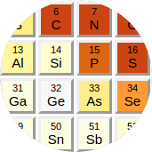

CIF Parser
##########

.. _cif_intro:

What are STAR, CIF, DDL, mmCIF?
==================================

(in case someone comes here when looking for a serialization format)

STAR is a human-readable data serialization format (think XML or JSON)
that happens to be known and used only in molecular-structure sciences.

CIF (Crystallographic Information File) -- a file format used
in crystallography -- is a restricted derivative of STAR.
It is restricted in features (to make implementation easier),
but also imposes arbitrary limits -- for example on the line length.

DDL is a schema language for STAR/CIF.

All of them (STAR, CIF and DDL) have multiple versions.
We will be more specific in the following sections.

The STAR/CIF syntax is relatively simple, but may be confusing at first.
(Note that the initial version of STAR was published by Sydney Hall in 1991 --
before XML and long before JSON and YAML, not to mention TOML).

.. highlight:: default

Key-value pairs have the form::

    _year 2017  # means year = 2017

Blocks (sections) begin with the ``data_`` keyword
with a block name glued to it::

    data_tomato   # [tomato]
    _color red    # color = "red"

Importantly, unlike XML/JSON/YAML/TOML, STAR is designed
to concisely represent tabular data. This example from TOML docs::

    # TOML
    points = [ { x = 1, y = 2, z = 3 },
               { x = 7, y = 8, z = 9 },
               { x = 2, y = 4, z = 8 } ]

could be expressed as a so-called *loop* in STAR (keyword ``loop_``
followed by column names followed by values)::

    # STAR/CIF
    loop_
    _points.x _points.y _points.z
    1 2 3
    7 8 9
    2 4 8

Typically, long tables (loops) make most of the CIF content::

    1    N N   . LEU A 11  ? 0.5281 0.5618 0.5305 -0.0327 -0.0621 0.0104
    2    C CA  . LEU A 11  ? 0.5446 0.5722 0.5396 -0.0317 -0.0632 0.0080
    # many, many lines...
    5331 S SD  . MET C 238 ? 2.2952 2.3511 2.3275 -0.0895 0.0372  -0.0230
    5332 C CE  . MET C 238 ? 1.5699 1.6247 1.6108 -0.0907 0.0388  -0.0244

The dot and question mark in the example above are two null types:
``?`` = *unknown* and ``.`` = *not applicable*.

The CIF syntax has a serious flaw resulting from historical trade-offs:
a string that can be interpreted as a number does not need to be quoted.
Therefore, the type of ``5332`` above is not certain:
the JSON equivalent can be either ``5332`` or ``"5332"``.

Note: "STAR File" is trademarked by IUCr, and it used to be patented_.

.. _patented: https://patents.google.com/patent/WO1991016682A1

The mmCIF format (by mmCIF we mean what is more formally called PDBx/mmCIF)
is the CIF syntax + a huge dictionary (ontology/schema) in DDL2.
The dictionary defines relations between columns in different tables,
which makes it resemble a relational database (it was designed at the
height of popularity of RDBMSs).

**Where are the specs?**

International Tables for Crystallography
`Vol. G (2006) <http://it.iucr.org/Ga/contents/>`_
describes all of the STAR, CIF 1.1, DDL1 and DDL2.
If you don't have access to it -- IUCr website has specs of
`CIF1.1 <http://www.iucr.org/resources/cif/spec/version1.1>`_
and `DDLs <http://www.iucr.org/resources/cif/ddl>`_.
As far as I can tell all versions of the STAR spec are behind paywalls.

Later versions of the formats (hardly used as of 2017)
are described in these articles:
`STAR <https://dx.doi.org/10.1021/ci300074v>`_ (2012),
`DDLm <http://pubs.acs.org/doi/abs/10.1021/ci300075z>`_ and
`dREL <http://pubs.acs.org/doi/abs/10.1021/ci300076w>`_ (2012),
and `CIF 2.0 <http://journals.iucr.org/j/issues/2016/01/00/aj5269/>`_ (2016).
Only the last one is freely available.

PDBx/mmCIF is documented at `mmcif.pdb.org <http://mmcif.pdb.org/>`_.

What is parsed?
===============

The parser supports CIF 1.1 spec and some extras.

Currently, it is available as:

* C++11 header-only library, and
* Python (2 and 3) extension module.

We use it to read:

* mmCIF files
* Chemical Component Dictionary from PDB
* DDL1 and DDL2 dictionaries from IUCr and PDB
* monomer library a.k.a. Refmac dictionary
* a subset of COD

The parser handles:

* all constructs of CIF 1.1 (including *save frames*),
* the ``global_`` and ``stop_`` keywords from STAR -- needed for Refmac
  monomer library and ``mmcif_nmr-star.dic``, respectively.

It could be extended to handle also the new features of CIF 2.0
or even the full STAR format, but we don't have a good reason to do this.
The same goes for DDLm/dREL.

Additionally:

* names and lines can have any length like in STAR
  (the CIF spec imposes the limit of 2048 characters, but some mmCIF files
  from PDB exceed it, e.g. 3j3q.cif),
* unquoted strings cannot start with keywords (STAR spec is ambiguous
  about this -- see
  `StarTools doc <http://www.globalphasing.com/startools/>`_ for details)

Not supported (yet):

* the line wrapping convention (``eol;\eol``)

* Greek letters (``\m`` -> µ), accented letters (``\'o`` -> ó),
  special alphabetic characters (``\%A`` -> Å) and some other codes
  (``\\infty`` -> ∞) as per CIF 1.1 markup conventions

CIF parsers in the small-molecules field often face incorrect syntax.
The papers about `iotbx.cif <https://doi.org/10.1107/S0021889811041161>`_
and `COD::CIF::Parser <http://dx.doi.org/10.1107/S1600576715022396>`_
enumerate 12 and 10 common error categories, respectively.
As the MX community embraced the CIF format later, the problem may be less
severe for us. So we start with relatively strict parser and will be
pragmatically relaxing it when needed.

C++ Library
===========

The CIF parser is implemented in header files (``#include <gemmi/cif.hpp>``),
so you do not need to compile Gemmi.
It has a single dependency: PEGTL (also header-only),
which is included in the ``third_party`` directory.
All you need is to make sure that Gemmi and PEGTL headers are in your
project's include path, and compile your program as C++11 or later.
For example:

.. code-block:: none

    git clone https://github.com/project-gemmi/gemmi.git
    c++ -std=c++11 -Igemmi/include -Igemmi/third_party -O2 my_program.cpp

If you'd like Gemmi to uncompress gzipped (.cif.gz) files on the fly,
add ``#include <gemmi/gz.hpp>`` and link your program with the zlib library.

The CIF parsing functionality can be used in two ways that roughly
correspond to DOM and SAX parsing:

1. Parse a file (or C++ stream or string) into a document
   that can be easily accessed and manipulated.

2. Define own `PEGTL Actions <https://github.com/taocpp/PEGTL/blob/master/doc/Actions-and-States.md>`_
   corresponding to the grammar rules from ``cif.hpp``.
   These actions will be triggered while reading a CIF file.

This documention focuses on the former (DOM parsing).
The hierarchy in the DOM reflects the structure of CIF 1.1:

* Document contains blocks.
* Block can contain name-value pairs, loops and frames.
* Frame can contain name-value pairs and loops.
* Loop (*m*\ ×\ *n* table) contains *n* column names and *m*\ ×\ *n* values.

Names are often called *tags*. The leading ``_`` is usually treated
as part of the tag, not just a syntactic feature, so we store it in DOM
as ``std::string`` with value ``_my_tag``.

Values have types, but while the type can be inferred correctly in almost all
cases, it is the corresponding dictionary that specifies the type.
Additionally, DDL2 dictionaries can specify subtypes of the standard CIF types,
for example ``int`` and ``float`` are mmCIF subtypes of a generic CIF ``numb``.

Let us start with a simple example.
This code reads mmCIF file and shows weights of the chemical components:

.. literalinclude:: doc_cif_cc.cpp
   :language: cpp

Reading a file
--------------

The ``gemmi::cif`` namespace has a few functions that return Document::

    Document read_file(const std::string& filename)
    Document read_memory(const char* data, const size_t size, const char* name)
    Document read_cstream(std::FILE *f, size_t maximum, const char* name)
    Document read_istream(std::istream &is, size_t maximum, const char* name)

Parameter ``name`` is used only when reporting errors.
Parameter ``maximum`` determines the buffer size and only affects performance.
Regardless of the buffer size, the last two options are slower
than ``read_file()`` -- they were not optimized for.

Additional header ``<gemmi/gz.hpp>`` is needed to transparently open
a gzipped file (by uncompressing it first into a memory buffer)
if the filename ends with ``.gz``::

    gemmi::cif::Document doc = gemmi::cif::read(gemmi::MaybeGzipped(path));

And if the ``path`` above is ``-``, the standard input is read.

Document
--------

``Document`` has the following variables that can be accessed directly::

  std::string source;  // filename or the explicitly provided name
  std::vector<Block> blocks;

As the mmCIF files are expected to have only a single block,
we have a function::

  const Block& sole_block() const;

to express the intention of accessing the only block in the file
(it throws an exception if the number of blocks is not one).

At last, function ``clear()`` works in the same way as in C++ containers.

Block
-----

.. warning::
    The API still evolves and for now this documentation lists only
    the most used functions.

Value corresponding to a particular tag can is read using::

    const std::string* find_value(const std::string& tag) const;

which returns ``nullptr`` if there is no such tag in the block.
The result is a raw string (possibly with quotes) that can be fed into
``as_string()`` or ``as_number()`` or ``as_int()``.
For example::

    const std::string *rf = block.find_value("_refine.ls_R_factor_R_free");
    // here you may check for rf == nullptr, possibly also for "?" and "."
    double rfree = gemmi::cif::as_number(*rf); // NaN if '?' or '.'

If you do not need to distinguish between missing tag, unknown (?)
and n/a (.), we have convenience functions::

    // returns empty string if not found or unknown or n/a.
    const std::string& find_string(const std::string& tag) const;
    // returns NaN if not found or unknown or n/a, throws if not numeric
    double find_number(const std::string& tag) const;
    // returns default_ if not found or unknown or n/a, throws if not int
    int find_int(const std::string& tag, int default_) const;

To read values from a single column for a loop (table) use::

    LoopColumn find_loop(const std::string& tag) const;

The values can be iterated over using a C++11 range-based ``for``::

    for (const std::string &s : block.find_loop("_atom_site.type_symbol"))
      std::cout << gemmi::cif::as_string(s) << std::endl;

TODO: document LoopColumn

Most often, we want to access multiple (but not necessarily all) columns
from a table.
Additionally, some values can be given either in a loop or, if the loop
would have only a single row, as tag-value pairs.
So we want our access function to handle transparently both cases.
These requirements led to a functions ``find``::

    TableView find(const std::string& tag) const;
    TableView find(const std::vector<std::string>& tags) const;

which returns a lightweight, iterable (by C++11 range-based ``for``) view
of the data.

As a rule, columns from the same loop have a common prefix,
so we added a third overload::

    TableView find(const std::string& prefix,
                   const std::vector<std::string>& tags) const;

so we can write::

    block.find("_entity_poly_seq.", {"entity_id", "num", "mon_id"})

instead of::

    block.find({"_entity_poly_seq.entity_id", "_entity_poly_seq.num", "_entity_poly_seq.mon_id"})

TODO: document optional tags: ``{"_required_tag", "?_optional_tag"}``

TODO: document TableView methods (``ok()``, ``width()``, ``length()``,
``operator``, ``at(size_t)``, ``find_row(const std::string&)``.

The first example in this section shows how this function can be used.

Python Module
=============

.. highlight:: python

Both Python 2.7 and 3.x are supported (thanks to the excellent
`pybind11 <https://github.com/pybind/pybind11>`_ project).
To install the gemmi module you need pip, git and not too old
C++ compiler (GCC 4.8+, Clang 3.4+, MSVC 2015+, ICC 16+)::

    pip install git+https://github.com/project-gemmi/gemmi.git

(when the project is more mature and has regular releases, it will be simply
``pip install gemmi``).

TODO: documentation

(in the meantime see ``pydoc gemmi.cif`` and examples)

Example (says hello to each element found in mmCIF):

.. literalinclude:: ../examples/hello.py
   :lines: 2-

More complex examples are shown in the :ref:`cif_examples` section.

Performance
===========

Gemmi CIF parser is based on `PEGTL <https://github.com/taocpp/PEGTL/>`_ --
an excellent "parser combinator library".

In my testing (with GCC 5 and Clang 3.8) our parser is
3x faster than cif_api (``validate -f`` vs ``cif2_syncheck -f``),
which in turn `is reported <https://doi.org/10.1107/S1600576715021883>`_
to be several times faster than iotbx.cif (ucif).

While further improvement would be possible (the fastest JSON parsers are
`much faster <https://github.com/project-gemmi/benchmarking-json>`_),
it is not a priority.

Design rationale
================

Parser
------

Parsing formal languages is a well-researched topic in computer science.
The first versions of lex and yacc - popular tools that generate lexical
analyzers and parsers - were written in 1970's. Today many tools exist
to translate grammar rules into C/C++ code.
On the other hand many compilers and high-profile tools use hand-coded
parsers - as it is more flexible.

Looking at other STAR and CIF parsers -- some use parser generators
(COD::CIF::Parser and starlib2 use yacc/bison, iotbx.cif uses Antlr3),
others are hand-coded.

I had experience with flex/bison and Boost.Spirit
(and I wanted to try also Lemon and re2c)
but I decided to use PEGTL for this task. I was convinced by the
`TAOC++ JSON <https://github.com/taocpp/json>`_
parser that is based on PEGTL and has a good balance of simplicity
and performance.

PEGTL is a C++ library (not a generator) for creating PEG parsers.
PEG stands for Parsing Expression Grammar -- a simpler approach than
tradional Context Free Grammar.

As a result, our parser depends on a third-party (header-only) library,
but the parser itself is pretty simple.

Data structures
---------------

The next thing is how we store the data read from file.
We decided rely on the C++ standard library where we can.

Generally, storage of such data involves (in C++ terms) some containers
and a union/variant type for storing values of mixed types.

We use primarily ``std::vector`` as a container,
and ``std::unordered_map`` when quicker access is needed.

Custom structures with (unrestricted) unions are used where variants
are needed.

Strings are stored in ``std::string`` and it is fast enough.
Mainstream C++ standard libraries have short string optimization (SSO)
for up to 15 or 22 characters, which covers most of the values in mmCIF files.

.. _cif_examples:

Examples
========

The examples here use C++11 or Python 2.7/3.x.
Full working code code can be found in the examples__ directory.

If you have the Python ``gemmi`` module installed you should also have
the Python examples -- try ``python -m gemmi-examples`` if not sure
where they are.

The examples below can be run on one or more PDBx/mmCIF files.
We normally run them on a
`local copy <https://www.wwpdb.org/download/downloads>`_ of the mmCIF
archive (30GB+ gzipped, don't uncompress!) to perform PDB-wide analyses,

__ https://github.com/project-gemmi/gemmi/tree/master/examples

.. _auth_label_example:

auth vs label
-------------

When you look at the list of atoms (``_atom_site.*``) in mmCIF files
some columns seem to be completely redundant. Are they?

.. raw:: html

    <table style="font-size:11px; border-spacing:5px 0; margin-top:60px; width:100%; border-collapse:separate;">
    <colgroup>
    <col span="3">
    <col style="background-color:#fc8">
    <col>
    <col style="background-color:#ffa">
    <col style="background-color:#aff">
    <col>
    <col style="background-color:#bd8">
    <col span="12">
    <col style="background-color:#bd8">
    <col style="background-color:#ffa">
    <col style="background-color:#aff">
    <col style="background-color:#fc8">
    <col>
    </colgroup>
    <tr style="font-size:10px;">
    <th style="max-width:12px; transform-origin:left; transform:rotate(315deg);">group_PDB</th>
    <th style="max-width:12px; transform-origin:left; transform:rotate(315deg);">id</th>
    <th style="max-width:12px; transform-origin:left; transform:rotate(315deg);">type_symbol</th>
    <th style="max-width:12px; transform-origin:left; transform:rotate(315deg);">label_atom_id</th>
    <th style="max-width:12px; transform-origin:left; transform:rotate(315deg);">label_alt_id</th>
    <th style="max-width:12px; transform-origin:left; transform:rotate(315deg);">label_comp_id</th>
    <th style="max-width:12px; transform-origin:left; transform:rotate(315deg);">label_asym_id</th>
    <th style="max-width:12px; transform-origin:left; transform:rotate(315deg);">label_entity_id</th>
    <th style="max-width:12px; transform-origin:left; transform:rotate(315deg);">label_seq_id</th>
    <th style="max-width:12px; transform-origin:left; transform:rotate(315deg);">pdbx_PDB_ins_code</th>
    <th style="max-width:12px; transform-origin:left; transform:rotate(315deg);">Cartn_x</th>
    <th style="max-width:12px; transform-origin:left; transform:rotate(315deg);">Cartn_y</th>
    <th style="max-width:12px; transform-origin:left; transform:rotate(315deg);">Cartn_z</th>
    <th style="max-width:12px; transform-origin:left; transform:rotate(315deg);">occupancy</th>
    <th style="max-width:12px; transform-origin:left; transform:rotate(315deg);">B_iso_or_equiv</th>
    <th style="max-width:12px; transform-origin:left; transform:rotate(315deg);">Cartn_x_esd</th>
    <th style="max-width:12px; transform-origin:left; transform:rotate(315deg);">Cartn_y_esd</th>
    <th style="max-width:12px; transform-origin:left; transform:rotate(315deg);">Cartn_z_esd</th>
    <th style="max-width:12px; transform-origin:left; transform:rotate(315deg);">occupancy_esd</th>
    <th style="max-width:12px; transform-origin:left; transform:rotate(315deg);">B_iso_or_equiv_esd</th>
    <th style="max-width:12px; transform-origin:left; transform:rotate(315deg);">pdbx_formal_charge</th>
    <th style="max-width:12px; transform-origin:left; transform:rotate(315deg);">auth_seq_id</th>
    <th style="max-width:12px; transform-origin:left; transform:rotate(315deg);">auth_comp_id</th>
    <th style="max-width:12px; transform-origin:left; transform:rotate(315deg);">auth_asym_id</th>
    <th style="max-width:12px; transform-origin:left; transform:rotate(315deg);">auth_atom_id</th>
    <th style="max-width:12px; transform-origin:left; transform:rotate(315deg);">pdbx_PDB_model_num</th>
    <tr>
    <td>ATOM</td><td>1</td><td>N</td><td>N</td><td>.</td><td>GLY</td><td>A</td>
    <td>1</td><td>1</td><td>?</td><td>-9.009</td><td>4.612</td><td>6.102</td>
    <td>1.00</td><td>16.77</td><td>?</td><td>?</td><td>?</td><td>?</td><td>?</td>
    <td>?</td><td>1</td><td>GLY</td><td>A</td><td>N</td><td>1</td>
    </tr><tr>
    <td>ATOM</td><td>2</td><td>C</td><td>CA</td><td>.</td><td>GLY</td><td>A</td>
    <td>1</td><td>1</td><td>?</td><td>-9.052</td><td>4.207</td><td>4.651</td>
    <td>1.00</td><td>16.57</td><td>?</td><td>?</td><td>?</td><td>?</td><td>?</td>
    <td>?</td><td>1</td><td>GLY</td><td>A</td><td>CA</td><td>1</td>
    </tr><tr>
    <td>ATOM</td><td>3</td><td>C</td><td>C</td><td>.</td><td>GLY</td><td>A</td>
    <td>1</td><td>1</td><td>?</td><td>-8.015</td><td>3.140</td><td>4.419</td>
    <td>1.00</td><td>16.16</td><td>?</td><td>?</td><td>?</td><td>?</td><td>?</td>
    <td>?</td><td>1</td><td>GLY</td><td>A</td><td>C</td><td>1</td>
    </tr><tr>
    <td>ATOM</td><td>4</td><td>O</td><td>O</td><td>.</td><td>GLY</td><td>A</td>
    <td>1</td><td>1</td><td>?</td><td>-7.523</td><td>2.521</td><td>5.381</td>
    <td>1.00</td><td>16.78</td><td>?</td><td>?</td><td>?</td><td>?</td><td>?</td>
    <td>?</td><td>1</td><td>GLY</td><td>A</td><td>O</td><td>1</td>
    </tr><tr>
    <td>ATOM</td><td>5</td><td>N</td><td>N</td><td>.</td><td>ASN</td><td>A</td>
    <td>1</td><td>2</td><td>?</td><td>-7.656</td><td>2.923</td><td>3.155</td>
    <td>1.00</td><td>15.02</td><td>?</td><td>?</td><td>?</td><td>?</td><td>?</td>
    <td>?</td><td>2</td><td>ASN</td><td>A</td><td>N</td><td>1</td>
    </tr><tr>
    <td>ATOM</td><td>6</td><td>C</td><td>CA</td><td>.</td><td>ASN</td><td>A</td>
    <td>1</td><td>2</td><td>?</td><td>-6.522</td><td>2.038</td><td>2.831</td>
    <td>1.00</td><td>14.10</td><td>?</td><td>?</td><td>?</td><td>?</td><td>?</td>
    <td>?</td><td>2</td><td>ASN</td><td>A</td><td>CA</td><td>1</td>
    </tr><tr>
    <td>ATOM</td><td>7</td><td>C</td><td>C</td><td>.</td><td>ASN</td><td>A</td>
    <td>1</td><td>2</td><td>?</td><td>-5.241</td><td>2.537</td><td>3.427</td>
    <td>1.00</td><td>13.13</td><td>?</td><td>?</td><td>?</td><td>?</td><td>?</td>
    <td>?</td><td>2</td><td>ASN</td><td>A</td><td>C</td><td>1</td>
    </tr><tr>
    <td>ATOM</td><td>8</td><td>O</td><td>O</td><td>.</td><td>ASN</td><td>A</td>
    <td>1</td><td>2</td><td>?</td><td>-4.978</td><td>3.742</td><td>3.426</td>
    <td>1.00</td><td>11.91</td><td>?</td><td>?</td><td>?</td><td>?</td><td>?</td>
    <td>?</td><td>2</td><td>ASN</td><td>A</td><td>O</td><td>1</td>
    </tr><tr>
    <td>ATOM</td><td>9</td><td>C</td><td>CB</td><td>.</td><td>ASN</td><td>A</td>
    <td>1</td><td>2</td><td>?</td><td>-6.346</td><td>1.881</td><td>1.341</td>
    <td>1.00</td><td>15.38</td><td>?</td><td>?</td><td>?</td><td>?</td><td>?</td>
    <td>?</td><td>2</td><td>ASN</td><td>A</td><td>CB</td><td>1</td>
    </tr><tr>
    <td>ATOM</td><td>10</td><td>C</td><td>CG</td><td>.</td><td>ASN</td><td>A</td>
    <td>1</td><td>2</td><td>?</td><td>-7.584</td><td>1.342</td><td>0.692</td>
    <td>1.00</td><td>14.08</td><td>?</td><td>?</td><td>?</td><td>?</td><td>?</td>
    <td>?</td><td>2</td><td>ASN</td><td>A</td><td>CG</td><td>1</td>
    </tr><tr>
    <td>ATOM</td><td>11</td><td>O</td><td>OD1</td><td>.</td><td>ASN</td><td>A</td>
    <td>1</td><td>2</td><td>?</td><td>-8.025</td><td>0.227</td><td>1.016</td>
    <td>1.00</td><td>17.46</td><td>?</td><td>?</td><td>?</td><td>?</td><td>?</td>
    <td>?</td><td>2</td><td>ASN</td><td>A</td><td>OD1</td><td>1</td>
    </tr><tr>
    <td>ATOM</td><td>12</td><td>N</td><td>ND2</td><td>.</td><td>ASN</td><td>A</td>
    <td>1</td><td>2</td><td>?</td><td>-8.204</td><td>2.155</td><td>-0.169</td>
    <td>1.00</td><td>11.72</td><td>?</td><td>?</td><td>?</td><td>?</td><td>?</td>
    <td>?</td><td>2</td><td>ASN</td><td>A</td><td>ND2</td><td>1</td>
    </tr><tr>
    <td colspan="25">...</td>
    </tr><tr>
    <td>ATOM</td><td>58</td><td>O</td><td>OH</td><td>.</td><td>TYR</td><td>A</td>
    <td>1</td><td>7</td><td>?</td><td>3.766</td><td>0.589</td><td>10.291</td>
    <td>1.00</td><td>14.39</td><td>?</td><td>?</td><td>?</td><td>?</td><td>?</td>
    <td>?</td><td>7</td><td>TYR</td><td>A</td><td>OH</td><td>1</td>
    </tr><tr>
    <td>ATOM</td><td>59</td><td>O</td><td>OXT</td><td>.</td><td>TYR</td><td>A</td>
    <td>1</td><td>7</td><td>?</td><td>11.358</td><td>2.999</td><td>7.612</td>
    <td>1.00</td><td>17.49</td><td>?</td><td>?</td><td>?</td><td>?</td><td>?</td>
    <td>?</td><td>7</td><td>TYR</td><td>A</td><td>OXT</td><td>1</td>
    </tr><tr>
    <td>HETATM</td><td>60</td><td>O</td><td>O</td><td>.</td><td>HOH</td><td>B</td>
    <td>2</td><td>.</td><td>?</td><td>-6.471</td><td>5.227</td><td>7.124</td>
    <td>1.00</td><td>22.62</td><td>?</td><td>?</td><td>?</td><td>?</td><td>?</td>
    <td>?</td><td>8</td><td>HOH</td><td>A</td><td>O</td><td>1</td>
    </tr><tr>
    <td>HETATM</td><td>61</td><td>O</td><td>O</td><td>.</td><td>HOH</td><td>B</td>
    <td>2</td><td>.</td><td>?</td><td>10.431</td><td>1.858</td><td>3.216</td>
    <td>1.00</td><td>19.71</td><td>?</td><td>?</td><td>?</td><td>?</td><td>?</td>
    <td>?</td><td>9</td><td>HOH</td><td>A</td><td>O</td><td>1</td>
    </tr><tr>
    <td>HETATM</td><td>62</td><td>O</td><td>O</td><td>.</td><td>HOH</td><td>B</td>
    <td>2</td><td>.</td><td>?</td><td>-11.286</td><td>1.756</td><td>-1.468</td>
    <td>1.00</td><td>17.08</td><td>?</td><td>?</td><td>?</td><td>?</td><td>?</td>
    <td>?</td><td>10</td><td>HOH</td><td>A</td><td>O</td><td>1</td>
    </tr><tr>
    </tr>
    </table>

It is hard to manually find an example
where ``_atom_site.auth_atom_id`` differs from ``_atom_site.label_atom_id``, or
where ``_atom_site.auth_comp_id`` differs from ``_atom_site.label_comp_id``.
So here is a small C++ program:

.. literalinclude:: ../examples/auth_label.cc

We compile it, run it, and come back after an hour:

.. code-block:: none

    $ g++-6 -O2 -I.. -Ithird_party examples/auth_label.cc -lstdc++fs -lz
    $ ./a.out pdb_copy/mmCIF
    3D3W: atom_id  O1 -> OD
    1TNI: atom_id  HN2 -> HN3
    1S01: comp_id  CA -> UNL
    2KI7: atom_id  H -> H1
    2KI7: atom_id  H -> H1
    2KI7: atom_id  H -> H1
    2KI7: atom_id  H -> H1
    2KI7: atom_id  H -> H1
    2KI7: atom_id  H -> H1
    2KI7: atom_id  H -> H1
    2KI7: atom_id  H -> H1
    2KI7: atom_id  H -> H1
    2KI7: atom_id  H -> H1
    2KI7: atom_id  H -> H1
    2KI7: atom_id  H -> H1
    2KI7: atom_id  H -> H1
    2KI7: atom_id  H -> H1
    2KI7: atom_id  H -> H1
    2KI7: atom_id  H -> H1
    2KI7: atom_id  H -> H1
    2KI7: atom_id  H -> H1
    2KI7: atom_id  H -> H1
    2KI7: atom_id  H -> H1
    4E1U: atom_id  H101 -> H103
    4WH8: atom_id  H3 -> H391
    4WH8: atom_id  H4 -> H401
    3V2I: atom_id  UNK -> UNL
    1AGG: atom_id  H3 -> H
    1AGG: atom_id  H3 -> H
    1AGG: atom_id  H3 -> H

So, as of April 2017, only a single autor's residue name was changed,
and atom names were changed in 7 PDB entries.

Amino acid frequency
--------------------

.. highlight:: python

Let say we see in a `paper <https://doi.org/10.1093/nar/gkw978>`_
amino acid frequency averaged over 5000+ proteomes
(Ala 8.76%, Cys 1.38%, Asp 5.49%, etc),
and we want to compare it with the frequency in the PDB database.
So we write a little script

.. literalinclude:: ../examples/aafreq.py

We can run this script on our copy of the PDB database
(mmCIF format) and get such an output:

.. code-block:: none

    200L ALA:17 LEU:15 LYS:13 ARG:13 THR:12 ASN:12 GLY:11 ILE:10 ASP:10 VAL:9 GLU:8 SER:6 TYR:6 GLN:5 PHE:5 MET:5 PRO:3 TRP:3 HIS:1
    ...
    4ZZZ LEU:40 LYS:33 SER:30 ASP:25 GLY:25 ILE:25 VAL:23 ALA:19 PRO:18 GLU:18 ASN:17 THR:16 TYR:16 GLN:14 ARG:11 PHE:10 HIS:9 MET:9 CYS:2 TRP:2
    TOTAL LEU:8.90% ALA:7.80% GLY:7.34% VAL:6.95% GLU:6.55% SER:6.29% LYS:6.18% ASP:5.55% THR:5.54% ILE:5.49% ARG:5.35% PRO:4.66% ASN:4.16% PHE:3.88% GLN:3.77% TYR:3.45% HIS:2.63% MET:2.14% CYS:1.38% TRP:1.35%

On my laptop it takes about an hour, using a single core.
Most of this hour is spent on tokenizing the CIF files and copying
the content into a DOM structure, what could be largely avoided given
that we use only sequences not atoms.
But it is not worth to optimize one-off scripts.
The same goes for using multiple core.

Custom PDB search
-----------------

We may need to go through a local copy of the PDB archive to find entries
according to criteria that cannot be queried in RCSB/PDBe/PDBj web interfaces.
For example, if for some reason we need PDB entries with large number
of anisotropic B-factors, we may write a quick script:

.. literalinclude:: ../examples/simple_search.py

and then run it for an hour or so.

.. code-block:: none

    $ ./examples/simple_search.py pdb_copy/mmCIF
    5AEW 60155
    5AFI 98325
    3AIB 52592
    ...

Search PDB by elements
----------------------

Let say we want to be able to search the PDB by specifying a set of elements
present in the model. First we write down elements present in each
PDB entry::

    block = cif.read(path).sole_block()
    elems = set(block.find_loop("_atom_site.type_symbol"))
    print(name + ' ' + ' '.join(elems))

This example ended up overdone a bit and it was put into a
`separate repository <https://github.com/project-gemmi/periodic-table>`_.

Here is a demo: `<https://project-gemmi.github.io/periodic-table/>`_

Solvent content vs resolution
-----------------------------

.. |Vm| replace:: *V*\ :sub:`M`
.. |Vs| replace:: *V*\ :sub:`S`
.. |dmin| replace:: *d*\ :sub:`min`

Let say that we would like to generate a plot of solvent content
as a function of |dmin|, similar to the plots
by C. X. Weichenberger and B. Rupp
in `Acta Cryst D <https://www.ncbi.nlm.nih.gov/pubmed/24914969>`_
and `CNN <http://www.phenix-online.org/newsletter/CCN_2015_01.pdf#page=14>`_),
but less smoothed and with duplicate entries included.

In macromolecular crystallography solvent content is conventionally
estimated as:

    |Vs| = 1 -- 1.230 / |Vm|

where |Vm| is Matthews coefficient defined as |Vm|\ =\ *V*\ /\ *m*
(volume of the asymmetric unit over the molecular weight of all
molecules in this volume).

Weichenberger and Rupp calculated |Vs| themselves, but we will simply
use the values present in mmCIF files.
So first we extract |Vm|, |Vs| and |dmin|,
as well as number of DNA/RNA chains (protein-only entries will have 0 here),
deposition date and group ID (which will be explained later).

.. literalinclude:: ../examples/matthews.py
   :pyobject: gather_data

After a few checks (see :file:`examples/matthews.py`) we may decide to use
only those PDB entries in which |Vm| and |Vs| are consistent.
To make things more interesting we plot separately depositions from before
and after 1/1/2015.

.. figure:: img/solvent-content-old.png
   :alt: A plot of solvent content vs resolution. PDB entries up to 2014.
   :align: center
   :scale: 100

   About 90,000 PDB entries (up to 2014)
   plotted as intentionally undersmoothed kernel density estimate.
   The code used to produce this plot is in :file:`examples/matthews.py`.

Ripples in the right subplot show that in many entries |Vs|
is reported as integer, so we should calculate it ourselves
(like Weichenberger & Rupp) for better precision.
Ripples in the top plot show that we should use a less arbitrary metric
of resolution than |dmin| (but it's not so easy).
Or we could just smooth them out by changing parameters of this plot.

.. figure:: img/solvent-content-recent.png
   :alt: A plot of solvent content vs resolution. PDB entries since 2015.
   :align: center
   :scale: 100

   About 17,000 PDB entries (2015 - April 2017)
   plotted as intentionally undersmoothed kernel density estimate.
   The code used to produce this plot is in :file:`examples/matthews.py`.

On the left side of the yellow egg you can see dark stripes
caused by *group depositions*, which were introduced by PDB in 2016.
As of Apr 2017 only a few groups have been deposited (it's just the beginning).
They came from two European high-throughput beamlines and
serve as an illustration of how automated software can analyze hundreds
of similar samples (fragment screening) and submit them quickly to the PDB.

We can easily filter out group depositions -- either using the group IDs
that we extracted from mmCIF files or, like W&B, by excluding redundant
entries based on the unit cell and |Vm|.

Not all the dark spots are group depositions.
For example, at |Vs|\ ≈66.5%, |dmin| 2.5-3A we can see the 20S proteasome
studied by Huber *et al* --
a systematic research of the same important protein,
with dozens PDB submissions.

Weights
-------

Let say we would like to verify consistency of molecular weights.
First, let us look at chem_comp tables:

.. code-block:: none

    loop_
    _chem_comp.id
    _chem_comp.type
    _chem_comp.mon_nstd_flag
    _chem_comp.name
    _chem_comp.pdbx_synonyms
    _chem_comp.formula
    _chem_comp.formula_weight
    ALA 'L-peptide linking' y ALANINE         ?                 'C3 H7 N O2'     89.093
    ARG 'L-peptide linking' y ARGININE        ?                 'C6 H15 N4 O2 1' 175.209
    ASN 'L-peptide linking' y ASPARAGINE      ?                 'C4 H8 N2 O3'    132.118
    ASP 'L-peptide linking' y 'ASPARTIC ACID' ?                 'C4 H7 N O4'     133.103
    CYS 'L-peptide linking' y CYSTEINE        ?                 'C3 H7 N O2 S'   121.158
    EDO non-polymer         . 1,2-ETHANEDIOL  'ETHYLENE GLYCOL' 'C2 H6 O2'       62.068
    ...

We expect that by using molecular weights of elements and a simple arithmetic
we can recalculate ``_chem_comp.formula_weight`` from ``_chem_comp.formula``.
The full code is in :file:`examples/weights.py``.
It includes a function that converts ``'C2 H6 O2'`` to ``{C:2, H:6, O:2}``.
Here we only show the few lines of code that sum the element weights
and compare the result:

.. literalinclude:: ../examples/weight.py
   :pyobject: check_chem_comp_formula_weight

This script prints differences above 0.1 u:

.. code-block:: none

    3A1R DOD  D2 O                20.028 -    18.015 = +2.013
    5AI2 D8U  D 1                  2.014 -         ? = +nan
    5AI2 DOD  D2 O                20.028 -    18.015 = +2.013
    4AR3 D3O  O 1                 15.999 -    22.042 = -6.043
    4AR4 D3O  O 1                 15.999 -    22.042 = -6.043
    4AR5 DOD  D2 O                20.028 -    18.015 = +2.013
    4AR6 DOD  D2 O                20.028 -    18.015 = +2.013
    4B1A K3G  MO12 O40 P 1      1822.350 -  1822.230 = +0.120
    4BVO E43  H2 O40 W12 6      2848.072 -  2848.192 = -0.120
    ...
    5FHW HFW  Hf O61 P2 W17     4341.681 -  4343.697 = -2.016
    ...

The differences are few and minor.
We see a few PDB entries with the weight of D\ :sub:`2`\ O
set to the weight H\ :sub:`2`\ O. The second line shows missing weight.
The differences +0.12 and -0.12 next to Mo12 and W12 probably come from
the 0.01u difference in the input masses of the elements.
In two entries D3O is missing D in the formula, and -2.016 in HFW
suggests two missing hydrogens.

Now let us try to re-calculate ``_entity.formula_weight`` from the chem_comp
weights and the sequence.
The PDB software calculates it as a sum of components in the chain,
minus the weight of N-1 waters.
In case of nucleic acids also PO\ :sub:`2` is subtracted
(why not PO\ :sub:`3`\ ? -- to be checked).
And in case of microheterogeneity only the main conformer is taken into
account. As the PDB software uses single precision for these computations,
we ignore differences below 0.003%, which we checked to be enough to
account for numerical errors.

.. literalinclude:: ../examples/weight.py
   :pyobject: check_entity_formula_weight

Running this script on a local copy of the PDB database prints 26 lines,
and the difference is always (except for 4PMN) the mass of PO\ :sub:`2`
showing that we have not fully reproduced the rule when to subtract this group.

.. code-block:: none

    ...
    4D67 entity_id: 44 1625855.77 - 1625917.62 =  -61.855
    1HZS entity_id:  1    1733.88 -    1796.85 =  -62.973
    2K4G entity_id:  1    2158.21 -    2221.18 =  -62.974
    3MBS entity_id:  1    2261.35 -    2324.33 =  -62.974
    1NR8 entity_id:  2    2883.07 -    2946.05 =  -62.974
    3OK2 entity_id:  1    3417.14 -    3354.17 =  +62.968
    ...

Chemical Component Dictionary
-----------------------------

For something a bit different, let us look at the data from
`CCD <https://www.wwpdb.org/data/ccd>`_.
The :file:`components.cif` file describes all the monomers (residues,
ligands, solvent molecules) from the PDB entries.
It contains information about bonds that is normally absent in the PDB
entries. Macromolecular refinement programs need more detailed description
of monomers (to derive restraints),
so they have own dictionaries, such as Refmac dictionary (a.k.a. monomer
library or cif files).

:file:`examples/monomers.py` has a simple consistency checks
between the CCD and Refmac dictionary. This example will be expanded
after the coming revolution in the Refmac monomer library.
