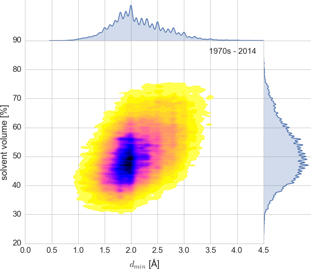
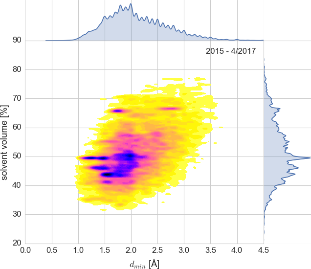

Utilities and Examples
######################

The CIF-handling part of the Gemmi library comes with a couple of utilities,
and several examples that show how you can use the library in your scripts.

Utilities
=========

gemmi-validate
--------------

A validator that checks the syntax and, optionally, also ontology
using a corresponding DDL1/DDL2 dictionary.
(checking with DDL1 is mostly finished, DDL2 is only started).

.. literalinclude:: validate-help.txt
   :language: console

gemmi-convert
-------------

Converts CIF to JSON, aiming to be compatible with the COMCIFS spec
when `the draft`_ is finalized and agreed__ upon.

.. _the draft: http://comcifs.github.io/cif-json
__ http://www.iucr.org/iucr-top/lists/cif-developers/

.. literalinclude:: convert-help.txt
   :language: console

.. _cif_examples:

Examples
========

The examples here use C++11 or Python 2.7/3.x.
Full working code code can be found in the examples__ directory.

If you have the Python ``gemmi`` module installed you should also have
the Python examples -- try ``python -m gemmi-examples`` if not sure
where they are.

The examples below can be run on one or more PDBx/mmCIF files.
We normally run them on a
`local copy <https://www.wwpdb.org/download/downloads>`_ of the mmCIF
archive (30GB+ gzipped, don't uncompress!) to perform PDB-wide analyses,

__ https://github.com/project-gemmi/gemmi/tree/master/examples

.. _auth_label_example:

auth vs label
-------------

When you look at the list of atoms in mmCIF files some columns
seem to completely redundant. Are they?
It is hard to manually find an example
where ``_atom_site.auth_atom_id`` differs from ``_atom_site.label_atom_id``, or
where ``_atom_site.auth_comp_id`` differs from ``_atom_site.label_comp_id``.
So here is a small C++ program:

.. literalinclude:: ../examples/auth_label.cc

We compile it, run it, and come back after an hour:

.. code-block:: none

    $ g++-6 -O2 -I.. -Ithird_party examples/auth_label.cc -lstdc++fs -lz
    $ ./a.out pdb_copy/mmCIF
    3D3W: atom_id  O1 -> OD
    1TNI: atom_id  HN2 -> HN3
    1S01: comp_id  CA -> UNL
    2KI7: atom_id  H -> H1
    2KI7: atom_id  H -> H1
    2KI7: atom_id  H -> H1
    2KI7: atom_id  H -> H1
    2KI7: atom_id  H -> H1
    2KI7: atom_id  H -> H1
    2KI7: atom_id  H -> H1
    2KI7: atom_id  H -> H1
    2KI7: atom_id  H -> H1
    2KI7: atom_id  H -> H1
    2KI7: atom_id  H -> H1
    2KI7: atom_id  H -> H1
    2KI7: atom_id  H -> H1
    2KI7: atom_id  H -> H1
    2KI7: atom_id  H -> H1
    2KI7: atom_id  H -> H1
    2KI7: atom_id  H -> H1
    2KI7: atom_id  H -> H1
    2KI7: atom_id  H -> H1
    2KI7: atom_id  H -> H1
    4E1U: atom_id  H101 -> H103
    4WH8: atom_id  H3 -> H391
    4WH8: atom_id  H4 -> H401
    3V2I: atom_id  UNK -> UNL
    1AGG: atom_id  H3 -> H
    1AGG: atom_id  H3 -> H
    1AGG: atom_id  H3 -> H

So, as of April 2017, only a single autor's residue name was changed,
and atom names were changed in 7 PDB entries.

Amino acid frequency
--------------------

.. highlight:: python

Let say we see in a `paper <https://doi.org/10.1093/nar/gkw978>`_
amino acid frequency averaged over 5000+ proteomes
(Ala 8.76%, Cys 1.38%, Asp 5.49%, etc),
and we want to compare it with the frequency in the PDB database.
So we write a little script

.. literalinclude:: ../examples/aafreq.py

We can run this script on our copy of the PDB database
(mmCIF format) and get such an output:

.. code-block:: none

    200L ALA:17 LEU:15 LYS:13 ARG:13 THR:12 ASN:12 GLY:11 ILE:10 ASP:10 VAL:9 GLU:8 SER:6 TYR:6 GLN:5 PHE:5 MET:5 PRO:3 TRP:3 HIS:1
    ...
    4ZZZ LEU:40 LYS:33 SER:30 ASP:25 GLY:25 ILE:25 VAL:23 ALA:19 PRO:18 GLU:18 ASN:17 THR:16 TYR:16 GLN:14 ARG:11 PHE:10 HIS:9 MET:9 CYS:2 TRP:2
    TOTAL LEU:8.90% ALA:7.80% GLY:7.34% VAL:6.95% GLU:6.55% SER:6.29% LYS:6.18% ASP:5.55% THR:5.54% ILE:5.49% ARG:5.35% PRO:4.66% ASN:4.16% PHE:3.88% GLN:3.77% TYR:3.45% HIS:2.63% MET:2.14% CYS:1.38% TRP:1.35%

On my laptop it takes about an hour, using a single core.
Most of this hour is spent on tokenizing the CIF files and copying
the content into a DOM structure, what could be largely avoided given
that we use only sequences not atoms.
But it is not worth to optimize one-off scripts.
The same goes for using multiple core.

Search PDB by elements
----------------------

Let say we want to be able to search the PDB by specifying a set of elements
present in the model. First we write down elements present in each
PDB entry::

    block = cif.read_any(path).sole_block()
    elems = set(block.find_loop("_atom_site.type_symbol"))
    print(name + ' ' + ' '.join(elems))

This example ended up overdone a bit and it was put into a
`separate repository <https://github.com/project-gemmi/periodic-table>`_.

Here is a demo: `<https://project-gemmi.github.io/periodic-table/>`_

Solvent content vs resolution
-----------------------------

.. |Vm| replace:: *V*\ :sub:`M`
.. |Vs| replace:: *V*\ :sub:`S`
.. |dmin| replace:: *d*\ :sub:`min`

Let say that we would like to generate a plot of solvent content
as a function of |dmin|, similar to the plots
by C. X. Weichenberger and B. Rupp
in `Acta Cryst D <https://www.ncbi.nlm.nih.gov/pubmed/24914969>`_
and `CNN <http://www.phenix-online.org/newsletter/CCN_2015_01.pdf#page=14>`_),
but less smoothed and with duplicate entries included.

In macromolecular crystallography solvent content is conventionally
estimated as:

    |Vs| = 1 -- 1.230 / |Vm|

where |Vm| is Matthews coefficient defined as |Vm|\ =\ *V*\ /\ *m*
(volume of the asymmetric unit over the molecular weight of all
molecules in this volume).

Weichenberger and Rupp calculated |Vs| themselves, but we will simply
use the values present in mmCIF files.
So first we extract |Vm|, |Vs| and |dmin|,
as well as number of DNA/RNA chains (protein-only entries will have 0 here),
deposition date and group ID (which will be explained later).

.. literalinclude:: ../examples/matthews.py
   :pyobject: gather_data

After a few checks (see :file:`examples/matthews.py`) we may decide to use
only those PDB entries in which |Vm| and |Vs| are consistent.
To make things more interesting we plot separately depositions from before
and after 1/1/2015.

   About 90,000 PDB entries (up to 2014)
   plotted as intentionally undersmoothed kernel density estimate.
   The code used to produce this plot is in :file:`examples/matthews.py`.

Ripples in the right subplot show that in many entries |Vs|
is reported as integer, so we should calculate it ourselves
(like Weichenberger & Rupp) for better precision.
Ripples in the top plot show that we should use a less arbitrary metric
of resolution than |dmin| (but it's not so easy).
Or we could just smooth them out by changing parameters of this plot.

   About 17,000 PDB entries (2015 - April 2017)
   plotted as intentionally undersmoothed kernel density estimate.
   The code used to produce this plot is in :file:`examples/matthews.py`.

On the left side of the yellow egg you can see dark stripes
caused by *group depositions*, which were introduced by PDB in 2016.
As of Apr 2017 only a few groups have been deposited (it's just the beginning).
They came from two European high-throughput beamlines and
serve as an illustration of how automated software can analyze hundreds
of similar samples (fragment screening) and submit them quickly to the PDB.

We can easily filter out group depositions -- either using the group IDs
that we extracted from mmCIF files or, like W&B, by excluding redundant
entries based on the unit cell and |Vm|.

Not all the dark spots are group depositions.
For example, at |Vs|\ ≈66.5%, |dmin| 2.5-3A we can see the 20S proteasome
studied by Huber *et al* --
a systematic research of the same important protein,
with dozens PDB submissions.

Weights
-------

Let say we would like to verify consistency of molecular weights.
First, let us look at chem_comp tables:

.. code-block:: none

    loop_
    _chem_comp.id
    _chem_comp.type
    _chem_comp.mon_nstd_flag
    _chem_comp.name
    _chem_comp.pdbx_synonyms
    _chem_comp.formula
    _chem_comp.formula_weight
    ALA 'L-peptide linking' y ALANINE         ?                 'C3 H7 N O2'     89.093
    ARG 'L-peptide linking' y ARGININE        ?                 'C6 H15 N4 O2 1' 175.209
    ASN 'L-peptide linking' y ASPARAGINE      ?                 'C4 H8 N2 O3'    132.118
    ASP 'L-peptide linking' y 'ASPARTIC ACID' ?                 'C4 H7 N O4'     133.103
    CYS 'L-peptide linking' y CYSTEINE        ?                 'C3 H7 N O2 S'   121.158
    EDO non-polymer         . 1,2-ETHANEDIOL  'ETHYLENE GLYCOL' 'C2 H6 O2'       62.068
    ...

We expect that by using molecular weights of elements and a simple arithmetic
we can recalculate ``_chem_comp.formula_weight`` from ``_chem_comp.formula``.
The full code is in :file:`examples/weights.py``.
It includes a function that converts ``'C2 H6 O2'`` to ``{C:2, H:6, O:2}``.
Here we only show the few lines of code that sum the element weights
and compare the result:

.. literalinclude:: ../examples/weight.py
   :pyobject: check_chem_comp_formula_weight

This script prints differences above 0.1 u:

.. code-block:: none

    3A1R DOD  D2 O                20.028 -    18.015 = +2.013
    5AI2 D8U  D 1                  2.014 -         ? = +nan
    5AI2 DOD  D2 O                20.028 -    18.015 = +2.013
    4AR3 D3O  O 1                 15.999 -    22.042 = -6.043
    4AR4 D3O  O 1                 15.999 -    22.042 = -6.043
    4AR5 DOD  D2 O                20.028 -    18.015 = +2.013
    4AR6 DOD  D2 O                20.028 -    18.015 = +2.013
    4B1A K3G  MO12 O40 P 1      1822.350 -  1822.230 = +0.120
    4BVO E43  H2 O40 W12 6      2848.072 -  2848.192 = -0.120
    ...
    5FHW HFW  Hf O61 P2 W17     4341.681 -  4343.697 = -2.016
    ...

The differences are few and minor.
We see a few PDB entries with the weight of D\ :sub:`2`\ O
set to the weight H\ :sub:`2`\ O. The second line shows missing weight.
The differences +0.12 and -0.12 next to Mo12 and W12 probably come from
the 0.01u difference in the input masses of the elements.
In two entries D3O is missing D in the formula, and -2.016 in HFW
suggests two missing hydrogens.

Now let us try to re-calculate ``_entity.formula_weight`` from the chem_comp
weights and the sequence.
The PDB software calculates it as a sum of components in the chain,
minus the weight of N-1 waters.
In case of nucleic acids also PO\ :sub:`2` is subtracted
(why not PO\ :sub:`3`\ ? -- to be checked).
And in case of microheterogeneity only the main conformer is taken into
account. As the PDB software uses single precision for these computations,
we ignore differences below 0.003%, which we checked to be enough to
account for numerical errors.

.. literalinclude:: ../examples/weight.py
   :pyobject: check_entity_formula_weight

Running this script on a local copy of the PDB database prints 26 lines,
and the difference is always (except for 4PMN) the mass of PO\ :sub:`2`
showing that we have not fully reproduced the rule when to subtract this group.

.. code-block:: none

    ...
    4D67 entity_id: 44 1625855.77 - 1625917.62 =  -61.855
    1HZS entity_id:  1    1733.88 -    1796.85 =  -62.973
    2K4G entity_id:  1    2158.21 -    2221.18 =  -62.974
    3MBS entity_id:  1    2261.35 -    2324.33 =  -62.974
    1NR8 entity_id:  2    2883.07 -    2946.05 =  -62.974
    3OK2 entity_id:  1    3417.14 -    3354.17 =  +62.968
    ...

Chemical Component Dictionary
-----------------------------

For something a bit different, let us look at the data from
`CCD <https://www.wwpdb.org/data/ccd>`_.
The :file:`components.cif` file describes all the monomers (residues,
ligands, solvent molecules) from the PDB entries.
It contains information about bonds that is normally absent in the PDB
entries. Macromolecular refinement programs need more detailed description
of monomers (to derive restraints),
so they have own dictionaries, such as Refmac dictionary (a.k.a. monomer
library or cif files).

:file:`examples/monomers.py` has a simple consistency checks
between the CCD and Refmac dictionary. This example will be expanded
after the coming revolution in the Refmac monomer library.
