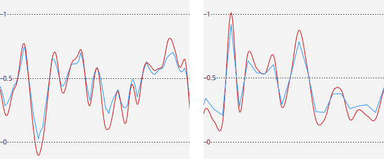
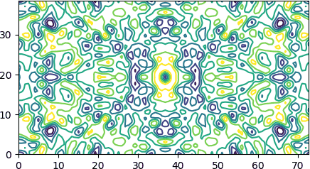

Grids and maps
##############

.. _grid:

Volumetric grid
===============

Introduction
------------

Macromolecular models are often accompanied by 3D data on an evenly spaced,
rectangular grid (but note that the spacing in different directions may differ).
The data may represent electron density, a mask of the protein area,
or any other scalar data.

In Gemmi such a data is stored in a class called Grid.
Actually, it is a set of classes for storing
different types of data: floating point numbers, integers or boolean masks.

Grid dimension are given in variables nu, nv, nw.
The data layout is Fortran-style contiguous, i.e. point (1,1,1) is followed
by (2,1,1).

Grid classes also store:

* unit cell dimensions (to know Cartesian coordinates of grid nodes),
* and crystallographic symmetry (to know symmetry-equivalent grid nodes).

If the symmetry is not set (or is set to P1)
we effectively have a box with periodic boundary conditions (PBC).

C++
~~~

The ``gemmi/grid.hpp`` header defines::

  template<typename T=float> struct Grid;

which stores dimensions and data::

  int nu, nv, nw;
  std::vector<T> data;

To specify the grid size use function ``set_size()``
or ``set_size_from_spacing()``. They both check that the size
is compatible with the space group (so it is better to call
these functions after setting ``Grid::spacegroup``.
The latter function additionally ensures that the size is FFT-friendly.

The data point can be accessed with::

  T Grid<T>::get_value(int u, int v, int w) const
  void Grid<T>::set_value(int u, int v, int w, T x)

(This class has a number of other functions that are not documented yet.
The majority of Gemmi users use it from Python, so that's also where most of
the documentation effort goes.)

Python
~~~~~~

In Python we have classes FloatGrid (for maps), Int8Grid (for masks).
(We will add other classes such and ComplexGrid when we see
a use for it.)

The constructor may take grid dimensions or a NumPy array as an argument:

.. doctest::

  >>> import gemmi
  >>> grid = gemmi.FloatGrid(12, 12, 12)
  >>> grid.nu, grid.nv, grid.nw
  (12, 12, 12)

.. doctest::
  :skipif: numpy is None

  >>> grid2 = gemmi.FloatGrid(numpy.zeros((30, 31, 32), dtype=numpy.float32))
  >>> grid2.nu, grid2.nv, grid2.nw
  (30, 31, 32)

Alternatively, you may set (or change) the size later on:

.. doctest::

  >>> grid3 = gemmi.FloatGrid()
  >>> # grid3.spacegroup = ...
  >>> grid3.set_size(12, 12, 12)

The advantage of calling ``set_size()`` after a space group was set
is that this function checks if the size is compatible with the space group
(a symmetry operation cannot map a node to a point between nodes).

If a unit cell is assigned to the grid (it will be discussed
:ref:`later <grid_cell>`), you can request the size that gives approximately
the specified spacing, with one of the possible rounding modes: ``Nearest``,
``Up`` (denser grid) and ``Down``:

.. doctest::

  >>> grid3.set_unit_cell(gemmi.UnitCell(40, 50, 40, 90, 82.5, 90))
  >>> grid3.set_size_from_spacing(1.2, gemmi.GridSizeRounding.Nearest)

You can create a copy of a grid with:

.. doctest::

  >>> grid.clone()
  <gemmi.FloatGrid(12, 12, 12)>

Values are accessed with functions get_value() and set_value():

.. doctest::

  >>> grid.set_value(1, 1, 1, 7.0)
  >>> grid.get_value(1, 1, 1)
  7.0
  >>> # we can test wrapping of indices (a.k.a. periodic boundary conditions)
  >>> grid.get_value(-11, 13, 25)
  7.0

.. _buffer_protocol:

The data can be also accessed through the
`buffer protocol <https://docs.python.org/3/c-api/buffer.html>`_.
It means that you can use it as a NumPy array (Fortran-style contiguous)
without copying the data:

.. doctest::
  :skipif: numpy is None or sys.platform == 'win32'

  >>> import numpy
  >>> array = numpy.array(grid, copy=False)
  >>> array.dtype
  dtype('float32')
  >>> array.shape
  (12, 12, 12)
  >>> numpy.argwhere(array == 7.0)
  array([[1, 1, 1]])

The buffer protocol is not specific to NumPy -- any other Python library
that supports this protocol can directly access the grid data.
Alternatively, the grid can be viewed as a NumPy array through
the ``array`` property:

.. doctest::
  :skipif: numpy is None or sys.platform == 'win32'

  >>> grid.array.shape
  (12, 12, 12)

Symmetry
--------

The main advantage that Grid has over a generic 3D array is that
it understands crystallographic symmetry.
After setting the symmetry we can use a family of *symmetrize* functions
that performs operations on symmetry-equivalent grid points.
For example, we can set all equivalent points to the value calculated
as a minimum, maximum or a sum of values of the equivalent points.

In C++ we directly set the spacegroup property::

  const SpaceGroup* spacegroup;

Similarly in Python:

.. doctest::

  >>> grid.spacegroup = gemmi.find_spacegroup_by_name('P2')
  
Now let us use one of the symmetrizing functions:

.. doctest::

  >>> # the point (1, 1, 1) was already set to 7.0
  >>> grid.set_value(0, 0, 0, 0.125)  # a special position
  >>> grid.sum()  # for now only two points: 7.0 + 0.125
  7.125
  >>> grid.symmetrize_max()  # applying symmetry
  >>> grid.sum()  # one point got duplicated, the other is on rotation axis
  14.125

In C++ we have a templated function that can perform any operation
on symmetry-equivalent points::

    template<typename Func> void Grid::symmetrize(Func func)

Python bindings provide the following specializations:

.. doctest::
  :skipif: numpy is None

  >>> grid.symmetrize_min()      # minimum of equivalent values
  >>> grid.symmetrize_max()      # maximum
  >>> grid.symmetrize_abs_max()  # max(|x|)
  >>> grid.symmetrize_avg()      # average
  >>> grid2.symmetrize_sum()     # sum (symmetry-equivalent nodes are added, multiplying nodes on special positions)

.. _grid_cell:

Unit cell
---------

The unit cell parameters (in a member variable ``unit_cell``: UnitCell)
enable conversion between coordinates and grid points.

The unit cell should be set using ``Grid<T>::set_unit_cell()``,
which in addition to setting ``unit_cell`` sets also ``spacing``,
the spacing between grid planes that is precalculated for efficiency.

.. doctest::

  >>> grid.set_unit_cell(gemmi.UnitCell(45, 45, 45, 90, 82.5, 90))
  >>> grid.unit_cell
  <gemmi.UnitCell(45, 45, 45, 90, 82.5, 90)>
  >>> grid.spacing  #doctest: +ELLIPSIS
  (3.7179..., 3.75..., 3.7179...)

Each grid point (*u*, *v*, *w*) can now be expressed in fractional or Cartesian
coordinates:

.. doctest::

  >>> grid.get_fractional(6, 6, 6)
  <gemmi.Fractional(0.5, 0.5, 0.5)>
  >>> grid.get_position(6, 6, 6)
  <gemmi.Position(25.4368, 22.5, 22.3075)>

Grid point
----------

Grid contains a little helper class (GridBase<T>::Point in C++)
that bundles grid point coordinates (u, v, w: int) and a pointer
to the value in grid (value). This bundle is obtained with getter:

.. doctest::

  >>> grid.get_point(0, 0, 0)
  <gemmi.FloatGridBase.Point (0, 0, 0) -> 0.125>
  >>> _.u, _.v, _.w, _.value
  (0, 0, 0, 0.125)

or when iterating the grid:

.. doctest::

  >>> for point in grid:
  ...   if point.value != 0.: print(point)
  <gemmi.FloatGridBase.Point (0, 0, 0) -> 0.125>
  <gemmi.FloatGridBase.Point (1, 1, 1) -> 7>
  <gemmi.FloatGridBase.Point (11, 1, 11) -> 7>

The point can be converted to its index (position in the array):

.. doctest::

  >>> point = grid.get_point(6, 6, 6)
  >>> grid.point_to_index(point)
  942

to fractional coordinates:

.. doctest::

  >>> grid.point_to_fractional(point)
  <gemmi.Fractional(0.5, 0.5, 0.5)>

and to orthogonal (Cartesian) coordinates in Angstroms:

.. doctest::

  >>> grid.point_to_position(point)
  <gemmi.Position(25.4368, 22.5, 22.3075)>

The other way around, we can find the grid point nearest to a position:

.. doctest::

  >>> grid.get_nearest_point(_)
  <gemmi.FloatGridBase.Point (6, 6, 6) -> 0>

Common operations
-----------------

The Grid class is often used for electron density maps.
A common operation on such maps is normalization -- scaling
that changes the mean to 0 and RMSD to 1:

.. doctest::

    >>> gr = grid.clone()
    >>> gr.normalize()

----

To extract a block-shaped sub-array data as a Fortran-contiguous array,
or to set data in a block in a grid, use functions get/set_subarray.
Unlike array slicing, these functions are aware of the cell repeat
(PBC) -- the block area is not limited by the unit cell boundaries.

.. doctest::
  :skipif: numpy is None

  >>> sub = gr.get_subarray(start=[3,3,3], shape=[2,3,4])
  >>> sub.shape
  (2, 3, 4)
  >>> gr.set_subarray(sub, start=[0,0,0])

----

To set the whole grid to the same value use:

.. doctest::

  >>> gr.fill(0)

To set the grid points in a certain radius from a specified position use::

  void Grid<T>::set_points_around(const Position& ctr, double radius, T value)

.. doctest::
  :skipif: numpy is None or sys.platform == 'win32'

  >>> gr.set_points_around(gemmi.Position(25, 25, 25), radius=3, value=10)
  >>> numpy.argwhere(gr.array == 10)
  array([[6, 6, 7],
         [6, 7, 7]])

This function, to be efficient, ignores symmetry.
At the end we should call one of the *symmetrizing* functions:

.. doctest::

  >>> gr.symmetrize_max()

While we could use the above functions for masking the molecule
(or bulk solvent) area, we have specialized functions to create
a bulk :ref:`solvent mask <solventmask>`.

Interpolation
-------------

To get a value corresponding to an arbitrary position,
you may use trilinear interpolation of the 8 nearest nodes,
or tricubic interpolation that uses 64 nodes.

**C++**

::

  T Grid<T>::interpolate_value(const Fractional& fctr) const
  T Grid<T>::interpolate_value(const Position& ctr) const

  double Grid<T>::tricubic_interpolation(const Fractional& fctr) const
  double Grid<T>::tricubic_interpolation(const Position& ctr) const

  // calculates also derivatives
  std::array<double,4> Grid<T>::tricubic_interpolation_der(double x, double y, double z) const

**Python**

.. doctest::

  >>> grid.interpolate_value(gemmi.Fractional(1/24, 1/24, 1/24))
  0.890625
  >>> grid.interpolate_value(gemmi.Position(2, 3, 4))
  2.0333263874053955
  >>> grid.tricubic_interpolation(gemmi.Fractional(1/24, 1/24, 1/24))
  1.283477783203125
  >>> grid.tricubic_interpolation(gemmi.Position(2, 3, 4))
  2.6075661737715046
  >>> # calculate also derivatives in directions of unit cell axes
  >>> grid.tricubic_interpolation_der(gemmi.Fractional(1/24, 1/24, 1/24))
  [1.283477783203125, 35.523193359375, 36.343505859375, 35.523193359375]

The cubic interpolation is smoother than linear, but may amplify the noise.
This is illustrated on the plots below, which shows density along two lines
in a grid that was filled with random numbers from [0, 1).
Trilinear interpolation is blue, tricubic -- red.
The left plot shows density along a line in a random direction,
the right plot -- along a line parallel to one of the axes.

*Implementation notes*

Tricubic interpolation, as described
on `Wikipedia page <https://en.wikipedia.org/wiki/Tricubic_interpolation>`_ and in
`Appendix B of a PHENIX paper <https://journals.iucr.org/d/issues/2018/06/00/ic5103/#APPB>`_,
can be implemented either as 21 cubic interpolations, or using method
introduced by `Lekien & Marsen <https://doi.org/10.1002/nme.1296>`_ in 2005,
which involves 64x64 matrix of integral coefficients
(see also this `blog post <http://ianfaust.com/2016/03/20/Tricubic/>`_).
The latter method should be more efficient, but gemmi uses the former,
which takes ~100 ns. If you'd like to speed it up or to get derivatives,
contact developers.

*Optimization for Python*

If you have a large number of points, making a Python function call
each time would be slow.
If these points are on a regular 3D grid (which may not be aligned
with our grid) call ``interpolate_values()`` (with s at the end)
with two arguments: a 3D NumPy array (for storing the results)
and a :ref:`Transform <transform>` that relates indices of the array
to positions in the grid:

.. doctest::
  :skipif: numpy is None

  >>> # first we create a numpy array of the same type as the grid
  >>> arr = numpy.zeros([32, 32, 32], dtype=numpy.float32)
  >>> # then we setup a transformation (array indices) -> (position [A]).
  >>> tr = gemmi.Transform()
  >>> tr.mat.fromlist([[0.1, 0, 0], [0, 0.1, 0], [0, 0, 0.1]])
  >>> tr.vec.fromlist([1, 2, 3])
  >>> # finally we calculate interpolated values
  >>> grid.interpolate_values(arr, tr)
  >>> arr[10, 10, 10]  # -> corresponds to Position(2, 3, 4)
  2.0333264

(If your points are not on a regular grid -- get in touch -- there might be
another way.)

.. _masked_grid:

ASU and MaskedGrid
------------------

Sometimes we want to focus on a part of the grid only.
For this, we have class MaskedGrid that contains vector marking masked
positions and a reference to the original grid.

When an element of the mask is 0 (false), the corresponding element
of the grid is unmasked and is to be used. This is the same convention
as in NumPy MaskedArray.

The primary use for MaskedGrid is working with asymmetric unit (asu) only:

.. doctest::
  :skipif: numpy is None

  >>> asu = grid.masked_asu()
  >>> asu  # doctest: +ELLIPSIS
  <gemmi.MaskedFloatGrid object at 0x...>
  >>> asu.grid is grid
  True
  >>> asu.mask_array  # doctest: +ELLIPSIS
  array([[[0, 0, 0, ..., 1, 1, 1],
         ...
          [1, 0, 0, ..., 1, 1, 1]]], dtype=int8)
  >>> sum(point.value for point in asu)
  7.125
  >>> for point in asu:
  ...   if point.value != 0: print(point)
  <gemmi.FloatGridBase.Point (0, 0, 0) -> 0.125>
  <gemmi.FloatGridBase.Point (1, 1, 1) -> 7>

.. _solventmask:

Solvent mask
------------

Gemmi implements a variant of the most popular method for calculating
the bulk solvent area. This method was introduced in CNS.
It uses van der Waals (or similar) atomic radii *r* and two parameters:
*r*\ :sub:`probe` and *r*\ :sub:`shrink`.

* We mark the area in radius *r* + *r*\ :sub:`probe` of each
  atom as non-solvent (0). *r* usually depends on the element,
  but some programs use the same radius for all atoms.
  The extra margin *r*\ :sub:`probe` is largely cancelled in the next step.
* We shrink the non-solvent area by *r*\ :sub:`shrink`.
  All the 0's in a distance *r*\ :sub:`shrink` from 1's are changed to 1,
  shrinking the solvent volume.
  Both *r*\ :sub:`probe` and *r*\ :sub:`shrink` have the same
  order of magnitude.
  `Jiang & Brünger (1994) <https://doi.org/10.1006/jmbi.1994.1633>`_
  proposed *r*\ :sub:`probe` = 1.0 Å and *r*\ :sub:`shrink` = 1.1 Å.
* The above procedure eliminates small solvent islands.
  If it is not sufficient, we can explicitly remove islands
  (contiguous areas of 1's) up to a certain volume.
  This step was added for compatibility with Refmac.

Here is how to create a mask identical as ``phenix.mask``:

.. doctest::

  >>> masker = gemmi.SolventMasker(gemmi.AtomicRadiiSet.Cctbx)
  >>> st = gemmi.read_structure('../tests/1orc.pdb')
  >>> grid = gemmi.Int8Grid()
  >>> # take space group and unit cell from Structure,
  >>> # and set size based on the specified minimal spacing
  >>> grid.setup_from(st, spacing=1.0)
  >>> masker.put_mask_on_int8_grid(grid, st[0])

The parameters of SolventMasker can be inspected and changed:

.. doctest::

  >>> masker.atomic_radii_set
  <AtomicRadiiSet.Cctbx: 1>
  >>> masker.rprobe
  1.11
  >>> masker.rshrink
  0.9
  >>> masker.island_min_volume  # 0 = unused
  0.0
  >>> masker.constant_r  # 0 = unused
  0.0

The example above uses a parameter set based on cctbx.
We also have a few others sets.
You can create mask similar to Refmac (but due to unintended features
of solvent masking in Refmac, the results are not identical):

.. doctest::

  >>> masker = gemmi.SolventMasker(gemmi.AtomicRadiiSet.Refmac)

or a mask with Van der Waals radii from
`Wikipedia <https://en.wikipedia.org/wiki/Atomic_radii_of_the_elements_(data_page)>`_
and *r*\ :sub:`probe` = 1.0 Å and *r*\ :sub:`shrink` = 1.1 Å,
as in the original Jiang & Brünger paper:

.. doctest::

  >>> masker = gemmi.SolventMasker(gemmi.AtomicRadiiSet.VanDerWaals)

or with constant radius, similarly to the NCSMASK program from CCP4:

.. doctest::

  >>> masker = gemmi.SolventMasker(gemmi.AtomicRadiiSet.Constant, 3.0)

If the mask is to be FFT-ed to structure factors, store it on FloatGrid
(function ``put_mask_on_float_grid`` in Python
and ``put_mask_on_grid`` in C++).
See the section about :ref:`bulk solvent coorection <scaling>`
for details and examples.

Blob search
-----------

When we have an electron density map on a Grid we may want to check *blobs* --
unmodelled electron density, potential ligand sites.
Similarly to the "Unmodelled blobs" function in COOT, Gemmi has a function
that finds such blobs. It was added to be used in CCP4 Dimple.

The blobs can be searched either in a difference map, or in a normal map
with the model masked out. In this example we do the latter.

.. doctest::

  >>> # load map from MTZ
  >>> mtz = gemmi.read_mtz_file('../tests/5wkd_phases.mtz.gz')
  >>> grid = mtz.transform_f_phi_to_map('FWT', 'PHWT', sample_rate=3)
  >>>
  >>> # Load model. No real blobs in this tiny example,
  >>> # so we remove water to get one water-sized blob.
  >>> st = gemmi.read_structure('../tests/5wkd.pdb')
  >>> st.remove_waters()
  >>>
  >>> # use SolventMasker to mask the models with zeros
  >>> masker = gemmi.SolventMasker(gemmi.AtomicRadiiSet.Constant, 1.75)
  >>> masker.set_to_zero(grid, st[0])
  >>>
  >>> # find the blob
  >>> blobs = gemmi.find_blobs_by_flood_fill(grid, cutoff=0.6, min_volume=5,
  ...                                        min_score=0, min_peak=0)
  >>> blobs  #doctest: +ELLIPSIS
  [<gemmi.Blob object at 0x...>]
  >>> blobs[0].volume
  9.967250538023837
  >>> blobs[0].score  #doctest: +ELLIPSIS
  10.1815458...
  >>> blobs[0].peak_value
  1.8486430644989014
  >>> blobs[0].centroid
  <gemmi.Position(12.5868, -0.45056, 0)>
  >>> blobs[0].peak_pos
  <gemmi.Position(12.307, 0, 0)>

In addition to the blob coordinates, it can be useful to know what is
the nearest chain, residue and atom. Here is a quick recipe how to
find it out with the help of :ref:`NeighborSearch <neighbor_search>`:

.. doctest::

  >>> pos = blobs[0].peak_pos
  >>> ns = gemmi.NeighborSearch(st[0], st.cell, 8).populate(include_h=False)
  >>> mark = ns.find_nearest_atom(pos)
  >>> mark.to_cra(st[0])
  <gemmi.CRA A/GLN 303/O>
  >>> # To calculate distance from the atom, we need to account for the periodicity
  >>> # of crystal. mark.pos is atom.pos transformed by a symmetry op, but we may need
  >>> # to add a multiplicity of the unit cell vectors before calculating the distance.
  >>> st.cell.find_nearest_pbc_image(pos, mark.pos, 0)
  <gemmi.NearestImage 1_554 in distance 3.51>
  >>> # You may also want to find a symmetry image of the blob that is near
  >>> # the original molecule.
  >>> atom_pos = mark.to_cra(st[0]).atom.pos
  >>> st.cell.find_nearest_pbc_position(atom_pos, pos, mark.image_idx, inverse=True)
  <gemmi.Position(12.8665, -2.3885, 0)>
  >>> _.dist(atom_pos)
  3.511341999194701

Flood fill
----------

`Flood fill <https://en.wikipedia.org/wiki/Flood_fill>`_
is an algorithm that determines the area connected to a *seed* point,
the area of all connected points which match a certain condition.
Here, the criterion for grid points is having the value above
(or, alternatively, below) a given threshold value.

The blob search from the previous section uses flood fill and returns Blob
objects that contain a few statistics for each blob. To get a mask
corresponding to a Blob we need to run the flood fill algorithm again,
using peak_pos as the seed:

.. doctest::

  >>> seed = blobs[0].peak_pos
  >>> mask = gemmi.flood_fill_above(grid, [seed], threshold=0.6)
  >>> mask
  <gemmi.Int8Grid(90, 8, 30)>

The second argument of flood_fill_above() is a list of positions used as seeds.
We could use multiple seeds to obtain a single mask for all blobs together.

To find area with values below a certain value,
run flood_fill_above() with optional argument ``negate=True``.

Here we print a few characteristics of the mask:

.. doctest::

  >>> mask.sum()  # == number of masked points
  62
  >>> _ * grid.unit_cell.volume / grid.point_count  # cf. blobs[0].volume
  9.967250538023837
  >>> extent = mask.get_nonzero_extent()  # bounding box containing the blob
  >>> extent.minimum  # in fractional coordinates
  <gemmi.Fractional(0.227778, -0.0625, -0.0833333)>
  >>> grid.unit_cell.orthogonalize(extent.minimum)
  <gemmi.Position(11.7177, -0.298563, -1.20317)>
  >>> grid.unit_cell.orthogonalize(extent.maximum)
  <gemmi.Position(13.4558, 4.47844, 1.20317)>

MRC/CCP4 maps
=============

We support one file format for storing the grid data on disk: MRC/CCP4 map.
The content of the map file is stored in a class that contains
both the Grid class and all the meta-data from the CCP4 file header.

The CCP4 format has a few different modes that correspond to different
data types. Gemmi supports:

* mode 0 -- which correspond to the C++ type int8_t,
* mode 1 -- corresponds to int16_t,
* mode 2 -- float,
* and mode 6 -- uint16_t.

CCP4 programs use mode 2 (float) for the electron density,
and mode 0 (int8_t) for masks. A mask is 0/1 data that marks part of the volume,
such as the solvent region. Other modes are not used in crystallography,
but may be used for CryoEM data.

The CCP4 format is quite flexible. The data is stored as sections,
rows and columns that correspond to a permutation of the X, Y and Z axes
as defined in the file header.
The file can contain only a part of the asymmetric unit,
or more than an asymmetric unit (i.e. redundant data).
There are two typical approaches to generate a crystallographic map:

* Covering a molecule with some margin around it.
  This is necessary for programs such as PyMOL that don't know about symmetry.
  CCP4 utilities ``fft`` + ``mapmask`` can make such a map.
* Covering the asymmetric unit (asu). The program that reads
  the map is supposed to expand the symmetry. This approach is used by
  the CCP4 clipper library and by programs such as Coot.

The latter approach generates map for exactly one asu, if possible.
It is not possible if the shape of the asu in fractional coordinates
is not rectangular, and in such case we must have some redundancy.
On average, the maps generated for asu are significantly smaller,
as compared in the
`UglyMol wiki <https://github.com/uglymol/uglymol/wiki/ccp4-dsn6-mtz>`_.

Nowadays, the CCP4 format is rarely used in crystallography.
Almost all programs read the reflection data and calculate maps on the fly.

Reading
-------

C++
~~~

To work with CCP4 maps you need::

    #include <gemmi/ccp4.hpp>

The Ccp4 class is templated with the data type.
Normally, we use float type for a map::

    gemmi::Ccp4<float> map;
    map.read_ccp4_map("my_map.ccp4");

and int8_t for a mask (mask typically has only values 0 and 1,
but in principle the values can be from -127 to 128)::

    gemmi::Ccp4<int8_t> mask;
    mask.read_ccp4_map("my_mask.ccp4");

If the grid data type does not match the file data type, the library
will attempt to convert the data when reading.

Alternatively, you can use helper functions ``read_ccp4_map()``
and ``read_ccp4_mask()`` defined in ``gemmi/read_map.hpp``.

Python
~~~~~~

To read a ccp4 map:

.. doctest::

    >>> m = gemmi.read_ccp4_map('../tests/5i55_tiny.ccp4')
    >>> m
    <gemmi.Ccp4Map with grid 8x6x10 in SG #4>

Similarly, to read a mask (ccp4 map in mode 0) call ``read_ccp4_mask()``.

Header
------

The CCP4 map header is organised as 56 words (4-bytes that are interpreted
as integer, float or 4 characters) followed by 800 bytes -- a space for ten
80-character text labels.

Low-level access to the header is provided by getters and setters
that use the word number (as in the format description from
`ccp4 <https://www.ccp4.ac.uk/html/maplib.html>`_
or `ccp-em <https://www.ccpem.ac.uk/mrc_format/mrc2014.php>`_)
as the first argument.

**C++**

::

    int32_t header_i32(int w) const;
    float header_float(int w) const;
    // ccp4 map header has mostly 80-byte strings
    std::string header_str(int w, size_t len=80) const;

    void set_header_i32(int w, int32_t value);
    void set_header_float(int w, float value);
    void set_header_str(int w, const std::string& str);

For example::

    int mode = map.header_i32(4);
    float x = map.header_float(11);

**Python**

.. doctest::

    >>> m.header_float(20), m.header_float(21)  # dmin, dmax
    (-0.5310382843017578, 2.3988280296325684)
    >>> m.header_i32(28)
    0
    >>> m.set_header_i32(28, 20140)
    >>> m.header_str(57, 80).strip()
    'Created by MAPMAN V. 080625/7.8.5 at Wed Jan 3 12:57:38 2018 for A. Nonymous'

When the file is read, the header is used to set properties of the grid:

.. doctest::

    >>> m.grid  # tiny grid as it is a toy example
    <gemmi.FloatGrid(8, 6, 10)>
    >>> m.grid.spacegroup
    <gemmi.SpaceGroup("P 1 21 1")>
    >>> m.grid.unit_cell
    <gemmi.UnitCell(29.45, 10.5, 29.7, 90, 111.975, 90)>

setup()
-------

``read_ccp4_map()`` and ``read_ccp4_mask()`` read the data from file
into a Grid class, by default keeping the same axis order and the same
dimensions as in the file.
But the functions that operate on the grid data (such as ``get_position()``,
``interpolate_value()``, ``symmetrize()``) expect that the grid covers
the whole unit cell and that the axes are in the X,Y,Z order.
So before calling a function that uses either the symmetry or the unit
cell parameters we need to *setup* the grid as required.
You do this either by calling the reading function with the optional
argument ``setup=True``, or by calling the ``setup()`` method afterwards.

The setup function has two arguments.
The first one is a value to be used for unknown values.
It is used only when the input file does not cover a complete asymmetric unit.
(If you used CCP4 program MAPMASK -- it is keyword PAD there).
When you call a read function with setup=True,
this argument is NaN for maps and -1 for masks.

The second argument (mode) is optional and can be used to perform
a partial setup.

* MapSetup.Full -- (default value) reorders and resizes the grid to cover
  the whole unit cell, applying symmetry.
* MapSetup.NoSymmetry -- does not use symmetry operations, only
  cell repeat (periodic boundary conditions, PBC) when extending the map.
* MapSetup.ReorderOnly -- only reorders axes to X, Y, Z.

**C++**

::

    map.setup(NAN);

**Python**

.. doctest::

    >>> m.setup(float('nan'))
    >>> # the grid dimensions were 8x6x10, now they are:
    >>> m.grid
    <gemmi.FloatGrid(60, 24, 60)>

Non-default modes are only for special occasions.
For example, if we had a suspicious file and wanted to check if the map
values obey the symmetry specified in the file, we could do this:

.. doctest::
  :skipif: numpy is None

    >>> m = gemmi.read_ccp4_map('../tests/5i55_tiny.ccp4')
    >>> m.setup(float('nan'), mode=gemmi.MapSetup.NoSymmetry)
    >>> grid_copy = m.grid.clone()
    >>> # use two grids to store min and max values of symmetry mates
    >>> m.grid.symmetrize_min()
    >>> grid_copy.symmetrize_max()
    >>> # find the biggest difference between symmetry-related points
    >>> numpy.nanmax(grid_copy.array - m.grid.array)
    0.0

Writing
-------

To write a map to a file, update the header if necessary,
(optionally) set the extent of the map that is to be written,
and call ``write_ccp4_map()``.

::

    map.update_ccp4_header();
    // map.set_extent(...);
    map.write_ccp4_map(filename);

.. doctest::

    >>> m.update_ccp4_header()
    >>> # m.set_extent(...)
    >>> m.write_ccp4_map('out.ccp4')

update_ccp4_header() does the following:

- if the map header is empty (a new map was created):
  it prepares the header,
- if the optional argument ``mode`` is given and if it is different than
  the current mode: the mode is changed and the data type will be
  converted while writing the file; the mode can be 0, 1, 2, 6, or
  -1 (default -- no action),
- if the optional argument ``update_stats`` is true (the default is true):
  DMIN, DMAX, DMEAN and RMS in the map header are re-calculated.

.. _set_extent:

By default, the written map covers the whole unit cell.
To change this, call ``set_extent()`` before writing the map.
As an example, let us cover a molecule with 5Å margin
(equivalent of running CCP4 program MAPMASK with XYZIN and BORDER 5).

::

    map.set_extent(calculate_fractional_box(structure, 5));

.. doctest::

    >>> st = gemmi.read_structure('../tests/5i55.cif')
    >>> m.set_extent(st.calculate_fractional_box(margin=5))
    >>> m.write_ccp4_map('out.ccp4')

After calling ``set_extent()`` we have the same situation as before calling
``setup()`` -- some grid functions may not work correctly.

Here we show three other scenarios of setting the map extent.

You may want to preserve the original map extent, which can be
read by calling ``get_extent()`` before the setup:

.. doctest::

    >>> m = gemmi.read_ccp4_map('../tests/5i55_tiny.ccp4')
    >>> box = m.get_extent()
    >>> m.setup(float('nan'))
    >>> # ... here the map gets modified ...
    >>> m.set_extent(box)
    >>> m.write_ccp4_map('out.ccp4')

Alternatively, you may want to write only an asymmetric unit
(actually, :ref:`asu brick <asu_brick>`) of the map,
which is enough to calculate the density everywhere.
For this, use the brick extent:

.. doctest::

  >>> brick = gemmi.find_asu_brick(m.grid.spacegroup)
  >>> brick.str()
  '0<=x<=1/2; 0<=y<1; 0<=z<1'
  >>> box = brick.get_extent()

At last, if the map would be padded with zeros or NaNs you could determine
the box that contains real data with ``get_nonzero_extent()``:

.. doctest::

    >>> m = gemmi.read_ccp4_map('../tests/5i55_tiny.ccp4')
    >>> m.setup(0., gemmi.MapSetup.NoSymmetry)
    >>> m.grid.get_nonzero_extent()  #doctest: +ELLIPSIS
    <gemmi.FractionalBox object at 0x...>

Map from Grid
-------------

To write grid data as a ccp4 file: create a new Ccp4 class,
set the grid, call ``update_ccp4_header()`` and write the file.

.. doctest::
  :skipif: numpy is None

  >>> ccp4 = gemmi.Ccp4Map()
  >>> ccp4.grid = gemmi.FloatGrid(numpy.zeros((10, 10, 10), dtype=numpy.float32))
  >>> ccp4.grid.unit_cell.set(20, 20, 20, 90, 90, 90)
  >>> ccp4.grid.spacegroup = gemmi.SpaceGroup('P1')
  >>> ccp4.update_ccp4_header()
  >>> ccp4.write_ccp4_map('out.ccp4')

Maps are often calculated from map coefficients --
:ref:`example in section about FFT <map_from_rblock>`
shows how to calculate such a map and write it to a file.

Examples
--------

**Example 1.**
A short code that draws a contour plot similar to mapslicer plots
(see Fig. 3 in `this CCP4 paper <http://dx.doi.org/10.1107/S0907444902016116>`_
if you wonder what is mapslicer).
To keep the example short we assume that the lattice vectors are orthogonal.

.. literalinclude:: ../examples/patterson_slice.py
   :language: python
   :lines: 3-

**Example 2.**
A tiny utility that compares two masks (maps with 0/1 values)
of the same size, printing a summary of matches and mismatches:

.. code-block:: console

  $ python examples/maskdiff.py old_mask.ccp4 new_mask.ccp4
  Size: 240 x 300 x 270  and  240 x 300 x 270
  0-0      5006818  25.76%
  1-1     13496058  69.42%
  0-1       937124   4.82%
  1-0            0   0.00%
  total   19440000

Here is the script:

.. literalinclude:: ../examples/maskdiff.py
   :language: python
   :lines: 3-

