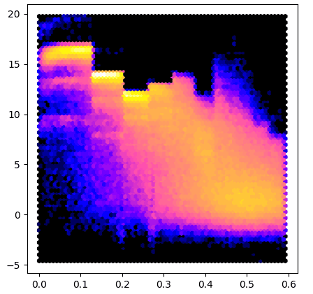
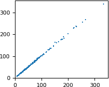
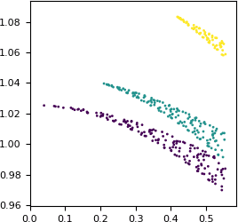

Reciprocal space
################

This section is primarily for people working with crystallographic data.

Gemmi supports three reflection file formats:

* MTZ files -- the most popular format in macromolecular crystallography,
* structure factor mmCIF files -- used for data archiving
  in the Protein Data Bank,
* and small molecule structure factor CIF files (usually with extension hkl).

Reflection files store Miller indices (*hkl*) with various associated
numbers. Initially, the numbers represent observations derived from
diffraction images (reflection intensities and error estimates).
Then other quantities derived from these are added,
as well as quantities derived from a macromolecular model
that is built to explain the experimental data.

Even electron density maps, which are used in the real space, are nowadays
stored mostly as map coefficients in reflection files.
Molecular viewers can Fourier-transform them on the fly and show
in the real space. Therefore, switching between the real and reciprocal space
is also included in Gemmi, as well as calculation of structure factors
from the model.

MTZ format
==========

MTZ format has textual headers and a binary data table, where all numbers
are stored in a 32-bit floating point format.
The headers, as well as data, are stored in class ``Mtz``.
The columns of data are grouped hierarchically (Project -> Crystal -> Dataset
-> Column), but normally the column name is all that is needed,
and the hierarchy can be ignored. In Gemmi, the hierarchy is flattened:
we have a list of columns and a list of datasets.
Each columns is associated with one dataset, and each dataset has properties
``dataset_name``, ``project_name`` and ``crystal_name``,
which is enough to reconstruct the tree-like hierarchy if needed.

Reading
-------

In C++, the MTZ file can be read using either stand-alone functions::

  Mtz read_mtz_file(const std::string& path)
  template<typename Input> Mtz read_mtz(Input&& input, bool with_data)

or member functions of the Mtz class, when more control over the reading
process is needed.

In Python, we have a single function for reading MTZ files:

.. doctest::

  >>> import gemmi
  >>> mtz = gemmi.read_mtz_file('../tests/5e5z.mtz')

The Mtz class has a number of properties read from the MTZ header
(they are the same in C++ and Python):

.. doctest::

  >>> mtz.cell        # from MTZ record CELL
  <gemmi.UnitCell(9.643, 9.609, 19.029, 90, 101.224, 90)>
  >>> mtz.spacegroup  # from SYMINF
  <gemmi.SpaceGroup("P 1 21 1")>
  >>> mtz.title       # from TITLE
  ''
  >>> mtz.history     # from history lines
  ['From cif2mtz 17/ 5/2019 12:15:14']

  >>> # The properties below are also read from the MTZ file,
  >>> # although they could be recalculated from the data.
  >>> mtz.nreflections   # from MTZ record NCOL
  441
  >>> mtz.min_1_d2       # from RESO
  0.0028703967109323008
  >>> mtz.max_1_d2       # from RESO
  0.36117017269134527

The resolution can also be checked using functions:

.. doctest::

  >>> mtz.resolution_low()   # sqrt(1 / min_1_d2)
  18.665044863474492
  >>> mtz.resolution_high()  # sqrt(1 / max_1_d2)
  1.6639645192598425

Importantly, Mtz class has a list of datasets and a list of columns.
Datasets are stored in the variable ``datasets``::

  std::vector<Mtz::Dataset> Mtz::datasets

.. doctest::

  >>> mtz.datasets
  MtzDatasets[<gemmi.Mtz.Dataset 0 HKL_base/HKL_base/HKL_base>, <gemmi.Mtz.Dataset 1 5e5z/5e5z/1>]

In the MTZ file, each dataset is identified internally by an integer
"dataset ID". To get dataset with the specified ID use function::

  Dataset& Mtz::dataset(int id)

.. doctest::

  >>> mtz.dataset(0)
  <gemmi.Mtz.Dataset 0 HKL_base/HKL_base/HKL_base>

Dataset has a few properties that can be accessed directly::

  struct Dataset {
    int number;
    std::string project_name;
    std::string crystal_name;
    std::string dataset_name;
    UnitCell cell;
    double wavelength = 0.;
  };

Python bindings provide the same properties:

.. doctest::

  >>> mtz.dataset(0).project_name
  'HKL_base'
  >>> mtz.dataset(0).crystal_name
  'HKL_base'
  >>> mtz.dataset(0).dataset_name
  'HKL_base'
  >>> mtz.dataset(0).cell
  <gemmi.UnitCell(9.643, 9.609, 19.029, 90, 101.224, 90)>
  >>> mtz.dataset(0).wavelength
  0.0

Columns are stored in variable ``columns``::

  std::vector<Mtz::Column> Mtz::columns

.. doctest::

  >>> mtz.columns[0]
  <gemmi.Mtz.Column H type H>
  >>> len(mtz.columns)
  8

To get the first column with the specified label use functions:

.. doctest::

  >>> mtz.column_with_label('FREE')
  <gemmi.Mtz.Column FREE type I>

If the column names are not unique, you may specify the dataset:

.. doctest::

  >>> mtz.column_with_label('FREE', mtz.dataset(0))
  >>> # None
  >>> mtz.column_with_label('FREE', mtz.dataset(1))
  <gemmi.Mtz.Column FREE type I>

To get all columns of the specified type use:

.. doctest::

  >>> mtz.columns_with_type('Q')
  MtzColumnRefs[<gemmi.Mtz.Column SIGFP type Q>, <gemmi.Mtz.Column SIGI type Q>]

Column has properties read from MTZ headers COLUMN and COLSRC::

  struct Column {
    int dataset_id;
    char type;
    std::string label;
    float min_value = NAN;
    float max_value = NAN;
    std::string source;  // from COLSRC
    // (and functions and variables that help in accessing data)
  };

Python bindings provide the same properties:

.. doctest::

  >>> intensity = mtz.column_with_label('I')
  >>> intensity.dataset_id
  1
  >>> intensity.type
  'J'
  >>> intensity.label
  'I'
  >>> intensity.min_value, intensity.max_value
  (-0.30090001225471497, 216.60499572753906)
  >>> intensity.source
  'CREATED_17/05/2019_12:15:14'

C++ function ``Mtz::Column::size()`` is wrapped in Python as ``__len__``:

.. doctest::

  >>> len(intensity)
  441

In both C++ and Python ``Column`` supports the iteration protocol:

.. doctest::
  :skipif: numpy is None

  >>> [x for x in intensity if x > 100]
  [124.25700378417969, 100.08699798583984, 216.60499572753906]
  >>> numpy.nanmean(intensity)
  11.505858

In Python we also have a read-only ``array`` property that provides
a view of the data compatible with NumPy. It does not copy the data,
so the data is not contiguous (because it's stored row-wise in MTZ):

.. doctest::

  >>> intensity.array.strides
  (32,)

Here is an example that uses the array property
to make a plot similar to `AUSPEX <http://www.auspex.de/>`_:

.. literalinclude:: ../examples/mtz_i_sigi.py
  :language: python
  :lines: 4-

To test this program we run it on data from 5DEI and we get result
similar to `#3 <http://www.auspex.de/pathol/#3>`_:

Another way to access all the MTZ data in Python is through the
`buffer protocol <https://docs.python.org/3/c-api/buffer.html>`_:
For example, to view the data as 2D NumPy array (C-style contiguous)
without copying do:

.. doctest::
  :skipif: numpy is None

  >>> import numpy
  >>> all_data = numpy.array(mtz, copy=False)

It helps to have labels on the columns. A good data structure for this
is Pandas DataFrame:

.. doctest::
  :skipif: pandas is None

  >>> import pandas
  >>> df = pandas.DataFrame(data=all_data, columns=mtz.column_labels())
  >>> # now we can handle columns using their labels:
  >>> I_over_sigma = df['I'] / df['SIGI']

The data in numpy array is float32. To cast Miller indices in the DataFrame
to integer type:

.. doctest::
  :skipif: pandas is None

  >>> df = df.astype({name: 'int32' for name in ['H', 'K', 'L']})

You may also have a look at a different project (not associated with Gemmi)
for working with reflection data in Python:
`ReciprocalSpaceship <https://hekstra-lab.github.io/reciprocalspaceship/>`_.

Modifying
---------

To change the data in Mtz object we can use function set_data().
In Python, we pass to this function a 2D NumPy array of floating point numbers.

In the previous section, we got such an array (``all_data``)
with the original data.
Now, as an example, let us remove reflections with the resolution
above 2Å (i.e. *d* < 2Å) and copy the result back into ``mtz``.
To show that it really has an effect we print the appropriate
:ref:`grid size <grid_size>` before and after:

.. doctest::
  :skipif: numpy is None

  >>> mtz.get_size_for_hkl()
  [12, 12, 24]
  >>> mtz.set_data(all_data[mtz.make_d_array() >= 2.0])
  >>> mtz.get_size_for_hkl()
  [10, 10, 20]

The metadata in an ``Mtz`` object can also be modified.
To illustrate it, we will create a complete ``Mtz`` object from scratch.
The code below is in Python, but all the functions and properties have
equivalents with the same names in C++.

We start from creating an object and setting its space group and unit cell:

.. doctest::

  >>> mtz = gemmi.Mtz()
  >>> mtz.spacegroup = gemmi.find_spacegroup_by_name('P 21 21 2')
  >>> mtz.cell.set(77.7, 149.5, 62.4, 90, 90, 90)

Now we need to add datasets and columns.

.. doctest::

  >>> mtz.add_dataset('HKL_base')
  <gemmi.Mtz.Dataset 0 HKL_base/HKL_base/HKL_base>

The name passed to ``add_dataset()`` is used to set ``dataset_name``,
``crystal_name`` and ``project_name``. These three names are often
kept the same, but if needed, they can be changed afterwards.

The MTZ format stores general, per file cell dimensions (keyword CELL),
as well per dataset ones (keyword DCELL).
Function ``add_dataset`` initializes the latter from the former.
This also can be changed afterwards.

The first three columns must always be Miller indices:

.. doctest::

  >>> for label in ['H', 'K', 'L']: mtz.add_column(label, 'H')
  <gemmi.Mtz.Column H type H>
  <gemmi.Mtz.Column K type H>
  <gemmi.Mtz.Column L type H>

Let's add two more columns in a separate dataset:

.. doctest::

  >>> mtz.add_dataset('synthetic')
  <gemmi.Mtz.Dataset 1 synthetic/synthetic/synthetic>
  >>> mtz.add_column('F', 'F')
  <gemmi.Mtz.Column F type F>
  >>> mtz.add_column('SIGF', 'Q')
  <gemmi.Mtz.Column SIGF type Q>

By default, the new column is assigned to the last dataset
and is placed at the end of the column list.
But we can choose any dataset and position:

.. doctest::

  >>> mtz.add_column('FREE', 'I', dataset_id=0, pos=3)
  <gemmi.Mtz.Column FREE type I>
  >>> mtz.column_labels()
  ['H', 'K', 'L', 'FREE', 'F', 'SIGF']

Now it is time to add data.
We will use the ``set_data()`` function that takes 2D NumPy array
of floating point numbers (even indices are converted to floats,
but they need to be converted at some point anyway -- the MTZ format
stores all numbers as 32-bit floats).

.. doctest::
  :skipif: numpy is None

  >>> data = numpy.array([[4, 13, 8, 1, 453.9, 19.12],
  ...                     [4, 13, 9, 0, 102.0, 27.31]], numpy.float)
  >>> mtz.set_data(data)
  >>> mtz
  <gemmi.Mtz with 6 columns, 2 reflections>

In C++ the ``set_data`` function takes a pointer to row-wise ordered data
and its size (columns x rows)::

  void Mtz::set_data(const float* new_data, size_t n)

To update properties ``min_1_d2`` and ``max_1_d2`` call ``update_reso()``:

.. doctest::

  >>> mtz.update_reso()
  >>> mtz.min_1_d2, mtz.max_1_d2
  (0.02664818727144997, 0.03101414716625602)

You do not need to call ``update_reso()`` before writing an MTZ file --
the values for the RESO record are re-calculated automatically when the file
is written.

Writing
-------

In C++, the MTZ file can be written to a file using one of the functions::

  void Mtz::write_to_stream(std::FILE* stream) const
  void Mtz::write_to_file(const std::string& path) const

and in Python using:

.. doctest::

  >>> mtz.write_to_file('output.mtz')

SF mmCIF
========

The mmCIF format is also used to store reflection data from crystallographic
experiments. Reflections and coordinates are normally stored in separate
mmCIF files. The files with reflections are called structure factor mmCIF
or shortly SF mmCIF. Such file for the 1ABC PDB entry
is usually named either ``1ABC-sf.cif`` (if downloaded through RCSB website)
or ``r1abcsf.ent`` (if downloaded through PDBe website or through FTP).

SF mmCIF files usually contain one block, but may have
multiple blocks, for example merged and unmerged data in separate blocks.
Merged and unmerged data is expected in mmCIF categories ``_refln``
and ``_diffrn_refln``, respectively.
Usually, also the unit cell, space group, and sometimes the radiation
wavelength is recorded.

The support for SF mmCIF files in Gemmi is built on top of the generic
support for the CIF format.
We have class ``ReflnBlock`` that wraps ``cif::Block``
and a function ``as_refln_blocks``::

  // in C++ it can be called:
  // auto rblocks = gemmi::as_refln_blocks(gemmi::read_cif_gz(path).blocks);
  std::vector<ReflnBlock> as_refln_blocks(std::vector<cif::Block>&& blocks)

In Python this function takes ``cif.Document`` as an argument:

.. doctest::

  >>> doc = gemmi.cif.read('../tests/r5wkdsf.ent')
  >>> doc
  <gemmi.cif.Document with 1 blocks (r5wkdsf)>
  >>> rblocks = gemmi.as_refln_blocks(doc)

Blocks are moved from the Document to the new list:

.. doctest::

  >>> doc
  <gemmi.cif.Document with 0 blocks ()>
  >>> rblocks
  ReflnBlocks[<gemmi.ReflnBlock r5wkdsf with 17 x 406 loop>]

When ReflnBlock is created some of the mmCIF tags are interpreted
to initialize the following properties:

.. doctest::

  >>> rblock = rblocks[0]
  >>> rblock.entry_id
  '5wkd'
  >>> rblock.cell
  <gemmi.UnitCell(50.347, 4.777, 14.746, 90, 101.733, 90)>
  >>> rblock.spacegroup
  <gemmi.SpaceGroup("C 1 2 1")>
  >>> rblock.wavelength
  0.9791

To check if block has either merged or unmerged data, in C++ use function
``ok()``, and in Python:

.. doctest::

  >>> bool(rblock)
  True

Normally, one block has only one type of data, merged and unmerged.
Which one is used can be checked with the function:

.. doctest::

  >>> rblock.is_unmerged()
  False

But it is syntactically correct to have both types of data in two tables
in one block. In such case you can switch which table is used:

.. doctest::

  >>> rblock.use_unmerged(True)
  >>> rblock.use_unmerged(False)

Finally, ReflnBlock has functions for working with the data table::

  std::vector<std::string> ReflnBlock::column_labels() const

  size_t ReflnBlock::get_column_index(const std::string& tag) const

  template<typename T>
  std::vector<T> ReflnBlock::make_vector(const std::string& tag, T null) const

  std::vector<std::array<int,3>> ReflnBlock::make_index_vector() const

  std::vector<double> ReflnBlock::make_1_d2_vector() const

  std::vector<double> ReflnBlock::make_d_vector() const

We will describe these functions while going through its Python equivalents.
``column_labels()`` returns list of tags associated with the columns,
excluding the category part. Unlike in the MTZ format, here the tags
must be unique.

.. doctest::

  >>> rblock.column_labels()
  ['crystal_id', 'wavelength_id', 'scale_group_code', 'index_h', 'index_k', 'index_l', 'status', 'pdbx_r_free_flag', 'F_meas_au', 'F_meas_sigma_au', 'F_calc_au', 'phase_calc', 'pdbx_FWT', 'pdbx_PHWT', 'pdbx_DELFWT', 'pdbx_DELPHWT', 'fom']

All the data is stored as strings. We can get integer or real values from
the selected column in an array. In Python -- in NumPy array:

.. doctest::
  :skipif: numpy is None
  :hide:

  >>> numpy.set_printoptions(threshold=5)

.. doctest::
  :skipif: numpy is None

  >>> rblock.make_int_array('index_h', -1000)  # 2nd arg - value for nulls
  array([-26, -26, -26, ...,  25,  26,  26], dtype=int32)

  >>> rblock.make_float_array('F_meas_au')  # by default, null values -> NAN
  array([12.66, 13.82, 24.11, ...,   nan,  9.02,   nan])
  >>> rblock.make_float_array('F_meas_au', 0.0)  # use 0.0 for nulls
  array([12.66, 13.82, 24.11, ...,  0.  ,  9.02,  0.  ])

We also have convenience functions that returns arrays of 1/*d*:sup:`2`
or just *d* values:

.. doctest::

  >>> rblock.make_1_d2_array().round(4)
  array([0.2681, 0.2677, 0.2768, ..., 0.301 , 0.2782, 0.2978])
  >>> rblock.make_d_array().round(3)
  array([1.931, 1.933, 1.901, ..., 1.823, 1.896, 1.832])

**Example 1**

The script below renders the same colorful *I*/*σ* image as in the previous
section, but it can take as an argument a file downloaded directly from
the wwPDB (for example,
``$PDB_DIR/structures/divided/structure_factors/de/r5deisf.ent.gz``).

.. literalinclude:: ../examples/cif_i_sigi.py
  :language: python
  :lines: 4-

**Example 2**

In this example we compare columns from two files using Python pandas.

Here we use the 5WKD entry, which has only 367 measured reflections,
but the same script works fine even for 1000x more reflections.
You'd only need to tweak the plots to make them more readable.

We use two data files (SF-mmCIF MTZ) downloaded from the RCSB website.
First, we make pandas DataFrames from both files, and then we merge them
into a single DataFrame:

.. literalinclude:: ../examples/merge_mtz_mmcif.py
  :language: python
  :lines: 4-27

We want to compare the FP column from the MTZ file and the F_meas_au column
from mmCIF. We start with plotting one against the other:

.. literalinclude:: ../examples/merge_mtz_mmcif.py
  :language: python
  :lines: 30-37

The numbers are similar, but not exactly equal.
Let us check how the difference between the two values depends on the
resolution. We will plot the difference as a function of 1/*d*.
This extremely small dataset has only three Miller indices *k* (0, 1 and 2),
so we can use it for coloring.

.. literalinclude:: ../examples/merge_mtz_mmcif.py
  :language: python
  :lines: 40-

Apparently, some scaling has been applied. The scaling is anisotropic
and is the strongest along the *k* axis.

hkl CIF
=======

In the small molecule world reflections are also stored in separate CIF files.
Similarly to SF mmCIF files, we may take cif::Block and wrap it into
the ReflnBlock class:

.. doctest::

  >>> doc = gemmi.cif.read('../tests/2242624.hkl')
  >>> gemmi.hkl_cif_as_refln_block(doc[0])
  <gemmi.ReflnBlock 2242624 with 7 x 71 loop>

The methods of ReflnBlock are the same as in the previous section.

.. doctest::

  >>> print(_.make_d_array(), _.make_float_array('F_squared_meas'), sep='\n')
  [1.7710345  1.03448487 0.71839568 ... 0.67356073 0.69445847 0.56034145]
  [173.17 246.01  11.61 ...  84.99  46.98  16.99]

These hkl files in the CIF format are not to be confused with the SHELX hkl
files. The latter is often included in the coordinate cif file,
as a text value of _shelx_hkl_file:

.. doctest::

  >>> cif_doc = gemmi.cif.read('../tests/4003024.cif')
  >>> hkl_str = gemmi.cif.as_string(cif_doc[0].find_value('_shelx_hkl_file'))
  >>> print(hkl_str[:87])
  <BLANKLINE>
    -1   0   0   20.05    0.74
     0   0  -1   20.09    0.73
     0   0   1   19.76    0.73

Data on 3D grid
===============

The reciprocal space data can be alternatively presented on a 3D grid
indexed by Miller indices.
This grid is represented by C++ class ReciprocalGrid,
which shares most of the properties with the real-space
class :ref:`Grid <grid>`.

In C++, the ``<gemmi/fourier.hpp>`` header defines templated function
``get_f_phi_on_grid()`` that can be used with both MTZ and SF mmCIF data.
Here, we focus on the usage from Python.

Both Mtz and ReflnBlock classes have method ``get_f_phi_on_grid``
that takes three mandatory arguments: column names for the amplitude and phase,
and the grid size.
It returns reciprocal grid of complex numbers
(``ReciprocalGrid<std::complex<float>>`` in C++,
``ReciprocalComplexGrid`` in Python).
Symmetry-related reflections are filled automatically (with phase shift).
All the missing values are set to 0:

.. doctest::

  >>> grid = rblock.get_f_phi_on_grid('pdbx_FWT', 'pdbx_PHWT', [54,6,18])
  >>> grid
  <gemmi.ReciprocalComplexGrid(54, 6, 18)>

If we'd ever need data from a single column put on a grid,
we can use analogical function:

.. doctest::

  >>> rblock.get_value_on_grid('F_meas_au', [54,6,18])
  <gemmi.ReciprocalFloatGrid(54, 6, 18)>

The grids in examples above have capacity to store reflections
with -27<*h*\ <27, -3<*k*\ <3 and -9<*l*\ <9.
Reflections outside of this range would be silently ignored.
To check if the size is big enough you can call:

.. doctest::

  >>> rblock.data_fits_into([54,6,18])
  True
  >>> rblock.data_fits_into([52,6,18])
  False

To access the data you can use either the buffer protocol
(:ref:`in the same way <buffer_protocol>` as in the Grid class),
or getter and setter:

.. doctest::

  >>> grid.get_value(7, 1, -5)
  (31.747737884521484-57.06287384033203j)
  >>> grid.set_value(7, 1, -5, 12+34j)
  >>> grid.get_value(7, 1, -5)
  (12+34j)

The functions above throw IndexError if the reflection is outside of the grid.
If you prefer zero instead of the error, use:

.. doctest::

  >>> grid.get_value_or_zero(20, 30, 40)
  0j

We can also iterate over points of the grid.

.. doctest::

  >>> for point in grid:
  ...    pass
  >>> point.value  # point is the last point from the iteration
  (-178.310546875+99.20561218261719j)
  >>> grid.to_hkl(point)
  [-1, -1, -1]

.. _grid_size:

Grid size
---------

To get an appropriate size, we can use method ``get_size_for_hkl``
that has two optional parameters: ``min_size`` and ``sample_rate``.
``min_size`` sets explicitely the minimal size of the grid:

.. doctest::

  >>> rblock.get_size_for_hkl()
  [54, 6, 18]
  >>> rblock.get_size_for_hkl(min_size=[64,8,0])
  [64, 8, 18]

The actual size can be increased to make room for all reflections,
to obey restrictions imposed by the spacegroup, and to make the size
FFT-friendly (currently this means factors 2, 3 and 5).

``sample_rate`` sets the minimal grid size in relation to *d*:sub:`min`.
It has the same meaning as the keyword SAMPLE in the CCP4 FFT program.
For example, ``sample_rate=3`` requests grid size that corresponds
to real-space sampling *d*:sub:`min`/3.
(N.B. 3 here is equivalent to Clipper oversampling parameter equal 1.5).

.. doctest::

  >>> rblock.get_size_for_hkl(sample_rate=3.0)
  [90, 8, 30]

Array layout
------------

The ``get_f_phi_on_grid`` function has also two optional arguments:
``half_l`` and ``axis_order``.
The ``half_l`` flag is used to shrink the size of the grid in the memory.
When set, the grid does not include data with negative index *l*.
If the data is Hermitian, i.e. if it is a Fourier transform of
the real data (electron density), the (*h* *k* *l*) reflection
with negative *l* can be restored as a complex conjugate of its Friedel mate
(*-h* *-k* *-l*).

.. doctest::

  >>> rblock.get_f_phi_on_grid('pdbx_FWT', 'pdbx_PHWT', [54,6,18], half_l=True)
  <gemmi.ReciprocalComplexGrid(54, 6, 10)>

``axis_order`` can take one of the two values : ``AxisOrder.XYZ`` (the default)
or ``AxisOrder.ZYX``. With the former -- the *h* direction is along the first
(fast) axis of the grid. The latter results in *l* along the fast axis.
(The fast axis is first, which is a Fortran convention. This convention
affected the design of the CCP4 format, which in turn affected the design of
the grid classes in Gemmi.)

.. doctest::

  >>> rblock.get_f_phi_on_grid('pdbx_FWT', 'pdbx_PHWT', [54,6,18], order=gemmi.AxisOrder.ZYX)
  <gemmi.ReciprocalComplexGrid(18, 6, 54)>

Example
-------

As an example, we will use numpy.fft to calculate electron density map
from map coefficients. Gemmi can calculate it internally, as described
in the next section, but it is instructive to do it with a general-purpose
tool.

.. doctest::
  :skipif: numpy is None

  >>> size = rblock.get_size_for_hkl(sample_rate=2.6)
  >>> full = rblock.get_f_phi_on_grid('pdbx_FWT', 'pdbx_PHWT', size)
  >>> array = numpy.array(full, copy=False)
  >>> complex_map = numpy.fft.ifftn(array.conj())
  >>> scale_factor = complex_map.size / full.unit_cell.volume
  >>> real_map = numpy.real(complex_map) * scale_factor
  >>> round(real_map[1][2][3], 5)
  -0.40554
  >>> round(real_map.std(), 5)
  0.66338

Above, we could use ``fftn(array)`` instead of ``ifftn(array.conj())``,
but the inverse FFT is more appropriate here (or so I think).

Since the data is Hermitian, using complex-to-complex FFT is equivant to
using complex-to-real FFT on a half of the data:

.. doctest::
  :skipif: numpy is None

  >>> half = rblock.get_f_phi_on_grid('pdbx_FWT', 'pdbx_PHWT', size, half_l=True)
  >>> array = numpy.array(half, copy=False)
  >>> real_map = numpy.fft.irfftn(array.conj()) * scale_factor
  >>> round(real_map[1][2][3], 5)
  -0.40554
  >>> round(real_map.std(), 5)
  0.66338

FFT
===

Internally, Gemmi is using
the `PocketFFT <https://gitlab.mpcdf.mpg.de/mtr/pocketfft>`_ library
to transform between real space and reciprocal space.
This library was picked after evaluation and
`benchmarking of many FFT libraries <https://github.com/project-gemmi/benchmarking-fft>`_.

In C++, the relevant functions are in the ``<gemmi/fourier.hpp>`` header,
and the :ref:`gemmi-sf2map <sf2map>` program may serve as a code example.
Like in the previous section, here we will cover only the Python interface.

Instead of using numpy.fft as in the example above,
we can use ``gemmi.transform_f_phi_grid_to_map()``
and we expect to get the same result (wrapped in a :ref:`Grid <grid>` class):

.. doctest::

  >>> gemmi.transform_f_phi_grid_to_map(half)
  <gemmi.FloatGrid(72, 8, 24)>
  >>> round(_.get_value(1, 2, 3), 5)
  -0.40554

Both Mtz and ReflnBlock classes have method ``transform_f_phi_to_map``
that combines ``get_f_phi_on_grid()`` with ``transform_f_phi_grid_to_map()``.

``transform_f_phi_to_map`` takes column names for amplitude and
phase (in degrees), and optional parameters ``min_size``, ``exact_size`` and
``sample_rate`` (normally only one of them is given):

.. doctest::

  >>> rblock.transform_f_phi_to_map('pdbx_FWT', 'pdbx_PHWT', sample_rate=4)
  <gemmi.FloatGrid(120, 12, 36)>
  >>> rblock.transform_f_phi_to_map('pdbx_FWT', 'pdbx_PHWT', min_size=[127,16,31])
  <gemmi.FloatGrid(128, 16, 32)>
  >>> rblock.transform_f_phi_to_map('pdbx_FWT', 'pdbx_PHWT', exact_size=[70,8,24])
  <gemmi.FloatGrid(70, 8, 24)>

The grid can be accessed as NumPy 3D array:

.. doctest::
  :skipif: numpy is None

  >>> array = numpy.array(_, copy=False)
  >>> round(array.std(), 5)
  0.66338

and it can be stored in a CCP4 map format:

.. doctest::

  >>> ccp4 = gemmi.Ccp4Map()
  >>> ccp4.grid = rblock.transform_f_phi_to_map('pdbx_FWT', 'pdbx_PHWT', sample_rate=2.6)
  >>> ccp4.update_ccp4_header(2, True)
  >>> ccp4.write_ccp4_map('5wkd.ccp4')

To transform the electron density back to reciprocal space coefficients
use function ``transform_map_to_f_phi``:

.. doctest::

  >>> ccp4.grid
  <gemmi.FloatGrid(72, 8, 24)>
  >>> gemmi.transform_map_to_f_phi(ccp4.grid)
  <gemmi.ReciprocalComplexGrid(72, 8, 24)>

Now you can access hkl reflections using ``Grid.get_value()``:

.. doctest::

  >>> _.get_value(23, -1, -3)
  (18.440279006958008+26.18924331665039j)

``transform_map_to_f_phi`` has one optional flag: ``half_l``.
It has the same meaning as in the function ``get_f_phi_on_grid``.
When you set ``half_l=True`` you cannot access directly a data point
with negative Miller index l, but you can use its Friedel mate:

.. doctest::

  >>> gemmi.transform_map_to_f_phi(ccp4.grid, half_l=True)
  <gemmi.ReciprocalComplexGrid(72, 8, 13)>
  >>> _.get_value(-23, 1, 3).conjugate()  # value for (23, -1, -3)
  (18.440279006958008+26.18924331665039j)

Then again, you can use ``transform_f_phi_grid_to_map()``
to transform it back to the direct space, and so on...

Scattering factors
==================

Atomic form factor
------------------

TODO

(also: direct calculation or FFT, tradoffs between performance and accuracy)

.. _anomalous:

Anomalous scattering
--------------------

The anomalous dispersion is wavelength dependent.
Gemmi provides function ``cromer_libermann`` that calculates
real and imaginary components *f'* and *f"*
for isolated atoms from Z=3 to Z=92.

As the name suggests, we use the Cromer-Libermann algorithm.
This algorithm, as is noted on the
`pyFprime website <https://subversion.xray.aps.anl.gov/trac/pyFprime/>`_,
"fails in computing *f'* for wavelengths < 0.16 Å (> 77.48 keV)
for the heaviest elements (Au-Cf)
and fails to correctly compute *f'*, *f"* and *μ*
for wavelengths > 2.67 Å (< 4.64 keV) for very heavy elements (Am-Cf)."

The implementation is contained in a single C++ header file
:file:`fprime.hpp` with no dependencies.
All the data is embedded in the code.
The binary size after compilation is about 100kB.

Admittedly, the data tables synthesised by C.T. Chantler are more accurate.
Consider using them instead. They are available from the
`NIST website <https://www.nist.gov/pml/x-ray-form-factor-attenuation-and-scattering-tables>`_
and from the `XrayDB <https://github.com/xraypy/XrayDB>`_ project.

The code in :file:`fprime.hpp` is based on the X-ray spectroscopy project
`Larch <https://xraypy.github.io/xraylarch/>`_
and should give the same results as the
`f1f2_cl <https://xraypy.github.io/xraylarch/xray/index.html#_xray.f1f2_cl>`_
function there. The Fortran code in Larch is, in turn, based on the
`Brennan and Cowan <https://aip.scitation.org/doi/10.1063/1.1142625>`_
routines. Which, in turn, were based on the
`original program <https://doi.org/10.1107/S0021889883010791>`_
from Don Cromer. Along the way, the code was extensively modified.
Importantly, the Jensen correction has been removed (as is recommended
in the chapter 4.2.6 of `ITvC <https://it.iucr.org/Cb/contents/>`_)
and the `Kissel and Pratt (1990) <https://doi.org/10.1107/S0108767389010718>`_
correction has been added.
Therefore, it gives different results than the
`crossec <http://www.ccp4.ac.uk/html/crossec.html>`_ program,
which was contributed to CCP4 directly by Don Cromer in the 1990's.

The ``cromer_libermann`` function is available in both C++ and Python:

.. doctest::

  >>> gemmi.Element('Se').atomic_number
  34
  >>> gemmi.cromer_libermann(z=_, energy=10332.0) # energy in eV
  (-1.4186231113544407, 0.7238969498014027)
  >>> # use gemmi.hc to convert wavelength [A] to energy [eV]
  >>> gemmi.cromer_libermann(z=34, energy=gemmi.hc/0.71073)
  (-0.09201659699543367, 2.2333699118331087)

The same values can be printed from the command line program
:ref:`gemmi-fprime <fprime>`.

Bulk solvent correction
-----------------------

TODO

