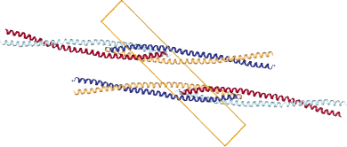
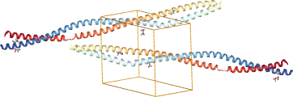

.. highlight:: cpp

.. _molecular:

Molecular models
################

In this section we show how to handle structural models of
biomolecules (to some degree, it also applies to small molecules
and inorganic structures).

Models from a single file (PDB, mmCIF, etc.) are stored in the ``Structure``
class, with the usual Model-Chain-Residue-Atom hierarchy.
Gemmi provides basic functions to access and manipulate the structure,
and on top of it more complex functions, such as
neighbor search, calculation of dihedral angles, removal of ligands from
a model, etc.

Comparing with tools rooted in bioinformatics:

* Gemmi focuses more on working with incomplete models
  (on all stages before they are published and submitted to the PDB),
* and Gemmi is aware of the neighbouring molecules that are implied by
  the crystallographic and non-crystallographic symmetry.

.. _elements:

Elements
========

When working with molecular structures it is good to have basic data
from the periodic table at hand.

**C++**

.. literalinclude:: code/elem.cpp

**Python**

.. doctest::

    >>> import gemmi
    >>> gemmi.Element('Mg').weight
    24.305
    >>> gemmi.Element(118).name
    'Og'
    >>> gemmi.Element('Mo').atomic_number
    42

.. _covalent_radius:

We also included covalent radii of elements from a
`Wikipedia page <https://en.wikipedia.org/wiki/Covalent_radius>`_,
which has data from
Cordero *et al* (2008), *Covalent radii revisited*, Dalton Trans. 21, 2832.

.. doctest::

    >>> gemmi.Element('Zr').covalent_r
    1.75

van der Waals radii taken from Wikipedia and cctbx:

.. doctest::

    >>> gemmi.Element('K').vdw_r
    2.75

and a flag for metals (the classification is somewhat arbitrary):

.. doctest::

    >>> gemmi.Element('Mg').is_metal
    True
    >>> gemmi.Element('C').is_metal
    False

Small Molecules
===============

CIF files that describe small-molecule and inorganic structures
can be read into an SmallStructure object.
Unlike macromolecular Structure, SmallStructure has no hierarchy.
It is just a flat list of atomic sites (``SmallStructure::Site``)
together with the unit cell and symmetry.

.. literalinclude:: code/smcif.cpp

.. doctest::

    >>> import gemmi
    >>> SiC = gemmi.read_small_structure('../tests/1011031.cif')
    >>> SiC.cell.a
    4.358
    >>> SiC.spacegroup_hm
    'F -4 3 m'
    >>> SiC.find_spacegroup()
    <gemmi.SpaceGroup("F -4 3 m")>
    >>> SiC.sites
    [<gemmi.SmallStructure.Site Si1>, <gemmi.SmallStructure.Site C1>]
    >>> len(SiC.get_all_unit_cell_sites())
    8
    >>> site = SiC.sites[0]
    >>> site.label
    'Si1'
    >>> site.type_symbol
    'Si4+'
    >>> site.fract
    <gemmi.Fractional(0, 0, 0)>
    >>> site.occ
    1.0
    >>> site.u_iso  # not specified here
    0.0
    >>> site.element  # obtained from type_symbol 'Si4+'
    <gemmi.Element: Si>
    >>> site.charge   # obtained from type_symbol 'Si4+'
    4

Occupancies in small molecules normally represent the real, chemical occupancy.
This differs from macromolecular crystallography, where models normally store
"crystallographic" occupancy -- atoms on special positions have occupancy
divided by the number of symmetry images in the same place.
This reduction of occupancies simplifies calculation of structure factors.

.. doctest::

    >>> 1 / site.occ
    1.0
    >>> SiC.change_occupancies_to_crystallographic()
    >>> 1 / site.occ
    24.0

We will need another cif file to show anisotropic ADPs and disorder_group:

.. doctest::

    >>> perovskite = gemmi.read_small_structure('../tests/4003024.cif')
    >>> for site in perovskite.sites:
    ...   print(site.label, site.aniso.nonzero(), site.disorder_group or 'n/a')
    Cs1 True n/a
    Sn2 False 1
    Cl1 True n/a
    In False 2
    >>> perovskite.sites[2].aniso.u11
    0.103
    >>> perovskite.sites[2].aniso.u22
    0.156
    >>> perovskite.sites[2].aniso.u33
    0.156
    >>> perovskite.sites[2].aniso.u12
    0.0
    >>> perovskite.sites[2].aniso.u13
    0.0
    >>> perovskite.sites[2].aniso.u23
    0.0

If your structure is stored in a macromolecular format (PDB, mmCIF)
you can read it first as macromolecular :ref:`hierarchy <mcra>`
and convert to SmallStructure:

.. doctest::

  >>> gemmi.mx_to_sx_structure(gemmi.read_structure('../tests/HEM.pdb'))
  <gemmi.SmallStructure: HEM>

You could also create SmallStructure from scratch:

.. doctest::

    >>> small = gemmi.SmallStructure()
    >>> small.spacegroup_hm = 'F -4 3 m'
    >>> small.cell = gemmi.UnitCell(4.358, 4.358, 4.358, 90, 90, 90)
    >>> small.setup_cell_images()
    >>> # add a single atom
    >>> site = gemmi.SmallStructure.Site()
    >>> site.label = 'C1'
    >>> site.element = gemmi.Element('C')
    >>> site.fract = gemmi.Fractional(0.25, 0.25, 0.25)
    >>> site.occ = 1
    >>> small.add_site(site)

.. _chemcomp:

Chemical Components
===================

Residues (monomers) and small molecule components of macromolecular models
are called *chemical components*.
Gemmi can use three sources of knowledge about chemical components:

* built-in basic data about 350+ popular components,
* the Chemical Component Dictionary (CCD) maintained by the PDB
  (25,000+ components),
* so-called CIF files compatible with the format of the Refmac/CCP4 monomer
  library.

.. _find_tabulated_residue:

Built-in data
-------------

The built-in data is accessed through the function ``find_tabulated_residue``.
It contains only minimal information about each residue:
assigned category, the "standard" flag (non-standard residues are marked
as HETATM in the PDB, even in polymer), one-letter code,
the number of hydrogens and molecular weight:

.. literalinclude:: code/resinfo.cpp

.. doctest::

    >>> gln = gemmi.find_tabulated_residue('GLN')
    >>> gln.is_amino_acid()
    True
    >>> gln.one_letter_code
    'Q'
    >>> round(gln.weight, 3)
    146.144
    >>> gln.hydrogen_count
    10
    >>> gemmi.find_tabulated_residue('DOD').is_water()
    True
    >>> # PDB marks "non-standard" residues as HETATM.
    >>> # Pyrrolysine is standard - some microbes have it.
    >>> gemmi.find_tabulated_residue('PYL').is_standard()
    True
    >>> gemmi.find_tabulated_residue('MSE').is_standard()
    False

.. _CCD_etc:

CCD and monomer libraries
-------------------------

To get more complete information, including atoms and bonds in the monomer,
we need to first read either the `CCD <https://www.wwpdb.org/data/ccd>`_
or a monomer library.

The CCD :file:`components.cif` file describes all the monomers
(residues, ligands, solvent molecules) from the PDB entries.
Importantly, it contains information about bonds.

.. note::

    The absence of bond information in mmCIF files from wwPDB is a
    `well-known problem <https://www.cgl.ucsf.edu/chimera/data/mmcif-oct2013/mmcif.html>`_,
    mitigated somewhat by PDBe which in parallel to the wwPDB archive has also
    `mmCIF files with connectivity <https://doi.org/10.1093/nar/gkv1047>`_
    and bond-order information;
    and by RCSB which has this information in the
    `MMTF format <https://www.ncbi.nlm.nih.gov/pmc/articles/PMC5473584/#__tag_618683893>`_.

Macromolecular refinement programs need to know more about monomers
than the CCD can tell: they need to know how to restrain the structure.
Therefore, they have own dictionaries of monomers (a.k.a monomer libraries),
such as the Refmac dictionary, where each monomer is described by one cif file.
These libraries are often complemented by user's own cif files.

Gemmi has class ``ChemComp`` that corresponds to the data about a monomer
from either the CCD or a cif file.

.. literalinclude:: ../examples/with_bgl.cpp
   :lines: 13-14,42-47

.. doctest::

    >>> # SO3.cif -> gemmi.ChemComp
    >>> block = gemmi.cif.read('../tests/SO3.cif')[-1]
    >>> so3 = gemmi.make_chemcomp_from_block(block)

It also has class ``MonLib`` that corresponds to a monomer library.
In addition to storing a mapping between residue names and ``ChemComp``\ s,
it also stores information that in the CCP4 monomer library is kept in
:file:`mon_lib_list.cif`: description of chemical links and modifications,
and classification of the residues.

These classes are not documented yet.
The examples in :ref:`graph_analysis`
show how to access the lists of atoms and bonds from ``ChemComp``.

.. _coordinates:

Coordinates and matrices
========================

Coordinates are represented by two classes:

* ``Position`` for coordinates in Angstroms (orthogonal coordinates),
* ``Fractional`` for coordinates relative to the unit cell
  (fractional coordinates).

Both ``Position`` and ``Fractional`` are derived from ``Vec3``,
which has three numeric properties: ``x``, ``y`` and ``z``.

.. doctest::

    >>> v = gemmi.Vec3(1.2, 3.4, 5.6)
    >>> v.y = -v.y
    >>> # it can also be indexed
    >>> v[1]
    -3.4

The only reason to have separate types is to prevent functions that
expect fractional coordinates from accepting orthogonal ones, and vice versa.
In C++ these types are defined in ``gemmi/math.hpp``.

If you have points in space you may want to calculate distances, angles
and dihedral angles:

.. doctest::

    >>> from math import degrees
    >>> p1 = gemmi.Position(0, 0, 0)
    >>> p2 = gemmi.Position(0, 0, 1)
    >>> p3 = gemmi.Position(0, 1, 0)
    >>> p4 = gemmi.Position(-1, 1, 0)
    >>> p1.dist(p2)
    1.0
    >>> degrees(gemmi.calculate_angle(p1, p2, p3))
    45.00000000000001
    >>> degrees(gemmi.calculate_dihedral(p1, p2, p3, p4))
    90.0

Additionally, in C++ you have other functions.
See headers ``gemmi/math.hpp`` and ``gemmi/calculate.hpp``.

----

.. _transform:

Working with macromolecular coordinates involves 3D transformations,
such as crystallographic and non-crystallographic symmetry operations,
and fractionalization and orthogonalization of coordinates.
This requires a tiny bit of linear algebra.

3D transformations tend to be represented either by a 4x4 matrix,
or by a 3x3 matrix and a translation vector. Gemmi uses the latter.
Transformations are represented by the ``Transform`` class
that has two member variables:
``mat`` (of type ``Mat33``) and ``vec`` (of type ``Vec3``, which was
introduced above).

.. doctest::

    >>> tr = gemmi.Transform()  # identity
    >>> tr.mat
    <gemmi.Mat33 [1, 0, 0]
                 [0, 1, 0]
                 [0, 0, 1]>
    >>> tr.vec
    <gemmi.Vec3(0, 0, 0)>

Both ``Vec3`` and ``Mat33`` can be converted to and from Python's list:
In case of ``Mat33`` it is a nested list:

.. doctest::

    >>> tr.vec.fromlist([3.0, 4.5, 5])
    >>> tr.vec.tolist()
    [3.0, 4.5, 5.0]

    >>> # nested listed for Mat33
    >>> m = tr.mat.tolist()
    >>> m
    [[1.0, 0.0, 0.0], [0.0, 1.0, 0.0], [0.0, 0.0, 1.0]]
    >>> m[1][2] = -5
    >>> tr.mat.fromlist(m)
    >>> tr.mat
    <gemmi.Mat33 [1, 0, 0]
                 [0, 1, -5]
                 [0, 0, 1]>

Here is an example that shows a few other properties:

.. doctest::

    >>> # get NCS transformation from an example pdb file
    >>> ncs_op = gemmi.read_structure('../tests/1lzh.pdb.gz').ncs[0].tr
    >>> type(ncs_op)
    <class 'gemmi.Transform'>
    >>> ncs_op.mat
    <gemmi.Mat33 [0.97571, -0.2076, 0.06998]
                 [0.2156, 0.96659, -0.13867]
                 [-0.03885, 0.15039, 0.98786]>
    >>> _.determinant()
    1.0000038877996669
    >>> ncs_op.vec
    <gemmi.Vec3(-14.1959, 0.72997, -30.5229)>

    >>> # is the 3x3 matrix above orthogonal?
    >>> mat = ncs_op.mat
    >>> identity = gemmi.Mat33()
    >>> mat.multiply(mat.transpose()).approx(identity, epsilon=1e-5)
    True

    >>> ncs_op.apply(gemmi.Vec3(20, 30, 40))
    <gemmi.Vec3(1.8895, 28.4929, 12.7262)>
    >>> ncs_op.inverse().apply(_)
    <gemmi.Vec3(20, 30, 40)>

To avoid mixing of orthogonal and fractional coordinates
Gemmi also has ``FTransform``, which is like ``Transform``,
but can be applied only to ``Fractional`` coordinates.

----

Separate classes are used for symmetric 3x3 matrices: SMat33f and SMat33d
(for 32- and 64-bit floating point numbers, respectively).
These classes are used primarily for anisotropic ADP tensors;
their member variables are named ``u11``, ``u22``, ``u33``,
``u12``, ``u13`` and ``u23``. SMat33 classes provide a few methods,
including calculations of eigenvalues and eigenvectors.

.. doctest::

  >>> aniso = perovskite.sites[2].aniso
  >>> aniso.u11
  0.103
  >>> aniso.elements_pdb()    # (u11, u22, u33, u12, u13, u23)
  [0.103, 0.156, 0.156, 0.0, 0.0, 0.0]
  >>> aniso.elements_voigt()  # (u11, u22, u33, u23, u13, u12)
  [0.103, 0.156, 0.156, 0.0, 0.0, 0.0]
  >>> aniso.trace()
  0.41500000000000004
  >>> aniso.determinant()
  0.002506608
  >>> aniso.calculate_eigenvalues()
  [0.103, 0.156, 0.156]

----

.. _box:

We also have a little utility for calculation of bounding boxes.
In two variants: for ``Position`` and ``Fractional``:

.. doctest::

  >>> box = gemmi.PositionBox()
  >>> box.extend(gemmi.Position(-5, 5, 0))
  >>> box.extend(gemmi.Position(4, 4, -1))
  >>> box.minimum
  <gemmi.Position(-5, 4, -1)>
  >>> box.maximum
  <gemmi.Position(4, 5, 0)>
  >>> box.get_size()
  <gemmi.Position(9, 1, 1)>
  >>> box.add_margin(0.5)  # changes both minimum and maximum
  >>> box.get_size()
  <gemmi.Position(10, 2, 2)>

  >>> # Fractional variant works in the same way
  >>> box = gemmi.FractionalBox()

----

In C++ all these types are defined in ``gemmi/math.hpp``.

.. _unitcell:

Unit Cell
=========

When working with a structural model in a crystal we need to know
the unit cell. In particular, we need to be able to switch between
orthogonal and fractional coordinates.
Here are the most important properties and methods of the ``UnitCell`` class:

**C++**

.. literalinclude:: code/cell.cpp

**Python**

.. doctest::

    >>> cell = gemmi.UnitCell(25.12, 39.50, 45.07, 90, 90, 90)
    >>> cell
    <gemmi.UnitCell(25.12, 39.5, 45.07, 90, 90, 90)>
    >>> cell.a, cell.b, cell.c
    (25.12, 39.5, 45.07)
    >>> cell.alpha, cell.beta, cell.gamma
    (90.0, 90.0, 90.0)
    >>> cell.volume
    44720.2568
    >>> cell.fractionalization_matrix
    <gemmi.Mat33 [0.0398089, -0, -0]
                 [0, 0.0253165, 0]
                 [0, 0, 0.0221877]>
    >>> cell.fractionalize(gemmi.Position(10, 10, 10))
    <gemmi.Fractional(0.398089, 0.253165, 0.221877)>
    >>> cell.orthogonalization_matrix
    <gemmi.Mat33 [25.12, 0, 0]
                 [0, 39.5, -0]
                 [0, 0, 45.07]>
    >>> cell.orthogonalize(gemmi.Fractional(0.5, 0.5, 0.5))
    <gemmi.Position(12.56, 19.75, 22.535)>

Next, we can obtain the reciprocal cell:

.. doctest::

    >>> cell.reciprocal()
    <gemmi.UnitCell(0.0398089, 0.0253165, 0.0221877, 90, 90, 90)>

and `metric tensors <https://dictionary.iucr.org/Metric_tensor>`_
in the direct and reciprocal space:

.. doctest::

    >>> cell.metric_tensor().u22
    1560.25
    >>> cell.reciprocal_metric_tensor().u23
    0.0

If the lattice is centered, we can obtain a primitive cell.
We have a function that takes centring type (return value of
``SpaceGroup.centring_type()``), uses matrix from ``centred_to_primitive()``
and returns orthogonalization matrix of a primitive cell:
of the primitive cell:

.. doctest::

    >>> cell.primitive_orth_matrix('I')
    <gemmi.Mat33 [-12.56, 12.56, 12.56]
                 [19.75, -19.75, 19.75]
                 [22.535, 22.535, -22.535]>

This matrix can be used to obtain the G\ :sup:`6` and S\ :sup:`6` vectors,
which are used in Niggli and Selling-Delaunay :ref:`cell reduction <niggli>`.

Function ``is_compatible_with_spacegroup`` checks if the space group
operations don't change the metric tensor elements by more than *ε*
(*ε*\ =0.001 by default):

.. doctest::

    >>> cell.is_compatible_with_spacegroup(gemmi.SpaceGroup('I 2 2 2'))
    True
    >>> cell.is_compatible_with_spacegroup(gemmi.SpaceGroup('P 3'), eps=0.01)
    False

The UnitCell object can also store a list of symmetry transformations.
This list is populated automatically when reading a coordinate file.
It contains crystallographic symmetry operations. In rare cases
when the file defines strict NCS operarations that are not "given"
(MTRIX record in the PDB format or _struct_ncs_oper in mmCIF)
the list contains also the NCS operations.
With this list we can use:

* ``UnitCell::volume_per_image() -> double`` -- returns ``UnitCell::volume``
  divided by the number of the molecule images in the unit cell,

  .. doctest::

    >>> st = gemmi.read_structure('../tests/1pfe.cif.gz')
    >>> st.spacegroup_hm
    'P 63 2 2'
    >>> st.cell.volume / st.cell.volume_per_image()
    12.0

* ``UnitCell::is_special_position(const Position& pos, double max_dist=0.8) -> int`` --
  returns the number of nearby symmetry mates of an atom.
  Non-zero only for atoms on special positions.
  For example, returns 3 for an atom on 4-fold symmetry axis.

  .. doctest::

    >>> # chloride ion in 1PFE is significantly off the special position
    >>> cl = st[0].sole_residue('A', gemmi.SeqId('20'))[0]
    >>> cl
    <gemmi.Atom CL at (-0.3, 23.0, -19.6)>
    >>> round(1.0 / cl.occ)
    6
    >>> st.cell.is_special_position(cl.pos, max_dist=0.5)
    0
    >>> st.cell.is_special_position(cl.pos, max_dist=0.8)
    3
    >>> st.cell.is_special_position(cl.pos, max_dist=1.2)
    5

* ``UnitCell::find_nearest_image(const Position& ref, const Position& pos, Asu asu) -> SymImage`` --
  with the last argument set to ``Asu::Any``,
  it returns the symmetric image of ``pos`` that is nearest to ``ref``.
  The last argument can also be set to ``Asu::Same`` or ``Asu::Different``.

The unit cell can be used to determine interplanar spacing *d*:sub:`hkl`
in the reciprocal space (the resolution corresponding to a reflection):

.. doctest::

    >>> cell.calculate_d([0, 1, 0])
    39.5

Computationally, *d* is calculated from 1/*d*:sup:`2`, so if you
need the latter you can calculate it directly:

.. doctest::

    >>> cell.calculate_1_d2([8, -9, 10])
    0.20256818878283983

When changing a symmetry setting of coordinates or reindexing reflections
we need a new unit cell, which can be obtained with one of functions
``changed_basis_forward()`` and ``changed_basis_backward()``:

.. doctest::

    >>> cell.changed_basis_backward(gemmi.Op('y,z,x'), set_images=True)
    <gemmi.UnitCell(45.07, 25.12, 39.5, 90, 90, 90)>

With ``set_images=False`` the ``images`` list in the new unit cell is empty.
With ``True`` -- it contains transformed original list
(but it doesn't work correctly when the cell volume changes).

Reading coordinate files
========================

Gemmi support the following coordinate file formats:

    * mmCIF (PDBx/mmCIF),
    * PDB (with popular extensions),
    * mmJSON,
    * a binary format (MMTF, binary CIF, or own format) is to be considered.

In this section we show how to read a coordinate file in Gemmi.
In the next sections we will go into details of the individual formats.
Finally, we will show what can be done with a structural model.

C++
---

All the macromolecular coordinate files supported by Gemmi can be opened
using::

  Structure read_structure_file(const std::string& path, CoorFormat format=CoorFormat::Unknown)

  // where CoorFormat is defined as
  enum class CoorFormat { Unknown, Pdb, Mmcif, Mmjson };

For example::

  #include <gemmi/mmread.hpp>
  // ...
  gemmi::Structure st = gemmi::read_structure_file(path);
  std::cout << "This file has " << st.models.size() << " models.\n";

In this example the file format is not specified and is determined from
the file extension.

``gemmi::Structure`` is defined in ``gemmi/model.hpp`` and
it will be documented :ref:`later on <mcra>`.

Gemmi also has a templated function ``read_structure`` that you can use
to customize how you provide the data (bytes) to the parsers.
This function is used to uncompress gzipped files on the fly:

.. literalinclude:: code/maybegz.cpp

If you include the :file:`gz.hpp` header (as in the example above)
the resulting program must be linked with the zlib library.

.. code-block:: console

  $ c++ -std=c++11 -Iinclude example_above.cpp -lz
  $ ./a.out 2cco.cif.gz
  This file has 20 models.

The :file:`gemmi/mmread.hpp` header includes many other headers
and is relatively slow to compile. For this reason, consider including it in
only one compilation unit (that does not change often).

Alternatively, if you want to support gzipped files,
use function ``gemmi::read_structure_gz()`` declared in the header
``gemmi/read_coor.hpp``. The definition of this file is guarded by a macro,
so in exactly one compilation unit you need to have::

  #define GEMMI_READ_COOR_IMPLEMENTATION
  #include "gemmi/read_coor.hpp"

If you know the format of files that you will read, you may also
use a function specific to this format. For example, the next section
shows how to read just a PDB file (``read_pdb_file(path)``).

Python
------

Any of the macromolecular coordinate files supported by Gemmi (gzipped
or not) can be opened using:

.. doctest::
  :hide:

  >>> path =  '../tests/1orc.pdb'

.. doctest::

  >>> gemmi.read_structure(path)  #doctest: +ELLIPSIS
  <gemmi.Structure ...>

If the file format is not specified (example above) it is determined from
the file extension. If the extension is not canonical you can specify
the format explicitly:

.. doctest::

  >>> gemmi.read_structure(path, format=gemmi.CoorFormat.Pdb)  #doctest: +ELLIPSIS
  <gemmi.Structure ...>

The file form
``gemmi.Structure`` will be documented :ref:`later on <mcra>`.

PDB format
==========

The PDB format evolved between 1970's and 2012. Nowadays the PDB organization
uses PDBx/mmCIF as the primary format and the legacy PDB format is frozen.

.. note::

   The PDB format  specification_ aims to describe the format of files
   generated by the wwPDB. It does not aim to specify a format that can
   be used for data exchange between third-party programs.
   Following literally the specification is neither useful nor possible.
   For example: the REVDAT record is mandatory, but using it makes sense
   only for the entries released by the PDB.
   Therefore no software generates files conforming to the specification
   except from the wwPDB software (and even this one is not strictly
   conforming: it writes ``1555`` in the LINK record for the identity operator
   while the specifications requires leaving these fields blank).

   Do not read too much into the specification.

Gemmi aims to support all flavours of PDB files that are in common use
in the field of macromolecular crystallography (this format got adopted
also in other fields, such as simulations of metals, ceramics, fluids).
Here, we focus on files from macromolecular software and wwPDB.

We support the following popular extensions of the format:

* two-character chain IDs (columns 21 and 22),
* segment ID (columns 73-76) from PDB v2,
* hybrid-36_ encoding of sequence IDs for sequences longer than 9999
  (although we are yet to find an examples for this),
* hybrid-36_ encoding of serial numbers for more than 99,999 atoms.

.. _supported_records:

Gemmi interprets more PDB records than most of programs and libraries,
but supporting all the records is not a goal.
The records that are interpreted can be converted from/to mmCIF:

- HEADER
- TITLE
- KEYWDS
- EXPDTA
- NUMMDL
- REMARK 2
- REMARK 3 (read-only, i.e. only in PDB -> mmCIF conversion)
- REMARK 200/230/240 (read-only)
- REMARK 290 (partly-read, but not by default)
- REMARK 300 (read-only)
- REMARK 350
- DBREF/DBREF1/DBREF2
- SEQRES
- HELIX
- SHEET
- SSBOND
- LINK
- CISPEP
- CRYST1
- ORIGXn
- SCALEn
- MTRIXn
- MODEL/ENDMDL
- ATOM/HETATM
- ANISOU
- TER
- END

Although the PDB format is widely used, some of its features can be easily
overlooked. The rest of this section describes
such features. It is for people who are interested in the details
of the PDB format.
You do not need to read it if you just want to use Gemmi and work with
molecular models.

----

Let us start with the list of atoms:

.. code-block:: none

   HETATM    8  CE  MSE A   1       8.081   3.884  27.398  1.00 35.65           C
   ATOM      9  N   GLU A   2       2.464   5.718  24.671  1.00 14.40           N
   ATOM     10  CA  GLU A   2       1.798   5.810  23.368  1.00 13.26           C

Standard residues of protein, DNA or RNA are marked as ATOM. Solvent,
ligands, metals, carbohydrates and everything else is marked as HETATM.
What about non-standard residues of protein, DNA or RNA?
According to the wwPDB they are HETATM,
but some programs and crystallographers prefer to mark them as ATOM.
It is better to not rely on any of the two conventions.
In particular, removing ligands and solvent cannot be done by
removing all the HETATM records.

The next field after ATOM/HETATM is the serial number of an atom.
The wwPDB spec limits the serial numbers to the range 1--99,999,
but the popular extension
called hybrid-36_ allows to have more atoms in the file by using
also letters in this field. If you do not need to interpret the CONECT
records the serial number can be simply ignored.

Columns 13-27 describe the atom's place in the hierarchy.
In the example above they are:

.. code-block:: none

   1      2
   345678901234567

    CE  MSE A   1
    N   GLU A   2
    CA  GLU A   2

Here the CE atom is in chain A, in residue MSE with sequence ID 1.

The atom names (columns 13-16) starts with the element name,
and as a rule columns 13-14 contain only the element name.
Therefore Cα and calcium ion, both named CA, are aligned differently:

.. code-block:: none

   1      2
   345678901234567
    CA  GLU A   2
   CA    CA A 101

This rule has an exception: when the atom name has four characters
it starts in column 13 even if it has a one-letter element code:

.. code-block:: none

   HETATM 6495  CAX R58 A 502      17.143 -29.934   7.180  1.00 58.54           C
   HETATM 6496 CAX3 R58 A 502      16.438 -31.175   6.663  1.00 57.68           C

Columns 23-27 contain a sequence ID. It consists of a number (columns 23-26)
and, optionally, also an insertion code (A-Z) in column 27:

.. code-block:: none

   ATOM  11918  CZ  PHE D 100      -6.852  76.356 -23.289  1.00107.94           C
   ATOM  11919  N   ARG D 100A     -9.676  74.726 -19.958  1.00105.71           N
   ...
   ATOM  11970  CE  MET D 100H     -8.264  83.348 -19.494  1.00107.93           C
   ATOM  11971  N   ASP D 101     -11.329  81.237 -14.804  1.00107.41           N

The insertion codes are the opposite of gaps in the numbering;
both are used to make the numbering consistent with a reference sequence
(and for the same reason the sequence number can be negative).

Another fields that is blank for most of the atoms is altloc.
It is a letter marking an alternative conformation
(columns 17, just before the residue name):

.. code-block:: none

   HETATM  557  O  AHOH A 301      13.464  41.125   8.469  0.50 20.23           O
   HETATM  558  O  BHOH A 301      12.554  42.700   8.853  0.50 26.40           O

Handling alternative conformations adds a lot of complexity,
as it will be described later on in this documentation.
These were all tricky things in the atom list.

Now let's go to matrices. In most of the PDB entries the CRYST1 record
is all that is needed to construct the crystal structure.
But in some PDB files we need to take into account two other records:

* MTRIX -- if marked as not-given it defines operations needed to reconstruct
  the asymmetric unit,
* SCALE -- provides fractionalization matrix. The format of this entry
  is unfortunate: for large unit cells the relative precision of numbers is
  too small. So if coordinates are given in standard settings it is better
  to calculate the fractionalization matrix from the unit cell dimensions
  (i.e. from the CRYST1 record).
  But the SCALE record needs to be checked to see if the settings *are*
  the standard ones.

.. _specification: https://www.wwpdb.org/documentation/file-format-content/format33/v3.3.html
.. _hybrid-36: http://cci.lbl.gov/hybrid_36/

Reading
-------

**C++**

As described in the previous section, all coordinate files can be read
using the same function calls. Additionally, in C++, you may read a selected
file format to avoid linking with the code you do not use::

  #include <gemmi/pdb.hpp>     // to read
  #include <gemmi/gz.hpp>      // to uncompress on the fly

  gemmi::Structure st1 = gemmi::read_pdb_file(path);
  // or
  gemmi::Structure st2 = gemmi::read_pdb(gemmi::MaybeGzipped(path));

The content of the file can also be read from a string or from memory::

    Structure read_pdb_string(const std::string& str, const std::string& name);
    Structure read_pdb_from_memory(const char* data, size_t size, const std::string& name);

**Python**

.. code-block:: python

    import gemmi

    # just use interface common for all file formats
    structure = gemmi.read_structure(path)

    # or a function that reads only pdb files
    structure = gemmi.read_pdb(path)

    # if you have the content of the PDB file in a string:
    structure = gemmi.read_pdb_string(string)

Not all the metadata read from a PDB file is directly accessible from Python.
Experimental details, refinement statistics, the secondary structure
information, and many other things can be only read indirectly,
by first putting it into a cif.Block:

.. doctest::

  >>> st = gemmi.read_structure('../tests/5moo_header.pdb')
  >>> block = st.make_mmcif_headers()
  >>> block.get_mmcif_category('_diffrn')
  {'id': ['1', '2'], 'crystal_id': ['1', '2'], 'ambient_temp': ['295', '295']}
  >>> block.get_mmcif_category('_diffrn_radiation')
  {'diffrn_id': ['1', '2'], 'pdbx_scattering_type': ['x-ray', 'neutron'], 'pdbx_monochromatic_or_laue_m_l': ['M', None], 'monochromator': [None, None]}

----

PDB files are expected to have 80 columns, although trailing spaces are
often not included. Some programs in certain situations produce longer lines,
so Gemmi reads lines up to 120 characters. In some old files from
the `wwPDB snapshots <ftp://snapshots.rcsb.org/20050106/>`_
columns 73-80 contain PDB ID and line number (such as "1ABC 205").
It confuses the PDB parser and it is not handled automatically -- such
files are not in use nowadays. Nevertheless, they can be read by manually
limiting the line length:

.. doctest::

  >>> gemmi.read_pdb('../tests/pdb1gdr.ent', max_line_length=72)
  <gemmi.Structure pdb1gdr.ent with 1 model(s)>

All remarks from the PDB file are stored in ``raw_remarks``. Some of them
(as listed :ref:`above <supported_records>`) are parsed and interpreted.
When writing a structure from the PDB format back to the PDB format,
by default, remarks are copied over from ``raw_remarks``.
To avoid it:

.. doctest::

  >>> gemmi.raw_remarks = []

Then, only these records that can be parsed and formatted are written.

Writing
-------

**C++**

Function for writing data from Structure to a pdb file are
in a header ``gemmi/to_pdb.hpp``::

  void write_pdb(const Structure& st, std::ostream& os,
                 PdbWriteOptions opt=PdbWriteOptions());
  void write_minimal_pdb(const Structure& st, std::ostream& os);
  std::string make_pdb_headers(const Structure& st);

Internally, these functions use the
`stb_sprintf <https://github.com/nothings/stb>`_ library.
And like in stb-style libraries, the implementation of the functions above
is guarded by a macro. In exactly one file you need to add::

  #define GEMMI_WRITE_IMPLEMENTATION
  #include <gemmi/to_pdb.hpp>

Moreover, the same holds for functions writing MTZ and mmCIF files defined in
``gemmi/mtz.hpp`` and ``gemmi/to_mmcif.hpp``.
In the source of the gemmi program all these functions are compiled in
one compilation unit -- see :file:`src/output.cpp`.

**Python**

To output a file or string in the PDB format use one of the functions:

.. code-block:: python

  # To write full PDB use (the options are listed below):
  structure.write_pdb(path [, options])

  # To write only CRYST1 and coordinates, use:
  structure.write_minimal_pdb(path)

  # To get the same as a string:
  pdb_string = structure.make_minimal_pdb()

  # To get PDB headers as a string:
  header_string = structure.make_pdb_headers()

``write_pdb()`` has options to suppress writing of various records,
to avoid assigning a serial number to the TER record,
and to add use non-standard Refmac LINKR record instead of LINK.
Here is the full signature:

.. doctest::

  >>> print(gemmi.Structure.write_pdb.__doc__.replace(',', ',\n         '))
  write_pdb(self: gemmi.Structure,
            path: str,
            seqres_records: bool = True,
            ssbond_records: bool = True,
            link_records: bool = True,
            cispep_records: bool = True,
            ter_records: bool = True,
            numbered_ter: bool = True,
            ter_ignores_type: bool = False,
            use_linkr: bool = False) -> None
  <BLANKLINE>

PDBx/mmCIF format
=================

The mmCIF format (more formally: PDBx/mmCIF) became the primary format
used by the wwPDB. The format uses the CIF 1.1 syntax with semantics
described by the PDBx/mmCIF DDL2 dictionary.

While this section may clarify a few things, you do not need to read it
to work with mmCIF files.

The main characteristics of the CIF syntax are described in the
:ref:`CIF introduction <cif_intro>`.
Here we focus on things specific to mmCIF:

* PDBx/mmCIF dictionary is clearly inspired by relational databases.
  Categories correspond to tables. Data items correspond to columns.
  Key data items correspond to primary (or composite) keys in RDBMS.

  While a single block in a single file always describes a single PDB entry,
  some relations between tables seem to be designed for any number of entries
  in one block.
  For example, although a file has only one ``_entry.id`` and
  ``_struct.title``, the dictionary uses an extra item called
  ``_struct.entry_id`` to match the title with id.
  Is it a good practice to check ``_struct.entry_id`` before reading
  ``_struct.title``? Probably not, as I have seen files with missing
  ``_struct.entry_id`` but never (yet) with multiple ``_struct.title``.

* Any category (RDBMS table) can be written as a CIF loop (table).
  If such a table would have a single row it can be (and always is in wwPDB)
  written as key-value pairs.
  So when accessing a value it is safer to use abstraction that hides the
  difference between a loop and a key-value pair
  (``cif::Table`` in Gemmi).

* Arguably, the mmCIF format is harder to parse than the old PDB format.
  Using ``grep`` and ``awk`` to extract atoms will work only with files
  written in a specific layout, usually by a particular software.
  It is unfortunate that the wwPDB FAQ encourages it, so one may expect
  portability problems when using mmCIF.

* The atoms (``_atom_site``) table has four "author defined alternatives"
  (``.auth_*``) that have similar meaning to the "primary" identifiers
  (``.label_*``).
  Two of them, atom name (``atom_id``) and residue name (``comp_id``)
  :ref:`almost never <auth_label_example>` differ (update: these few
  differences were removed from the PDB in 2018).
  The other two, chain name (``asym_id``) and sequence number (``seq_id``)
  may differ in a confusing way (A,B,C <-> C,A,B).
  Which one is presented to the user depends on a program (usually
  the author's version). This may lead to funny situations.

* There is a formal distinction between mmCIF and PDBx/mmCIF
  dictionaries (they are controlled by separate committees).
  The latter is built upon the former. So we have
  the ``pdbx_`` prefix in otherwise random places, to mark tags
  that are not in the vanilla mmCIF.

Here are example lines from a PDB file (3B9F) with the fields
numbered at the bottom:

.. code-block:: none

    ATOM   1033  OE2 GLU H  77      -9.804  19.834 -55.805  1.00 25.54           O
    ATOM   1034  N  AARG H  77A     -4.657  24.646 -55.236  0.11 20.46           N
    ATOM   1035  N  BARG H  77A     -4.641  24.646 -55.195  0.82 22.07           N
     |       |   |  | |  |  | |       |       |       |      |     |             | |
     1       2   3  4 5  6  7 8       9       10      11     12    13           14 15

and the corresponding lines from PDBx/mmCIF v5 (as served by the PDB in 2018):

.. code-block:: none

    ATOM   1032 O OE2 . GLU B 2  72  ? -9.804  19.834  -55.805 1.00 25.54 ? 77   GLU H OE2 1
    ATOM   1033 N N   A ARG B 2  73  A -4.657  24.646  -55.236 0.11 20.46 ? 77   ARG H N   1
    ATOM   1034 N N   B ARG B 2  73  A -4.641  24.646  -55.195 0.82 22.07 ? 77   ARG H N   1
     |       |  | |   |  |  | |   |  |    |       |       |     |    |    |  |    |  | |   |
     1       2 14 x   4  x  x x   x  8    9       10      11    12   13   15 7    5  6 3   x
     |       |  | |   |  label_comp_id    Cartn_x |       |     |    B_iso_or_equiv  | auth_atom_id
     |       id | |   label_alt_id|  pdbx_PDB_ins_code    |     occupancy |  |    |  auth_asym_id
     group_PDB  | label_atom_id   label_seq_id    |       Cartn_z         |  |    auth_comp_id
                type_symbol | label_entity_id     Cartn_y                 |  auth_seq_id   pdbx_PDB_model_num
                            label_asym_id                                 pdbx_formal_charge

``x`` marks columns not present in the PDB file.
The numbers in column 2 differ because in the PDB file the TER record
(that marks the end of a polymer) is also assigned a number.

``auth_seq_id`` used to be the full author's sequence ID,
but currently in the wwPDB entries it is only the sequence number;
the insertion code is stored in a separate column (``pdbx_PDB_ins_code``).
Confusingly, ``pdbx_PDB_ins_code`` is placed next to ``label_seq_id``
not ``auth_seq_id``
(``label_seq_id`` is always a positive number and has nothing to do
with the insertion code).

As mentioned above, the mmCIF format has two sets of names/numbers:
*label* and *auth* (for "author").
Both atom names (``label_atom_id`` and ``auth_atom_id``) are normally the same.
Both residue names (``label_comp_id`` and ``auth_comp_id``) are also normally
the same. So Gemmi reads and stores only one name: *auth* if it is present,
otherwise *label*.

On the other hand, chain names (``asym_id``) and sequence numbers often
differ and in the user interface it is better to use the author-defined
names, for consistency with the PDB format and with the literature.

.. _subchain:

While this is not guaranteed by the specification, in all PDB entries
each ``auth_asym_id`` "chain" is split into one or more ``label_asym_id``
"chains"; let us call them *subchains*.
The polymer (residues before the TER record in the PDB format) goes into
one subchain; all the other (non-polymer) residues are put into
single-residue subchains;
except the waters, which are all put into one subchain.
Currently, wwPDB treats non-linear polymers (such as sugars) as non-polymers.

.. note::

   Having two sets of identifiers in parallel is not a good idea.
   Making them look the same so they can be confused is a bad design.

   Additionally, the label_* identifiers are not unique: waters have null
   ``label_seq_id`` and therefore all waters in one chain have the same
   identifier. If a water atom is referenced in another table (_struct_conn
   or _struct_site_gen) the label_* identifier is ambiguous,
   so it is necessary to use the auth_* identifier anyway.

This all is quite confusing and lacks a proper documentation.
So once again, now in a color-coded version:

.. raw:: html

 
<pre style="color:#444">
 ATOM   <b>1032</b> O OE2 . GLU B 2  72  ? -9.804  19.834  -55.805 1.00 25.54 ? 77   GLU H OE2 1
 ATOM   <b>1033</b> N N   A ARG B 2  73  A -4.657  24.646  -55.236 0.11 20.46 ? 77   ARG H N   1
 ATOM   <b>1034</b> N N   B ARG B 2  73  A -4.641  24.646  -55.195 0.82 22.07 ? 77   ARG H N   1
 </pre>

and a couple lines from another file (6any):

.. raw:: html

 
<pre style="color:#444">
 ATOM   <b>1   </b> N N   . PHE A 1 1   ? 21.855 30.874 0.439  1.00 29.16 ? 17  PHE A N   1 
 ATOM   <b>2   </b> C CA  . PHE A 1 1   ? 20.634 31.728 0.668  1.00 26.60 ? 17  PHE A CA  1

 ATOM   <b>1630</b> C CD2 . LEU A 1 206 ? 23.900 18.559 1.006  1.00 16.97 ? 222 LEU A CD2 1 
 HETATM <b>1631</b> C C1  . NAG B 2 .   ? 5.126  22.623 37.322 1.00 30.00 ? 301 NAG A C1  1 
 HETATM <b>1632</b> C C2  . NAG B 2 .   ? 5.434  21.608 38.417 1.00 30.00 ? 301 NAG A C2  1

 HETATM <b>1709</b> O O   . HOH I 6 .   ? -4.171 14.902 2.395  1.00 33.96 ? 401 HOH A O   1 
 HETATM <b>1710</b> O O   . HOH I 6 .   ? 9.162  43.925 8.545  1.00 21.30 ? 402 HOH A O   1
 </pre>

.. role:: orange_fg
.. role:: blue_bg

Each atom site has three independent identifiers:

1. The number in bold is a short and simple one (it does not need to
   be a number according to the mmCIF spec).
2. The hierarchical identifier from the PDB format (:blue_bg:`blue` background)
   is what people usually use. Unfortunately, the arbitrary ordering
   of columns makes it harder to interpret.
3. The new mmCIF identifier (:orange_fg:`orange`) is confusingly similar to 2,
   but it cannot uniquely identify water atoms,
   so it cannot be used in every context.

How other tables in the mmCIF file refer to atom sites?
Some use both 2 and 3 (e.g. _struct_conn), some use only 2 (e.g. _struct_site),
and _atom_site_anisotrop uses all 1, 2 and 3.

Reading
-------

As a reminder, you may use the functions common for all file formats
(such as ``read_structure_gz()``) to read a structure.

But you may also use two functions that give you more control.
These functions correspond to two stages
of reading mmCIF files in Gemmi:
file → ``cif::Document`` → ``Structure``.

**C++**

::

    #include <gemmi/cif.hpp>       // file -> cif::Document
    #include <gemmi/gz.hpp>        // uncompressing on the fly
    #include <gemmi/mmcif.hpp>     // cif::Document -> Structure

    namespace cif = gemmi::cif;

    cif::Document doc = cif::read(gemmi::MaybeGzipped(mmcif_file));
    gemmi::Structure structure = gemmi::make_structure(doc);

``cif::Document`` can be additionally used to access meta-data,
such as the details of the experiment or software used for data processing.
The examples are provided in the :ref:`CIF parser <cif_examples>` section.

**Python**

.. doctest::
  :hide:

  >>> mmcif_path =  '../tests/5i55.cif'

.. doctest::

  >>> cif_block = gemmi.cif.read(mmcif_path)[0]
  >>> structure = gemmi.make_structure_from_block(cif_block)

``cif_block`` can be additionally used to access meta-data.

Writing
-------

Writing is also in two stages: first a ``cif::Document`` is created
and then it is written to disk.

**C++**

::

  #include <gemmi/to_cif.hpp>    // cif::Document -> file

  // In exactly one compilation unit define this before including one of
  // mtz.hpp, to_mmcif.hpp, to_pdb.hpp.
  #define GEMMI_WRITE_IMPLEMENTATION
  #include <gemmi/to_mmcif.hpp>  // Structure -> cif::Document

  std::ofstream os("new.cif");
  gemmi::write_cif_to_file(os, gemmi::make_mmcif_document(structure));

**Python**

.. doctest::

  >>> structure.make_mmcif_document().write_file('new.cif')

----

Similarly, instead of creating a CIF document we can create only a CIF block
(because a CIF document created from Structure has only a single block):

.. doctest::

  >>> structure.make_mmcif_block().write_file('new.cif')

Or we can take an existing CIF block and add/change the categories
that gemmi writes:

.. doctest::

  >>> cif_block = gemmi.cif.Block('name')
  >>> structure.update_mmcif_block(cif_block)

The functions above (make_mmcif_document, make_mmcif_block, update_mmcif_block)
can take optional argument of type MmcifOutputGroups that provides fine-grained
control of what is included in the output. For example, to write only cell
parameters and atoms we would do:

.. doctest::

  >>> groups = gemmi.MmcifOutputGroups(False)  # False -> start with all groups disabled
  >>> groups.cell = True   # enable category _cell
  >>> groups.atoms = True  # enable _atom_site and _atom_site_anisotrop
  >>> doc = structure.make_mmcif_document(groups)
  >>> doc.write_file('new2.cif')

All group names (about 30) are listed in ``gemmi/to_mmcif.hpp``.

The first three lines of the previous example can be replaced with:

.. doctest::

  >>> groups = gemmi.MmcifOutputGroups(False, cell=True, atoms=True)

We also have a convenience function ``make_mmcif_headers()`` that writes everything except
the list of atoms (categories ``_atom_site`` and ``_atom_site_anisotrop``).
These two calls are equivalent:

.. doctest::

  >>> structure.make_mmcif_headers()
  <gemmi.cif.Block 5I55>
  >>> structure.make_mmcif_block(gemmi.MmcifOutputGroups(True, atoms=False))
  <gemmi.cif.Block 5I55>

mmJSON format
=============

The mmJSON_ format is a JSON representation of the mmCIF data.
This format can be easily parsed with any JSON parser (Gemmi uses
`sajson <https://github.com/chadaustin/sajson>`_).
It is a good alternative to PDBML -- easier to parse and smaller.

.. _mmJSON: https://pdbj.org/help/mmjson?lang=en

Files in this format are available from PDBj using REST API:

.. code-block:: none

    curl -o 5MOO.json.gz 'https://pdbj.org/rest/downloadPDBfile?id=5MOO&format=mmjson-all'

as well as `ftp/rsync`__.

__ mmJSON_

Gemmi reads mmJSON files into ``cif::Document``,
as it does with mmCIF files.

Reading
-------

**C++**

::

    #include <gemmi/json.hpp>     // JSON -> cif::Document
    #include <gemmi/mmcif.hpp>    // cif::Document -> Structure
    #include <gemmi/gz.hpp>       // to uncompress on the fly

    namespace cif = gemmi::cif;

    cif::Document doc = cif::read_mmjson_file(path);
    // or, to handle gzipped files:
    cif::Document doc = cif::read_mmjson(gemmi::MaybeGzipped(path));
    // and then:
    gemmi::Structure structure =  gemmi::make_structure(doc);

**Python**

.. doctest::
  :hide:

  >>> mmjson_path =  '../tests/1pfe.json'

.. doctest::

  >>> # just use interface common for all file formats
  >>> structure = gemmi.read_structure(mmjson_path)
  >>>
  >>> # but you can do it in two steps if you wish
  >>> cif_block = gemmi.cif.read_mmjson(mmjson_path)[0]
  >>> structure = gemmi.make_structure_from_block(cif_block)

Writing
-------

**C++**

::

    #include <gemmi/to_json.hpp>  // for write_mmjson_to_stream

    // cif::Document doc = gemmi::make_mmcif_document(structure);
    gemmi::write_mmjson_to_stream(ostream, doc);

**Python**

.. doctest::

  >>> # Structure -> cif.Document -> mmJSON
  >>> json_str = structure.make_mmcif_document().as_json(mmjson=True)

.. _mcra:

Hierarchy
=========

The most useful representation for working with macromolecular models
is a hierarchy of objects.
To a first approximation all macromolecular libraries present the same
hierarchy: model - chain - residue - atom.

Naming
------

While *chain* and *residue* are not good names when referring to
ligands and waters, we use this nomenclature as it is the most popular one.
Some libraries (clipper) call it polymer - monomer - atom.
PDBx/mmCIF uses more general (but not so obvious) terms:
*entity* and *struct_asym* (structural component in asymetric unit)
instead of chain,
and *chem_comp* (chemical component) for residue/monomer.

.. _altconf:

Alternative conformations
-------------------------

Apart from the naming, the biggest difference between libraries is
how the disorder is presented. The main options are:

* group together atoms from the same conformer

* group together alternative locations of the same atom
  (cctbx.iotbx has residue-groups and atom-groups)

* leave it to the user (e.g. mmdb and clipper).

Handling alternative conformations adds significant complexity.
`Reportedly <https://cci.lbl.gov/cctbx_docs/iotbx/iotbx.pdb.html>`_,
"about 90% of the development time invested into iotbx.pdb was in some form
related to alternative conformations".

Gemmi exposes the *altloc* field to the user (like mmdb).
On top of it it offers utilities that make working with conformers
easier:

- functions that ignore all but the main conformation (inspired by BioPython),
- and lightweight proxy objects ResidueGroup and AtomGroup that group
  alternative conformers (inspired by iotbx).

Discontinuous chains
--------------------

The usual order of atoms in a file is

* either by chain (A-polymer, A-ligands, A-waters, B-polymer,
  B-ligands, B-waters)
* or by chain parts (A-polymer, B-polymer, A-ligands, B-ligands,
  A-waters, B-waters).

In the latter case (example: 100D), chain parts with the same name
are either merged automatically (MMDB, BioPython)
or left as separate chains (iotbx).

In gemmi we support both ways. Since merging is easier than splitting,
the chains are first read separately and after reading the file
the user can call ``Structure::merge_chain_parts()``.

In the Python interface merging is also controlled
by second argument to the ``gemmi.read_structure()`` function:

.. code-block:: python

  read_structure(path: str, merge_chain_parts: bool = True) -> gemmi.Structure

.. _met_mse_example:

Example
-------

Next sections document each level of the hierarchy.
But first a simple example.
The code below iterates over all the hierarchy levels
and mutates methionine residues (MET) to selenomethionine (MSE).

**C++**

.. literalinclude:: code/mutate.cpp

**Python**

.. testcode::

  import gemmi

  def met_to_mse(st: gemmi.Structure) -> None:
      for model in st:
          for chain in model:
              for residue in chain:
                  if residue.name == 'MET':
                      residue.name = 'MSE'
                      for atom in residue:
                          if atom.name == 'SD':
                              atom.name = 'SE'
                              atom.element = gemmi.Element('Se')

.. doctest::
  :hide:

  >>> st = gemmi.read_structure('../tests/1orc.pdb')
  >>> st[0].sole_residue('A', gemmi.SeqId('12'))
  <gemmi.Residue 12(MET) with 8 atoms>
  >>> met_to_mse(st)
  >>> st[0].sole_residue('A', gemmi.SeqId('12'))
  <gemmi.Residue 12(MSE) with 8 atoms>
  >>> _.sole_atom('SE').element
  <gemmi.Element: Se>

Structure
=========

The object of type Structure that we get from reading a PDB or mmCIF file
contains one or more models. This is the top level in the hierarchy:
structure - model - chain - residue - atom.

Apart from storing models (usually just a single model)
the ``Structure`` has the following properties:

* ``name`` (string) -- usually the file basename or PDB code,
* ``cell`` -- :ref:`unit cell <unitcell>`,
* ``spacegroup_hm`` (string) -- full space group name in Hermann–Mauguin
  notation (usually taken from the coordinate file),
* ``ncs`` (C++ type: ``vector<NcsOp>``) -- list of NCS operations,
  usually taken from the MTRIX record or from the _struct_ncs_oper category,
* ``resolution`` (C++ type: ``double``) -- resolution value from REMARK 2 or 3,
* ``entities`` (C++ type: ``vector<Entity>``) -- additional information
  about :ref:`subchains <subchain>`, such as entity type and polymer's
  sequence,
* ``connections`` (C++ type: ``vector<Connection>``) -- list of connections
  corresponding to the _struct_conn category in mmCIF, or to the pdb records
  LINK and SSBOND,
* ``assemblies`` (C++ type: ``vector<Assembly>``) -- list of biological
  assemblies defined in the REMARK 350 in pdb, or in corresponding mmCIF
  categories (_pdbx_struct_assembly, _pdbx_struct_assembly_gen,
  _pdbx_struct_assembly_prop and _pdbx_struct_oper_list)
* ``info`` (C++ type: ``map<string, string>``) --
  minimal metadata with keys being mmcif tags (_entry.id, _exptl.method, ...),
* ``raw_remarks`` (C++ type: ``vector<string>``) -- REMARK records
  from a PDB file, empty if the input file has different format.

In Python, the ``info`` member variable is a dictionary-like object:

.. doctest::

  >>> for key, value in st.info.items(): print(key, value)
  _cell.Z_PDB 4
  _entry.id 1ORC
  _exptl.method X-RAY DIFFRACTION
  _pdbx_database_status.recvd_initial_deposition_date 1995-10-30
  _struct.title CRO REPRESSOR INSERTION MUTANT K56-[DGEVK]
  _struct_keywords.pdbx_keywords GENE REGULATING PROTEIN
  _struct_keywords.text GENE REGULATING PROTEIN

Gemmi parses many more records from the PDB format, including
REMARK 3 and 200/230. This information is stored in the ``Metadata`` structure
defined in ``gemmi/metadata.hpp``. Currently, it's not exposed to Python.

``Structure`` has also a number of methods.
To access or delete a model with known name use::

  Model* Structure::find_model(const std::string& model_name)
  void Structure::remove_model(const std::string& model_name)

In Python these functions are wrapped as ``__getitem__`` and ``__delitem__``:

.. doctest::

  >>> structure[0]        # by 0-based index
  <gemmi.Model 1 with 6 chain(s)>
  >>> structure['1']      # by name, which is usually a 1-based index as string
  <gemmi.Model 1 with 6 chain(s)>
  >>> del structure[1:]   # delete all models but the first one
  >>> del structure['1']  # delete model "1" (normally, the first one)

To add a model to the structure, in C++ use directly methods of::

  std::vector<Model> Structure::models

and in Python use:

.. code-block:: python

  Structure.add_model(model, pos=-1)

for example,

.. testcode::

  structure.add_model(gemmi.Model('7'))  # add a new model
  structure.add_model(structure[0])      # add a copy of model #0

.. warning::

   Adding and removing models may invalidate references to other models
   from the same Structure. This is expected when working with a C++ vector,
   but when using Gemmi from Python it is a flaw. More precisely:

   * ``add_model`` may cause memory re-allocation invalidating references
     to all other models,
   * ``remove_model`` and ``__delitem__`` invalidate references only to
     models  that are after the removed one.

   This means that you need to update a reference before using it:

    .. code-block:: python

       model_reference = st[0]
       st.add_model(...)         # model_reference gets invalidated
       model_reference = st[0]   # model_reference is valid again

   The same rules apply to functions that add and remove chains, residues
   and atoms (``add_chain``, ``add_residue``, ``add_atom``, ``__delitem__``).

After adding or removing models you may call:

.. doctest::

  >>> structure.renumber_models()

which will set model *names* to sequential numbers (next section
explains why models have names).

The space group string is stored as ``spacegroup_hm``.
To get a matching entry in the table of space groups use ``find_spacegroup()``
(which uses angles to distinguish hexagonal and rhombohedral settings
for names such as "R 3"):

.. doctest::

  >>> structure.find_spacegroup()
  <gemmi.SpaceGroup("P 63 2 2")>

Entity
------

*Entity* is a new concept introduced in the mmCIF format.
If the structure is read from a PDB file, we can assign entities
by calling method ``setup_entities``.
This method uses a simple heuristic to group residues into
:ref:`subchains <subchain>` which are mapped to entities
(this is primarily about finding where the polymer ends;
works best if the TER record is used).
All polymers with identical sequence in the SEQRES record are mapped to
the same entity.

Calling ``setup_entities`` is useful when converting from PDB to mmCIF
(but to just convert files use :ref:`gemmi-convert <convert>`):

.. doctest::

  >>> st = gemmi.read_structure('../tests/1orc.pdb')
  >>> st.setup_entities()
  >>> st.assign_label_seq_id()
  >>> st.make_mmcif_document().write_file('out.cif')

The ``assign_label_seq_id()`` function above :ref:`aligns <sequence-alignment>`
sequence from the model to the full sequence (SEQRES) and sets
``Residue.label_seq`` (which corresponds to _atom_site.label_seq_id)
accordingly. It doesn't do anything if ``label_seq`` is already set or
if the full sequence is not known.

The Entity object may change in the future.
Here we only show its properties in an example:

.. doctest::

  >>> for entity in st.entities: print(entity)  #doctest: +ELLIPSIS
  <gemmi.Entity 'A' polymer polypeptide(L) object at 0x...>
  <gemmi.Entity 'water' water object at 0x...>
  >>> ent = st.entities[0]
  >>> ent.name
  'A'
  >>> ent.subchains
  ['Apoly']
  >>> ent.entity_type
  <EntityType.Polymer: 1>
  >>> ent.polymer_type
  <PolymerType.PeptideL: 1>
  >>> ent.full_sequence[:5]
  ['MET', 'GLU', 'GLN', 'ARG', 'ILE']

The last property is sequence from the PDB SEQRES record (or mmCIF equivalent).
More details in the :ref:`section about sequence <sequence>`.

Connection
----------

The list of connections contains bonds explicitly annotated in the file:

.. doctest::

  >>> st = gemmi.read_structure('../tests/4oz7.pdb')
  >>> st.connections[0]
  <gemmi.Connection disulf1  A/CYS 4/SG - A/CYS 10/SG>
  >>> st.connections[2]
  <gemmi.Connection covale1  A/22Q 1/C - A/ALA 2/N>
  >>> st.connections[-1]
  <gemmi.Connection metalc8  B/22Q 1/S - A/CU1 101/CU>

You can find connection between two atoms, or check if it exists,
by specifying two :ref:`atom addresses <atom_address>`:

.. doctest::

  >>> addr1 = gemmi.AtomAddress(chain='B', seqid=gemmi.SeqId('4'), resname='CYS', atom='SG')
  >>> addr2 = gemmi.AtomAddress('B', gemmi.SeqId('10'), 'CYS', atom='SG')
  >>> st.find_connection(addr1, addr2)
  <gemmi.Connection disulf2  B/CYS 4/SG - B/CYS 10/SG>

Each connection stores:

* type -- corresponding to _struct_conn.type in the mmCIF format;
  one of enumeration values: Covale, Disulf, Hydrog, MetalC, None;
  when reading PDB format the SSBOND record corresponds to Disulf,
  LINK records -- to Covale or MetalC,

  .. doctest::

    >>> st.connections[0].type
    <ConnectionType.Disulf: 1>

* name -- a unique name corresponding to _struct_conn.id in the mmCIF format;
  it is auto-generated the connections are read from the PDB format,

  .. doctest::

    >>> st.connections[0].name
    'disulf1'

* optionally, ID of the link used to restrain this bond during refinement
  (_chem_link.id from the CCP4 monomer library),
  written as _struct_conn.ccp4_link_id in mmCIF,

  .. doctest::

    >>> st.connections[0].link_id  # no link ID -> empty string
    ''

* addresses of two atoms (``partner1`` and ``partner2``),

  .. doctest::

    >>> st.connections[2].partner2
    <gemmi.AtomAddress A/ALA 2/N>

* a flag that for connections between different symmetry images,

  .. doctest::

    >>> st.connections[2].asu
    <Asu.Same: 0>
    >>> st.connections[-1].asu
    <Asu.Different: 1>

* and a distance read from the file.

  .. doctest::

    >>> st.connections[-1].reported_distance
    2.22

When the connection is written to a file, the symmetry image and the distance
are recalculated like this:

.. doctest::

  >>> con = st.connections[-1]
  >>> pos1 = st[0].find_cra(con.partner1).atom.pos
  >>> pos2 = st[0].find_cra(con.partner2).atom.pos
  >>> st.cell.find_nearest_image(pos1, pos2, con.asu)
  <gemmi.SymImage box:[2, 1, 1] sym:5>
  >>> _.dist()
  2.221153304029239

The vast majority of connections is intramolecular, so usually you get:

.. testcode::
  :hide:

  con = st.connections[0]
  pos1 = st[0].find_cra(con.partner1).atom.pos
  pos2 = st[0].find_cra(con.partner2).atom.pos

.. doctest::

  >>> st.cell.find_nearest_image(pos1, pos2, con.asu)
  <gemmi.SymImage box:[0, 0, 0] sym:0>

The section about :ref:`AtomAddress <atom_address>`
has an example that shows how to create a new connection.

Assembly
--------

Biological assemblies are nicely
`introduced in PDB-101 <https://pdb101.rcsb.org/learn/guide-to-understanding-pdb-data/biological-assemblies>`_.
Description of a biological assembly read from a coordinate file
is represented in Gemmi by the Assembly class.
It contains a recipe how to construct the assembly from a model.
In the PDB format, REMARK 350 says what operations should be applied
to what chains. Similarly in the PDBx/mmCIF format, but
:ref:`subchains <subchain>` are used instead of chains.

Class Assembly has a list of generators and couple of properties:

.. doctest::

  >>> for assembly in st.assemblies:
  ...   print(assembly.name)
  1
  2
  >>> assembly.author_determined
  True
  >>> assembly.software_determined
  False
  >>> assembly.oligomeric_details
  'MONOMERIC'
  >>> len(assembly.generators)
  1

Each generator has a list of chain names and a list of subchain names
(only one of them is normally used), and a list of operators:

.. doctest::

  >>> gen = st.assemblies[0].generators[0]
  >>> gen.chains
  ['A']
  >>> gen.subchains
  []
  >>> len(gen.operators)
  1

Each Operator has a :ref:`Transform <transform>`,
and optionally also a name and type:

.. doctest::

  >>> oper = gen.operators[0]
  >>> oper.name
  '1'
  >>> oper.type
  ''
  >>> oper.transform  # doctest: +ELLIPSIS
  <gemmi.Transform object at 0x...>
  >>> _.mat, _.vec
  (<gemmi.Mat33 [1, 0, 0]
               [0, 1, 0]
               [0, 0, 1]>, <gemmi.Vec3(0, 0, 0)>)

This is how the assembly is stored in the PDBx/mmCIF file.
Storing it differently in Gemmi would complicate reading and writing files.

----

To actually construct the assembly as a new Model use ``make_assembly()``.

As always, naming things is hard.
Biological unit may contain a number of copies of one chain.
Each copy needs to be named. Gemmi provides three options:

.. _how_to_name_copied_chain:

- HowToNameCopiedChain.Dup (in C++: HowToNameCopiedChain::Dup) --
  simply leaves the original chain name in all copies,
- HowToNameCopiedChain.AddNumber -- copies of chain A are named
  A1, A2, ..., copies of chain B -- B1, B2, ..., etc,
- HowToNameCopiedChain.Short -- unique one-character chain names are used
  until exhausted (after 26*2+10=62 chains), then two-character names are used.
  This option is appropriate when the output is to be stored in the PDB format.

Function ``make_assembly`` takes Assembly, Model and one of the naming
options above, and returns a new Model that represents the assembly.

.. doctest::

  >>> gemmi.make_assembly(st.assemblies[0], st[0], gemmi.HowToNameCopiedChain.AddNumber)
  <gemmi.Model 1 with 1 chain(s)>
  >>> list(_)
  [<gemmi.Chain A1 with 21 res>]
  >>> assem = gemmi.make_assembly(st.assemblies[1], st[0], gemmi.HowToNameCopiedChain.AddNumber)
  >>> list(assem)
  [<gemmi.Chain B1 with 26 res>]

In C++ ``make_assembly()`` is defined in ``<gemmi/assembly.hpp>``.

Atoms at special position usually have fractional occupancy.
When making an assembly such atoms are copied like all other atoms resulting in,
for example, two overlapping atoms with occupancy 0.5.
If you'd like to merge such overlapping identical atoms, use function:

.. doctest::

  >>> gemmi.merge_atoms_in_expanded_model(assem, gemmi.UnitCell(), max_dist=0.2)

Atoms are sometimes slightly off the special position, which means
a shift between overlapping images.
The ``max_dist`` parameter specifies cut-off for merging -- atom copies
are merged only if their distance is smaller. The merged atom has summed
occupancy and averaged position. B-factors are not changed.

See also the ``--assembly`` option in command-line program
:ref:`gemmi-convert <convert>`.

Common operations
-----------------

In Python, ``Structure`` has also methods for more specialized,
but often needed operations:

.. doctest::

  >>> st.remove_alternative_conformations()
  >>> st.remove_hydrogens()
  >>> st.remove_waters()
  >>> st.remove_ligands_and_waters()
  >>> st.remove_empty_chains()

In C++ the functions above are provided in ``gemmi/polyheur.hpp``.
They are implemented as templated free functions that can be applied
not only to ``Structure``, but also to ``Model`` and ``Chain``.

----

When the file has NCS operations that are not "given",
you can add NCS copies with:

.. doctest::

  >>> st.expand_ncs(gemmi.HowToNameCopiedChain.Short)

The meaning of the argument is the same as in ``make_assembly()`` above.

And as with making assemblies, expansion of NCS may produce overlapping
identical atoms, which can be merged with:

.. doctest::

  >>> gemmi.merge_atoms_in_expanded_model(st[0], st.cell)

See also the ``--expand-ncs`` option in command-line program
:ref:`gemmi-convert <convert>`.

----

Occasionally, you may come across an mmCIF file with chain names longer
than necessary. To store such structure in a PDB format you need to shorten
the chain names first:

.. doctest::

  >>> st.shorten_chain_names()

In C++ this functions is in ``gemmi/assembly.hpp``.

----

In Python, ``Structure`` has also methods to calculate the
:ref:`bounding box <box>` for the models,
in either Cartesian or fractional coordinates.
Symmetry mates are not taken into account here.

.. doctest::

  >>> box = st.calculate_box()
  >>> box.minimum
  <gemmi.Position(-41.767, -24.85, -21.453)>
  >>> box.maximum
  <gemmi.Position(-20.313, -1.804, 21.746)>

  >>> fbox = st.calculate_fractional_box()
  >>> fbox.get_size()
  <gemmi.Fractional(0.584259, 0.584627, 1.07353)>
  >>> st.calculate_fractional_box(margin=5).get_size()
  <gemmi.Fractional(0.85659, 0.838305, 1.32204)>

In C++ these are stand-alone functions in ``gemmi/calculate.hpp``.

.. _sequence:

Sequence
========

In the previous section we introduced sequence with the following example:

.. doctest::

  >>> ent.full_sequence[:5]
  ['MET', 'GLU', 'GLN', 'ARG', 'ILE']

``Entity.full_sequence`` is a list (in C++: ``std::vector``) of residue names.
It stores sequence from the SEQRES record (pdb) or
from the _entity_poly_seq category (mmCIF).
The latter can contain microheterogeneity (point mutation).
In such case, the residue names at the same point
in sequence are separated by commas:

.. doctest::

  >>> st = gemmi.read_structure('../tests/1pfe.cif.gz')
  >>> seq = st.get_entity('2').full_sequence
  >>> seq
  ['DSN', 'ALA', 'N2C,NCY', 'MVA', 'DSN', 'ALA', 'NCY,N2C', 'MVA']
  >>> #           ^^^^^^^  microheterogeneity     ^^^^^^^

To ignore point mutations we can use a helper function ``Entity::first_mon``:

.. doctest::

  >>> [gemmi.Entity.first_mon(item) for item in seq]
  ['DSN', 'ALA', 'N2C', 'MVA', 'DSN', 'ALA', 'NCY', 'MVA']

An example in the section about Chain shows how to
:ref:`extract corresponding sequence from the model <polymer_b_sequence>`.
In general, the sequence in SEQRES and the sequence in model differ, but
in this file they are the same.

To get a sequence as one-letter codes you can use
the :ref:`built-in table <find_tabulated_residue>` of popular residues:

.. doctest::

  >>> [gemmi.find_tabulated_residue(resname).one_letter_code for resname in _]
  ['s', 'A', ' ', 'v', 's', 'A', ' ', 'v']

``one_letter_code`` is lowercase for non-standard residues where it denotes
the parent component. If the code is blank, either the parent component is
not known, or the component is not tabulated in Gemmi (i.e. it's not in the
top 300+ most popular components in the PDB).
To get a FASTA-like string, you could continue the previous line with:

.. doctest::

  >>> ''.join((code if code.isupper() else 'X') for code in _)
  'XAXXXAXX'

or use:

.. doctest::

  >>> gemmi.one_letter_code(seq)
  'XAXXXAXX'

To go in the opposite direction, use:

.. doctest::

  >>> [gemmi.expand_protein_one_letter(letter) for letter in _]
  ['UNK', 'ALA', 'UNK', 'UNK', 'UNK', 'ALA', 'UNK', 'UNK']

or

.. doctest::

  >>> gemmi.expand_protein_one_letter_string('XAXXXAXX')
  ['UNK', 'ALA', 'UNK', 'UNK', 'UNK', 'ALA', 'UNK', 'UNK']

Molecular weight
----------------

Gemmi provides a simple function to calculate molecular weight
from the sequence. It uses the same built-in table of popular residues.
Since in this example we have two rare components that are not tabulated,
we must specify the average weight of unknown residue:

.. doctest::

  >>> gemmi.calculate_sequence_weight(seq, unknown=130.0)
  784.6114543066407

In such case the result is not accurate, but this is not a typical case.

Now we will take a PDB file with standard residues
and calculate the Matthews coefficient:

.. doctest::

  >>> st = gemmi.read_structure('../tests/5cvz_final.pdb')
  >>> list(st[0])
  [<gemmi.Chain A with 141 res>]
  >>> # we have just a single chain, which makes this example simpler
  >>> chain = st[0]['A']
  >>> chain.get_polymer()
  <gemmi.ResidueSpan of 0: []>
  >>> # Not good. The chain parts where not assigned automatically,
  >>> # because of the missing TER record in this file. We need to call:
  >>> st.setup_entities()  # it should sort out chain parts
  >>> chain.get_polymer()
  <gemmi.ResidueSpan of 141: [17(ALA) 18(ALA) 19(ALA) ... 157(SER)]>
  >>> st.get_entity_of(_)  # doctest: +ELLIPSIS
  <gemmi.Entity 'A' polymer polypeptide(L) object at 0x...>
  >>> weight = gemmi.calculate_sequence_weight(_.full_sequence)
  >>> # Now we can calculate Matthews coefficient
  >>> st.cell.volume_per_image() / weight
  3.1983428753317003

We could continue and calculate the solvent content, assuming the protein
density of 1.35 g/cm\ :sup:`3` (the other constants below are the Avogadro
number and Å\ :sup:`3`/cm\ :sup:`3` = 10\ :sup:`-24`):

.. doctest::

  >>> protein_fraction = 1. / (6.02214e23 * 1e-24 * 1.35 * _)
  >>> print('Solvent content: {:.1f}%'.format(100 * (1 - protein_fraction)))
  Solvent content: 61.5%

Gemmi also includes a program that calculates the solvent content:
:ref:`gemmi-contents <gemmi-contents>`.

.. _sequence-alignment:

Sequence alignment
------------------

Gemmi includes a sequence alignment algorithm based on the simplest
function (ksw_gg) from the `ksw2 project <https://github.com/lh3/ksw2>`_
of `Heng Li <https://www.ncbi.nlm.nih.gov/pubmed/29750242>`_.

It is a pairwise, global alignment with substitution matrix (or just
match/mismatch values) and affine gap penalty.
Additionally, in Gemmi the gap openings at selected positions can be made free.

Let say that we want to align residues in the model to the full sequence.
Sometimes, the alignment is ambiguous. If we'd align texts ABBC and ABC,
both A-BC and AB-C would have the same score. In a 3D structure, the position
of gap can be informed by inter-atomic distances.
This information is used automatically in the ``align_sequence_to_polymer``
function. Gap positions, determined by a simple heuristic, are passed
to the alignment algorithm as places where the gap opening penalty
is not to be imposed.

.. doctest::

  >>> st = gemmi.read_pdb('../tests/pdb1gdr.ent', max_line_length=72)
  >>> result = gemmi.align_sequence_to_polymer(st.entities[0].full_sequence,
  ...                                          st[0][0].get_polymer(),
  ...                                          gemmi.PolymerType.PeptideL)

The arguments of this functions are: sequence (a list of residue names),
:ref:`ResidueSpan <residuespan>` (a span of residues in a chain),
and the type of chain, which is used to infer gaps.
(The type can be taken from Entity.polymer_type, but in this example
we wanted to keep things simple).

The result provides statistics and methods of summarizing the alignment:

.. doctest::

  >>> result  #doctest: +ELLIPSIS
  <gemmi.AlignmentResult object at 0x...>

  >>> # score calculated according AlignmentScoring explained below
  >>> result.score
  69

  >>> # number of matching (identical) residues
  >>> result.match_count
  105
  >>> # identity = match count / length of the shorter sequence
  >>> result.calculate_identity()
  100.0
  >>> # identity wrt. the 1st sequence ( = match count / 1st sequence length)
  >>> result.calculate_identity(1)
  75.0
  >>> # identity wrt. the 2nd sequence
  >>> result.calculate_identity(2)
  100.0

  >>> # CIGAR = Concise Idiosyncratic Gapped Alignment Report
  >>> result.cigar_str()
  '11M3I23M7I71M25I'

To print out the alignment, we can combine function ``add_gaps``
and property ``match_string``:

.. doctest::

  >>> result.add_gaps(gemmi.one_letter_code(st.entities[0].full_sequence), 1)[:70]
  'MRLFGYARVSTSQQSLDIQVRALKDAGVKANRIFTDKASGSSSDRKGLDLLRMKVEEGDVILVKKLDRLG'
  >>> result.match_string[:70]
  '|||||||||||   |||||||||||||||||||||||       ||||||||||||||||||||||||||'
  >>> result.add_gaps(gemmi.one_letter_code(st[0][0].get_polymer()), 2)[:70]
  'MRLFGYARVST---SLDIQVRALKDAGVKANRIFTDK-------RKGLDLLRMKVEEGDVILVKKLDRLG'

or we can use function ``AlignmentResult.formatted()``.

We also have a function that aligns two sequences.
We can exercise it by comparing two strings:

.. doctest::

  >>> result = gemmi.align_string_sequences(list('kitten'), list('sitting'), [])

The third argument above is a list of free gap openings.
Now we can visualize the match:

.. doctest::

  >>> print(result.formatted('kitten', 'sitting'), end='')  # doctest: +NORMALIZE_WHITESPACE
  kitten-
  .|||.| 
  sitting
  >>> result.score
  0

The alignment and the score is calculate according to AlignmentScoring,
which can be passed as the last argument to both ``align_string_sequences``
and ``align_sequence_to_polymer`` functions.
The default scoring is +1 for match, -1 for mismatch, -1 for gap opening,
and -1 for each residue in the gap.
If we would like to calculate the
`Levenshtein distance <https://en.wikipedia.org/wiki/Levenshtein_distance>`_,
we would use the following scoring:

.. doctest::

  >>> scoring = gemmi.AlignmentScoring()
  >>> scoring.match = 0
  >>> scoring.mismatch = -1
  >>> scoring.gapo = 0
  >>> scoring.gape = -1
  >>> gemmi.align_string_sequences(list('kitten'), list('sitting'), [], scoring) # doctest: +ELLIPSIS
  <gemmi.AlignmentResult object at 0x...>
  >>> _.score
  -3

So the distance is 3, as expected.

In addition to the scoring parameters above, we can define a substitution
matrix. Gemmi includes ready-to-use BLOSUM62 matrix with the gap cost 10/1,
like in `BLAST <https://www.ncbi.nlm.nih.gov/blast/html/sub_matrix.html>`_.

.. doctest::

  >>> blosum62 = gemmi.prepare_blosum62_scoring()
  >>> blosum62.gapo, blosum62.gape
  (-10, -1)

Now we can test it on one of examples from the
`BioPython tutorial <http://biopython.org/DIST/docs/tutorial/Tutorial.html>`_.
First, we try global alignment:

.. doctest::

  >>> result = gemmi.align_string_sequences(
  ...         gemmi.expand_protein_one_letter_string('LSPADKTNVKAA'),
  ...         gemmi.expand_protein_one_letter_string('PEEKSAV'),
  ...         [], blosum62)
  >>> print(result.formatted('LSPADKTNVKAA', 'PEEKSAV'), end='')
  LSPADKTNVKAA
    |..|.   |.
  --PEEKS---AV
  >>> result.score
  -7

We have only global aligment available, but we can use free-gaps to
approximate a semi-global alignment (infix method) where gaps at the start
and at the end of the second sequence are not penalized.
Approximate -- because only gap openings are not penalized,
residues in the gap still decrease the score:

.. doctest::

  >>> result = gemmi.align_string_sequences(
  ...         gemmi.expand_protein_one_letter_string('LSPADKTNVKAA'),
  ...         gemmi.expand_protein_one_letter_string('PEEKSAV'),
  ...         # free gaps at 0 (start) and 7 (end):   01234567
  ...         [i in (0, 7) for i in range(8)],
  ...         blosum62)
  >>> print(result.formatted('LSPADKTNVKAA', 'PEEKSAV'), end='')  #doctest: +NORMALIZE_WHITESPACE
  LSPADKTNVKAA
    |..|..|   
  --PEEKSAV---
  >>> result.score
  11

The real infix method (or local alignment) would yield the score 16 (11+5),
because we have 5 missing residues at the ends.

See also the :ref:`gemmi-align <gemmi-align>` program.

Model
=====

Model contains chains (class ``Chain``) that
can be accessed by index or by name::

  // to access or delete a chain by index use directly the chains vector:
  std::vector<Chain> Model::chains
  // to access or delete a chain by name use functions:
  Chain* Model::find_chain(const std::string& chain_name)
  void Model::remove_chain(const std::string& chain_name)

.. doctest::

  >>> model = gemmi.read_structure('../tests/1orc.pdb')[0]
  >>> model
  <gemmi.Model 1 with 1 chain(s)>
  >>> model[0]
  <gemmi.Chain A with 121 res>
  >>> model['A']
  <gemmi.Chain A with 121 res>
  >>> del model['A']  # deletes chain A

As it was shown in the :ref:`MET to MSE example <met_mse_example>`,
you can iterate over chains in the model.
You can also use function ``all()`` to iterate over all atoms in the model,
getting objects of the :ref:`CRA <CRA>` class which holds three pointers --
chain, residue and atom. The function mutating MET to MSE could be
alternatively implemented as:

.. testcode::

  def met_to_mse2(st: gemmi.Structure) -> None:
      for model in st:
          for cra in model.all():
              if cra.residue.name == 'MET' and cra.atom.name == 'SD':
                  cra.residue.name = 'MSE'
                  cra.atom.name = 'SE'
                  cra.atom.element = gemmi.Element('Se')

.. doctest::
  :hide:

  >>> st = gemmi.read_structure('../tests/1orc.pdb')
  >>> st[0].sole_residue('A', gemmi.SeqId('12'))
  <gemmi.Residue 12(MET) with 8 atoms>
  >>> met_to_mse2(st)
  >>> st[0].sole_residue('A', gemmi.SeqId('12'))
  <gemmi.Residue 12(MSE) with 8 atoms>
  >>> _.sole_atom('SE').element
  <gemmi.Element: Se>

To add a chain to the model, in C++ use directly methods of ``Model::chains``
and in Python use:

.. code-block:: python

  Model.add_chain(chain, pos=-1, unique_name=False)

for example,

.. testcode::

  model.add_chain(gemmi.Chain('E'))  # add a new (empty) chain
  model.add_chain(model[0])          # add a copy of chain #0
  model.add_chain(model[0], unique_name=True)

In the example with ``unique_name=True``, if the model already has a chain
with the same name, the added chain is assigned a new name
(see :ref:`HowToNameCopiedChain.Short <how_to_name_copied_chain>`).

Each ``Model`` in a Structure must have a unique name (``string name``).
Normally, models are numbered and the name is a number.
But according to the mmCIF spec the name does not need to be a number,
so just in case we store it as a string.

.. doctest::

  >>> model.name
  '1'

----

As was discussed before, the PDBx/mmCIF format has also
a set of parallel identifiers. In particular, it has
``label_asym_id`` in parallel to ``auth_asym_id``.
In Gemmi the residues with the same ``label_asym_id`` are called
:ref:`subchain <subchain>`.
Subchain is represented by class ``ResidueSpan``.
If you want to access a subchain with the specified ``label_asym_id``, use::

  Model::get_subchain(const std::string& sub_name) -> ResidueSpan

.. doctest::

  >>> model = gemmi.read_structure('../tests/1pfe.cif.gz')[0]
  >>> model.get_subchain('A')
  <gemmi.ResidueSpan of 8: [1(DG) 2(DC) 3(DG) ... 8(DC)]>

To get the list of all subchains in the model, use::

  Model::subchains() -> std::vector<ResidueSpan>

.. doctest::

  >>> [subchain.subchain_id() for subchain in model.subchains()]
  ['A', 'C', 'F', 'B', 'D', 'E', 'G']

The subchains got re-ordered when the chain parts were merged.
Alternatively, we could do:

.. doctest::

  >>> model = gemmi.read_structure('../tests/1pfe.cif.gz', merge_chain_parts=False)[0]
  >>> [subchain.subchain_id() for subchain in model.subchains()]
  ['A', 'B', 'C', 'D', 'E', 'F', 'G']

The ``ResidueSpan`` is described in the next section.

..
  TODO: find_residue_group, sole_residue, get_all_residue_names

----

In Python, ``Model`` has also methods for often needed calculations:

.. doctest::

  >>> model.count_atom_sites()
  342
  >>> model.count_occupancies()
  302.9999997317791
  >>> model.calculate_mass()
  4395.826034891504
  >>> model.calculate_center_of_mass()
  <gemmi.Position(-5.7572, 16.4099, 2.88299)>

In C++, the same functionality is provided by templated functions
from ``gemmi/calculate.hpp``. These functions (in C++) can be applied not only
to ``Model``, but also to ``Structure``, ``Chain`` and ``Residue``.

Chain
=====

Chain corresponds to the chain in the PDB format and
to ``_atom_site.auth_asym_id`` in the mmCIF format.
It has a name and a list of residues (class ``Residue``).

To get the name or access a residue by index,
in C++ you may access these properties directly::

  std::string name;
  std::vector<Residue> residues;

In Python, we also have the ``name`` property:

.. doctest::

  >>> model = gemmi.read_structure('../tests/1pfe.cif.gz')[0]
  >>> chain_a = model['A']
  >>> chain_a.name
  'A'

but the residues are accessed by iterating or indexing directly
the chain object:

.. doctest::

  >>> chain_a[0]   # first residue
  <gemmi.Residue 1(DG) with 23 atoms>
  >>> chain_a[-1]  # last residue
  <gemmi.Residue 2070(HOH) with 1 atoms>
  >>> len(chain_a)
  79
  >>> sum(res.is_water() for res in chain_a)
  70

To add a residue to the chain, in C++ use directly methods
of ``Chain::residues`` and in Python use:

.. code-block:: python

  Chain.add_residue(residue, pos=-1)

for example,

.. doctest::

  >>> # add a copy of the first residue at the end
  >>> chain_a.add_residue(chain_a[0])
  <gemmi.Residue 1(DG) with 23 atoms>
  >>> # and then delete it
  >>> del chain_a[-1]

In the literature, residues are referred to by sequence ID (number and,
optionally, insertion code) and residue name. To get residues with
with the specified sequence ID use indexing with a string as an argument:

.. doctest::

  >>> chain_a['1']
  <gemmi.ResidueGroup [1(DG)]>

The returned object is a ResidueGroup with a single residue,
unless we have a point mutation.
The ResidueGroup is documented later on. For now let's only show
how to extract the residue we want:

.. doctest::

  >>> chain_a['1']['DG']   # gets residue DG
  <gemmi.Residue 1(DG) with 23 atoms>
  >>> chain_a['1'][0]      # gets first residue in the group
  <gemmi.Residue 1(DG) with 23 atoms>

----

Often, we need to refer to a part of the chain.
A span of consecutive residues can be represented by ``ResidueSpan``.
For example, if we want to process separately the polymer, ligand
and water parts of the chain, we can use the following functions
that return ``ResidueSpan``::

  ResidueSpan Chain::get_polymer()
  ResidueSpan Chain::get_ligands()
  ResidueSpan Chain::get_waters()

.. doctest::

  >>> chain_a.get_polymer()
  <gemmi.ResidueSpan of 8: [1(DG) 2(DC) 3(DG) ... 8(DC)]>
  >>> chain_a.get_ligands()
  <gemmi.ResidueSpan of 1: [20(CL)]>
  >>> chain_a.get_waters()
  <gemmi.ResidueSpan of 70: [2001(HOH) 2002(HOH) 2003(HOH) ... 2070(HOH)]>

.. note::

    This is possible because, conventionally, polymer is at the beginning
    of the chain, waters are at the end, and ligands are in the middle.
    It won't work if for some reasons the residues of different categories
    are intermixed.

We also have a function that returns the whole chain as a residue span::

  ResidueSpan Chain::whole()

.. doctest::

  >>> chain_a.whole()
  <gemmi.ResidueSpan of 79: [1(DG) 2(DC) 3(DG) ... 2070(HOH)]>

``Chain`` has also functions ``get_subchain()`` and ``subchains()``
that do the same as the functions of ``Model`` with the same names:

.. doctest::

  >>> [subchain.subchain_id() for subchain in model['A'].subchains()]
  ['A', 'C', 'F']
  >>> [subchain.subchain_id() for subchain in model['B'].subchains()]
  ['B', 'D', 'E', 'G']

----

Now let us consider microheterogeneities (point mutations).
They are less frequent than alternative conformations of atoms
in a residue, but we still need to handle them.
So we have two approaches, as mentioned before in the section
about :ref:`alternative conformations <altconf>`.

For quick and approximate analysis of the structure, one may get by
with ignoring all but the first (main) conformer.
Both ``Chain`` and ``ResidueSpan`` have function ``first_conformer()``
which returns iterator over residues of the main conformer.

.. _polymer_b_sequence:

.. doctest::

  >>> polymer_b = model['B'].get_polymer()
  >>> # iteration goes through all residues and atom sites
  >>> [res.name for res in polymer_b]
  ['DSN', 'ALA', 'N2C', 'NCY', 'MVA', 'DSN', 'ALA', 'NCY', 'N2C', 'MVA']
  >>> # The two pairs N2C/NCY above are alternative conformations.
  >>> # Sometimes we want to ignore alternative conformations:
  >>> [res.name for res in polymer_b.first_conformer()]
  ['DSN', 'ALA', 'N2C', 'MVA', 'DSN', 'ALA', 'NCY', 'MVA']

A more complex approach is to group together the alternatives.
Such a group is represented by ``ResidueGroup``, which is derived from
``ResidueSpan``.

.. doctest::

  >>> for group in polymer_b.residue_groups():
  ...     print(','.join(residue.name for residue in group), end='  ')  # doctest: +NORMALIZE_WHITESPACE
  DSN  ALA  N2C,NCY  MVA  DSN  ALA  NCY,N2C  MVA

----

In Python, Chain has a few specialized, but commonly used functions.
Four that are present also in the Model class:

.. doctest::

  >>> chain_a.count_atom_sites()
  242
  >>> chain_a.count_occupancies()
  216.9999997317791
  >>> chain_a.calculate_mass()
  3211.093834891507
  >>> chain_a.calculate_center_of_mass()
  <gemmi.Position(-4.83382, 17.5981, 0.0296776)>

and a function that changes a polypeptide chain into polyalanine:

.. doctest::

  >>> chain_a.trim_to_alanine()

In C++ ``trim_to_alanine()`` is defined in ``gemmi/polyheur.hpp``.

.. _residuespan:

ResidueSpan, ResidueGroup
=========================

ResidueSpan is a lightweight objects that refers
to a contiguous sequence of residues in a chain.
It does not hold a copy - it is only a view of a span of residues in Chain.

ResidueGroup is a ResidueSpan for residues with the same sequence ID
(microheterogeneities).

Both allow addressing residue by (0-based) index:

.. doctest::

  >>> # in the following examples we use polymer_b from the previous section
  >>> polymer_b
  <gemmi.ResidueSpan of 10: [1(DSN) 2(ALA) 3(N2C) ... 8(MVA)]>
  >>> polymer_b[1]   # gets residue by index
  <gemmi.Residue 2(ALA) with 5 atoms>

You can iterate over residues, although for ResidueSpan it may be better
to iterate only over one conformer:

.. doctest::

  >>> # iterating over all residues
  >>> for res in polymer_b: print(res.name, end=' ')  #doctest: +NORMALIZE_WHITESPACE
  DSN ALA N2C NCY MVA DSN ALA NCY N2C MVA
  >>> # iterating over primary (first) conformer
  >>> for res in polymer_b.first_conformer(): print(res.name, end=' ')  #doctest: +NORMALIZE_WHITESPACE
  DSN ALA N2C MVA DSN ALA NCY MVA

Related to this, the length can be calculating in two ways:

.. doctest::

  >>> len(polymer_b)      # number of residues
  10
  >>> polymer_b.length()  # length of the chain (which has 2 point mutations)
  8

The functions for adding and removing residues are the same as in Chain:

.. doctest::

  >>> # add a new (empty) residue at the beginning
  >>> polymer_b.add_residue(gemmi.Residue(), 0)
  <gemmi.Residue ?() with 0 atoms>
  >>> # and delete it
  >>> del polymer_b[0]

If ResidueSpan represents a subchain we can get its ID (``label_asym_id``):

.. doctest::

  >>> polymer_b.subchain_id()
  'B'

If it's a polymer, we can ask for polymer type and sequence:

.. doctest::

  >>> polymer_b.check_polymer_type()
  <PolymerType.PeptideL: 1>
  >>> polymer_b.make_one_letter_sequence()
  'sAXvsAXv'

In C++ these two functions are available in ``gemmi/polyheur.hpp``.

The latter function uses a simple heuristic to check for gaps
and the result includes a single dash (``-``) in places
where the distance between residues suggests a gap.

In addition to the numeric indexing,
``ResidueSpan.__getitem__`` (like ``Chain.__getitem__``) can take
sequence ID as a string, returning ResidueGroup.
In ResidueGroup we can uniquely address a residue by name, therefore
``ResidueGroup.__getitem__`` (and ``__delitem__``) takes residue name.

.. doctest::

  >>> polymer_b['2']  # ResidueSpan[sequence ID] -> ResidueGroup
  <gemmi.ResidueGroup [2(ALA)]>
  >>> _['ALA']        # ResidueGroup[residue name] -> Residue
  <gemmi.Residue 2(ALA) with 5 atoms>

Residue
=======

Residue contains atoms (class ``Atom``).

From C++ you may access directly the list of atoms::

  std::vector<Atom> Residue::atoms

Or you may use helper functions that take:
atom name,
alternative location (``'*'`` = take the first matching atom regardless
of altloc, ``'\0'`` = no altloc)
and, optionally, also the expected element if you want to verify it::

  Atom* Residue::find_atom(const std::string& atom_name, char altloc, El el=El::X)
  std::vector<Atom>::iterator Residue::find_atom_iter(const std::string& atom_name, char altloc, El el=El::X)

If atom is not found, the first function return ``nullptr``,
the second one throws exception.

To get all atoms with given name as ``AtomGroup`` (most often it will be
just a single atom) use ``Residue::get(const std::string& name)``.

In Python it is similar (but ``__getitem__`` is used instead of ``get()``):

.. doctest::

  >>> residue = polymer_b['2']['ALA']
  >>> residue
  <gemmi.Residue 2(ALA) with 5 atoms>
  >>> residue[0]
  <gemmi.Atom N at (-9.9, 10.9, 13.5)>
  >>> residue[-1]
  <gemmi.Atom CB at (-10.6, 9.7, 11.5)>
  >>> residue.find_atom('CA', '*')
  <gemmi.Atom CA at (-9.5, 10.0, 12.5)>
  >>> residue['CA']
  <gemmi.AtomGroup CA, sites: 1>

  >>> # Residue also has ``__contains__`` and ``__iter__``
  >>> 'CB' in residue
  True
  >>> ' '.join(a.name for a in residue)
  'N CA C O CB'

Atoms can be added, modified and removed:

.. doctest::

  >>> new_atom = gemmi.Atom()
  >>> new_atom.name = 'HA'
  >>> residue.add_atom(new_atom, 2)  # added at (0-based) position 2
  <gemmi.Atom HA at (0.0, 0.0, 0.0)>
  >>> del residue[2]

Residue contains also a number of properties:

* ``name`` -- residue name, such as ALA,
* ``seqid`` -- sequence ID, class SeqId with two properties:

  * ``num`` -- sequence number,
  * ``icode`` -- insertion code (a single character, ``' '`` = none),

* ``segment`` -- segment from the PDB format v2,
* ``subchain`` -- label_asym_id from mmCIF file, or ID generated by
  ``Structure.assign_subchains()``,
* ``label_seq`` -- numeric value from the label_seq_id field.
* ``entity_type`` -- one of EntityType.Unknown, Polymer, NonPolymer, Water,
* ``het_flag`` -- a single character based on the PDB record or
  on the _atom_site.group_PDB field:
  ``A``\ =ATOM, ``H``\ =HETATM, ``\0``\ =unspecified,
* ``flag`` -- custom flag, a single character that can be used for anything.

.. doctest::

  >>> residue.seqid.num, residue.seqid.icode
  (2, ' ')
  >>> residue.subchain
  'B'
  >>> residue.label_seq
  2
  >>> residue.entity_type
  <EntityType.Polymer: 1>
  >>> residue.het_flag
  'A'
  >>> residue.flag
  '\x00'

To check if a residue is water (normal or heavy) you may use a helper
function:

.. doctest::

  >>> residue.is_water()
  False

Classes Chain and ResidueSpan have function ``first_conformer()``
for iterating over residues of one conformer.
Similarly, ``Residue::first_conformer()`` iterates over atoms of
a single conformer:

.. doctest::

  >>> residue = chain_a[0]
  >>> for atom in residue: print(atom.name, end=' ') #doctest: +NORMALIZE_WHITESPACE
  O5' C5' C4' C4' O4' C3' C3' O3' O3' C2' C2' C1' N9 C8 N7 C5 C6 O6 N1 C2 N2 N3 C4
  >>> for atom in residue.first_conformer(): print(atom.name, end=' ') #doctest: +NORMALIZE_WHITESPACE
  O5' C5' C4' O4' C3' O3' C2' C1' N9 C8 N7 C5 C6 O6 N1 C2 N2 N3 C4

AtomGroup
=========

AtomGroup represents alternative locations of the same atom.
It is implemented as a lightweight object that points
to a consecutive atoms (atom sites) inside the same Residue.
It has minimal functionality:

.. doctest::

  >>> residue["O5'"]
  <gemmi.AtomGroup O5', sites: 1>
  >>> _.name()
  "O5'"
  >>> len(residue["O5'"])
  1

  >>> residue["O3'"]
  <gemmi.AtomGroup O3', sites: 2>
  >>> residue["O3'"][0]    # get atom site by index
  <gemmi.Atom O3'.A at (-8.3, 20.3, 17.9)>
  >>> residue["O3'"]['A']  # get atom site by altloc
  <gemmi.Atom O3'.A at (-8.3, 20.3, 17.9)>
  >>> for a in residue["O3'"]: print(a.altloc, end=' ')  #doctest: +NORMALIZE_WHITESPACE
  A B

Atom
====

Atom (more accurately: atom site) has the following properties:

* ``name`` -- atom name, such as ``CA`` or ``CB``,
* ``altloc`` -- alternative location indicator (one character),
* ``charge`` -- integer number (partial charges are not supported),
* ``element`` -- :ref:`element <elements>` from a periodic table,
* ``pos`` -- coordinates in Angstroms (instance of ``Position``),
* ``occ`` -- occupancy,
* ``b_iso`` -- isotropic temperature factor or, more accurately,
  atomic displacement parameter (ADP),
* ``aniso`` -- anisotropic atomic displacement parameters (U not B).
* ``serial`` -- atom serial number (integer).
* ``calc_flag`` -- mmCIF _atom_site.calc_flag (used since 2020).
* ``flag`` -- custom flag, a single character that can be used for anything
  by the user.

These properties can be read and written from both C++ and Python,
as was shown in :ref:`the example <met_mse_example>` where sulfur
was mutated to selenium.

.. doctest::

  >>> atom = polymer_b['2']['ALA']['CA'][0]
  >>> atom.name
  'CA'
  >>> atom.element
  <gemmi.Element: C>
  >>> atom.pos
  <gemmi.Position(-9.498, 10.028, 12.461)>
  >>> atom.occ
  1.0
  >>> atom.b_iso
  9.4399995803833
  >>> atom.charge
  0
  >>> atom.serial
  179
  >>> atom.flag
  '\x00'

``altloc`` is stored as a single character. Majority of atoms has
a single conformations and the altloc character set to NUL (``'\0'``).
If you want to check if an atom has non-NUL altloc, you may also use
method ``has_altloc()``:

.. doctest::

  >>> atom.altloc
  '\x00'
  >>> atom.has_altloc()
  False

``element`` can be compared (``==``, ``!=``) with other instances
of gemmi.Element. For checking if it is a hydrogen we have a dedicated
function ``is_hydrogen()`` which returns true for both H and D:

.. doctest::

  >>> atom.element == gemmi.Element('C')
  True
  >>> atom.is_hydrogen()
  False

Atom name in columns 13-16 of the PDB format is padded with a space
when it causes columns 13-14 to contain the element name.
We have a little helper function for this special purpose:

.. doctest::

  >>> atom.padded_name()
  ' CA'

**B-factors** -- atomic displacement parameters.

The PDB format stores isotropic ADP as *B* and
anisotropic as *U* (*B* = 8\ *π*\ :sup:`2`\ *U*).
So is Gemmi:

.. doctest::

  >>> atom.b_iso
  9.4399995803833
  >>> atom.aniso.nonzero()  # has non-zero anisotropic ADP
  True
  >>> '%g %g %g' % (atom.aniso.u11, atom.aniso.u22, atom.aniso.u33)
  '0.1386 0.1295 0.0907'
  >>> '%g %g %g' % (atom.aniso.u12, atom.aniso.u23, atom.aniso.u23)
  '-0.0026 0.0068 0.0068'
  >>> U_eq = atom.aniso.trace() / 3
  >>> from math import pi
  >>> '%g ~= %g' % (atom.b_iso, 8 * pi**2 * U_eq)
  '9.44 ~= 9.44324'

Anisotropic models also contain *B*\ :sub:`iso`, which should be
a full isotropic B-factor. But, as discussed in the
`BDB paper <http://dx.doi.org/10.1093/protein/gzu044>`_,
some PDB entries contain "residual" B-factors instead.
Moreover, "full isotropic ADP" can mean different things.
Usually, *B*\ :sub:`eq` is used (*B*\ :sub:`eq` ~ tr(*U*\ :sub:`ij`)).
But because *B*\ :sub:`eq` tends to give values larger than the B-factors
that would be obtained in isotropic refinement,
`Ethan Merrit proposed <https://doi.org/10.1107/S0108767311034350>`_
a metric named *B*\ :sub:`est`, more similar to the would-be isotropic *B*\ s.
Gemmi can calculate both:

.. doctest::

  >>> atom.b_eq()                    # B_eq
  9.443238117199861
  >>> gemmi.calculate_b_est(atom)    # B_est
  9.15448356208817

.. _atom_address:

AtomAddress and CRA
===================

Atoms are often referred to by specifying their chain, residue, atom name
and, optionally, altloc. In gemmi, a structure to store such a specification
is called AtomAddress.
For instance, the following line from a PDB file:

.. code-block:: none

  LINK         C   22Q A   1                 N   ALA A   2     1555   1555  1.34

corresponds to Connection that contains two addresses:

.. doctest::

  >>> st = gemmi.read_structure('../tests/4oz7.pdb')
  >>> st.connections[2]
  <gemmi.Connection covale1  A/22Q 1/C - A/ALA 2/N>

Let us check the properties of the second address:

.. doctest::

  >>> addr = _.partner2
  >>> addr
  <gemmi.AtomAddress A/ALA 2/N>
  >>> addr.chain_name
  'A'
  >>> addr.res_id
  <gemmi.ResidueId 2(ALA)>
  >>> addr.res_id.seqid
  <gemmi.SeqId 2>
  >>> addr.res_id.name
  'ALA'
  >>> addr.atom_name
  'N'
  >>> addr.altloc
  '\x00'

.. _CRA:

A valid AtomAddress points to a chain, residue and atom in a model.
Pointers to the Chain, Residue and Atom can be kept together in
another small structure, called CRA:

.. doctest::

  >>> cra = st[0].find_cra(addr)
  >>> cra
  <gemmi.CRA A/ALA 2/N>
  >>> cra.chain
  <gemmi.Chain A with 21 res>
  >>> cra.residue
  <gemmi.Residue 2(ALA) with 5 atoms>
  >>> cra.atom
  <gemmi.Atom N at (-24.5, -13.9, 14.8)>

Now, as an exercise, we will delete and re-create a disulfide bond:

.. doctest::

  >>> # remove
  >>> st.connections.pop(0)
  <gemmi.Connection disulf1  A/CYS 4/SG - A/CYS 10/SG>
  >>> # create
  >>> con = gemmi.Connection()
  >>> con
  <gemmi.Connection   / ?/ - / ?/>
  >>> con.name = 'new_disulf'
  >>> con.type = gemmi.ConnectionType.Disulf
  >>> con.asu = gemmi.Asu.Same
  >>> chain_a = st[0]['A']
  >>> res4 = chain_a['4']['CYS']
  >>> res10 = chain_a['10']['CYS']
  >>> con.partner1 = gemmi.make_address(chain_a, res4, res4.sole_atom('SG'))
  >>> con.partner2 = gemmi.make_address(chain_a, res10, res10.sole_atom('SG'))
  >>> st.connections.append(con)
  >>> st.connections[-1]
  <gemmi.Connection new_disulf  A/CYS 4/SG - A/CYS 10/SG>

Examples
========

.. _long_chain:

Chain longer than cell
----------------------

Is it possible for a single chain to exceed the size of the unit cell
in one of the directions? How much longer can it be than the cell?

.. literalinclude:: ../examples/long_geom.py
   :language: python
   :lines: 2-

When run on the PDB database (on a local copy of either pdb or mmCIF files)
this script prints too many lines to show here.

.. code-block:: console

  $ ./examples/long_geom.py $PDB_DIR/structures/divided/pdb/
  105M   chain:A   deltaY = 1.225
  208L   chain:A   deltaZ = 1.203
  11BA   chain:A   deltaX = 1.227
  11BA   chain:B   deltaX = 1.202
  ...
  3NWH   chain:A   deltaX = 3.893
  3NWH   chain:B   deltaX = 3.955
  3NWH   chain:C   deltaX = 4.093
  3NWH   chain:D   deltaX = 3.472
  ...
  5XG2   chain:A   deltaX = 4.267
  5XG2   chain:A   deltaZ = 1.467
  ...

As we see, a single chain may be even longer than four unit cells in one
of the directions.  How such chains look like?

For example, here is 3NWH -- a homo-4-mer in P2
(4 x 2 chains per unit cell) -- colored by chain id:

And here is 5XG2 -- a monomer in P21 -- with two copies of the
rainbow-colored chain:

CCD subset
----------

Since the whole Chemical Component Dictionary is large
we may want to extract a subset of it that covers only residues
in given structures.

.. literalinclude:: ../examples/sub_ccd.py
   :language: python
   :start-at: residue names

For complete and ready-to-use script see :file:`examples/sub_ccd.py`.

