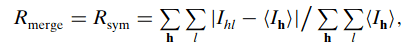

.. highlight:: console

.. _program:

Gemmi program
#############

The library comes with a command-line program which is also named gemmi;
running a program is easier than calling a library function.

This program is actually a set of small programs, each of them
corresponding to a subcommand:

.. literalinclude:: gemmi-help.txt
   :language: console

Hint. To process multiple files in parallel, in multiple threads,
use a tool such as `GNU parallel <https://www.gnu.org/software/parallel/>`_::

  $ find $PDB_DIR/structures/divided/mmCIF/ -name '*.cif.gz' | parallel gemmi grep _exptl.method

.. _gemmi-validate:

validate
========

This program validates CIF and mmCIF files. It can:

* check the STAR/CIF syntax (CIF 1.1, not 2)::

    gemmi validate file1.cif file2.cif

* verify rules imposed by DDL1 and DDL2 dictionaries::

    gemmi validate -d mmcif_pdbx_v50.dic -d extension.dic file.mmcif

* and perform a few extra checks for CCP4 monomer files::

    gemmi validate -m $CLIBD_MON/a/AAA.cif

Before validating mmCIF-like files, see :ref:`the notes on DDL2 <ddl2>`.
The dictionary used for mmCIF files is the first one
`from here <https://mmcif.wwpdb.org/dictionaries/downloads.html>`_.

.. literalinclude:: validate-help.txt
   :language: console

.. _grep:

grep
====

Searches for values in CIF files that correspond to the given tag(s).

Option `-h` shows the usage.
Some of the command-line options (`-c`, `-l`, `-H`, `-n`)
correspond to the options of GNU grep.

.. literalinclude:: grep-help.txt
   :language: console

When used without any options, it prints the values associated
with the specified tag. Each line contains the block name and the value::

  $ gemmi grep _refine.ls_R_factor_R_free 5fyi.cif.gz
  5FYI:0.2358

  $ gemmi grep _refine.ls_R_factor_R_free mmCIF/mo/?moo.cif.gz
  1MOO:0.177
  3MOO:0.21283
  4MOO:0.22371
  5MOO:0.1596
  5MOO:0.1848

  $ gemmi grep -b _software.name 5fyi.cif.gz
  DIMPLE
  PHENIX

The output can be easily processed with well-known Unix utilities, therefore
gemmi-grep does not have internal options for sorting and filtering.

* For text-based filtering, use `grep`::

    $ # list mmCIF files with links to EMDB
    $ gemmi grep _pdbx_database_related.db_name /pdb/mmCIF/aa/* | grep EMDB
    4AAS:EMDB
    5AA0:EMDB

* For numeric filtering, use `awk`
  (see the example with cell angles below).

* For sorting the output, use `sort`::

    $ # the heaviest monomers in CCD
    $ gemmi grep _chem_comp.formula_weight components.cif.gz | sort -k2 -t: -nr | head -3
    JGH:5496.513
    WO2:4363.030
    HFW:4343.697

* For counting different enumeration values, use `sort | uniq -c`
  (see the example with _entity_poly.type below).

* If you add `cut` to the mix, you could even count the number of distinct
  values (we won't go further than this)::

    $ # chemical components with the greatest variety of elements
    $ # LC_COLLATE=C avoids ignoring ':', which could result in order HOH:H HO:HO HOH:O
    $ gemmi grep _chem_comp_atom.type_symbol components.cif.gz | LC_COLLATE=C sort -u | cut -d: -f1 | uniq -c | sort -nr | head -5
        8 YL6
        8 YF7
        8 VM5

Gemmi-grep parses the CIF syntax and prints values from both name-value
pairs and loops. In particular, `gemmi grep _one` will give the same
output for both `_one 1` and `loop_ _one _two 1 2`.
It makes it more robust than using Unix grep. For example,
if one was using Unix grep to get R-free from mmCIF file,
it would fail in special cases such as the PDB entry 5MOO, which has two
Rfree values in a loop (see above, the second example in this section).

Gemmi-grep does not support regular expression, only globbing (wildcards):
`?` represents any single character, `*` represents any number of
characters (including zero). When using wildcards you may also want
to use the `-t` option which prints the tag::

  $ gemmi grep -t _*free 3gem.cif
  3GEM:[_refine.ls_R_factor_R_free] 0.182
  3GEM:[_refine.ls_percent_reflns_R_free] 5.000
  3GEM:[_refine.ls_number_reflns_R_free] 3951
  3GEM:[_refine.correlation_coeff_Fo_to_Fc_free] 0.952
  3GEM:[_refine_ls_shell.R_factor_R_free] 0.272
  3GEM:[_refine_ls_shell.number_reflns_R_free] 253

Let say we want to find extreme unit cell angles in the PDB.
`_cell.angle_*a` will match _cell.angle_alpha as well as beta and gamma,
but not _cell.angle_alpha_esd etc.

::

  $ gemmi grep -d' ' _cell.angle_*a /pdb/mmCIF/ | awk '$2 < 50 || $2 > 140 { print $0; }'
  4AL2 144.28
  2EX3 45.40
  2GMV 145.09
  4NX1 140.060
  4OVP 140.070
  1SPG 141.90
  2W1I 146.58

The option `-O` is used to make gemmi-grep faster.
With this option the program finds only the first occurrence of the tag
in file. Note that if the file has only one block (like mmCIF coordinate
files) and the tag is specified without wildcards then we cannot have
more than one match anyway.

Searching the whole compressed mmCIF archive from the PDB
(35GB of gzipped files) should take on an average computer
between 10 and 30 minutes, depending where the searched tag is located.
This is much faster than with other CIF parsers (to my best knowledge)
and it makes the program useful for ad-hoc PDB statistics::

  $ gemmi grep -O -b _entity_poly.type /pdb/mmCIF | sort | uniq -c
        1 cyclic-pseudo-peptide
        4 other
        2 peptide nucleic acid
     9905 polydeoxyribonucleotide
      156 polydeoxyribonucleotide/polyribonucleotide hybrid
       57 polypeptide(D)
   168923 polypeptide(L)
     4559 polyribonucleotide
       18 polysaccharide(D)

Option `-c` counts the values in each block or file. As an example,
we may check which entries have the greatest variety of chemical components
(spoiler: ribosomes)::

  $ gemmi grep -O -c _chem_comp.id /pdb/mmCIF | sort -t: -k2 -nr | head
  5J91:58
  5J8A:58
  5J7L:58
  5J5B:58
  4YBB:58
  5JC9:57
  5J88:57
  5IT8:57
  5IQR:50
  5AFI:50

or which chemical components in the CCD have the biggest number of atoms::

  $ gemmi grep -c _chem_comp_atom.atom_id components.cif.gz | sort -t: -k2 -nr | head -3
  JSG:440
  KDL:355
  TQN:348

Going back to moo, we may want to know to what experimental method
the Rfree values correspond::

  $ gemmi grep _refine.ls_R_factor_R_free -a _refine.pdbx_refine_id mmCIF/mo/?moo.cif.gz
  1MOO:0.177;X-RAY DIFFRACTION
  3MOO:0.21283;X-RAY DIFFRACTION
  4MOO:0.22371;X-RAY DIFFRACTION
  5MOO:0.1596;X-RAY DIFFRACTION
  5MOO:0.1848;NEUTRON DIFFRACTION

Option `-a` (`--and`) can be specified many times.
If we would add `-a _pdbx_database_status.recvd_initial_deposition_date`
we would get the deposition date in each line. In this case it would be
repeated for 5MOO::

    5MOO:0.1596;X-RAY DIFFRACTION;2016-12-14
    5MOO:0.1848;NEUTRON DIFFRACTION;2016-12-14

gemmi-grep operates on the syntax level and cannot match values from
different tables, as this would require consulting a DDL dictionary.
In the example above we have two values from the same table (`_refine`)
and a deposition date (single value). This works well. However,
would not be able to add the corresponding wavelengths from `_diffrn_source`.
If an extra tag (specified with `-a`) is not in the same table
as the main tag, gemmi-grep will use the first value for this tag,
not the corresponding one.

To output TSV (tab-separated values) add ``--delimiter='\t'``.
What are the heaviest chains?

::

  $ gemmi grep --delimiter='\t' _entity.formula_weight -a _entity.pdbx_description /hdd/mmCIF/ | sort -nrk2 | head -3
  6EK0    1641906.750     28S ribosomal RNA
  5T2C    1640238.125     28S rRNA
  5LKS    1640238.125     28S ribosomal RNA

With some further processing, the option `-a` can be used to generate
quite sophisticated reports. Here is a little demo:
https://project-gemmi.github.io/pdb-stats/xray.html

If `-a` is used together with `-c`, the values are counted
independently for each tag::

  $ gemmi grep -c _refln.intensity_meas -a _diffrn_refln.intensity_net r5paysf.ent.gz
  r5paysf:63611;0
  r5payAsf:0;356684

(The file used in this example is structure factor (SF) mmCIF.
Strangely these files in the PDB have extension `ent` not `cif`.)

The first number in the output above is the number of specified intensities.
To count also null values `?` and `.`, add `--raw`::

  $ gemmi grep --raw -c _refln.intensity_meas r5paysf.ent.gz
  r5paysf:63954
  r5payAsf:0

Gemmi-grep can work with any CIF files but it has one feature
specific to the PDB data. When :ref:`$PDB_DIR <pdb_dir>` is set
one may use PDB codes: just `5moo` or `5MOO` instead of the path
to `5moo.cif.gz`. And for convenience, using a PDB code implies
option `-O`.

The file paths or PDB codes can be read from a file.
For example, if we want to analyze PDB data deposited in 2016,
we may first create a file that lists all such files::

  $ gemmi grep -H -O _pdbx_database_status.recvd_initial_deposition_date $PDB_DIR/structures/divided/mmCIF | \
          grep 2016 >year2016.txt

The year2016.txt file has lines that start with the filename::

  /hdd/structures/divided/mmCIF/ww/5ww9.cif.gz:5WW9:2016-12-31
  /hdd/structures/divided/mmCIF/ww/5wwc.cif.gz:5WWC:2016-12-31

If we make a list of filenames only::

  $ awk -F: '{print $1}' year2016.txt > year2016_.txt

we can then use `-f` to grep files from this list::

  $ gemmi grep -f year2016_.txt _diffrn.ambient_temp

Exit status of gemmi-grep has the same meaning as in GNU grep:
0 if a line is selected, 1 if no lines were selected,
and 2 if an error occurred.

Examples
--------

comp_id check
~~~~~~~~~~~~~

The monomer library (Refmac dictionary) has tags such as
`_chem_comp_atom.comp_id`, `_chem_comp_bond.comp_id` that are expected
to be consistent with the block name::

  $ gemmi grep _*.comp_id $CLIBD_MON/a/ASN.cif
  comp_ASN:ASN
  [repeated 106 times]

We can quickly check if the names are always consistent by filtering
the output above with awk, for all monomer files, to print only lines
where the block name and comp_id differ::

  $ gemmi grep _*.comp_id $CLIBD_MON/? | awk -F: 'substr($1, 6) != $2'
  comp_M43:N09
  ...

planarity
~~~~~~~~~

The monomer library includes planarity restraints.
Each row in the `_chem_comp_plane_atom` table with the same `plane_id`
represents atom belonging to the same plane.
What is the maximum number of atoms in one plane?

::

  $ gemmi grep _chem_comp_plane_atom.plane_id $CLIBD_MON/? | uniq -c | sort -nr | head -3
   38 comp_LG8:plan-1
   36 comp_UCM:plan-1
   36 comp_SA3:plan-1

.. _cif2json:

cif2json
========

Syntax-level conversion from CIF 1.1 to JSON.
The JSON representation of the CIF data can be customized.
In particular we support CIF-JSON_ standard from COMCIFS
and mmJSON_ standard from PDBj (the latter is specific to mmCIF files).

.. literalinclude:: cif2json-help.txt
   :language: console

The major difference between the two is that CIF-JSON is dictionary-agnostic:
it cannot recognize categories (mmJSON groups by categories),
and it cannot recognize numbers (so it quotes the numbers).
CIF-JSON adds also two extra objects: "CIF-JSON" and "Metadata".
The minor differences are:

 =========== =========== ===========
    CIF        CIF-JSON    mmJSON
 =========== =========== ===========
  data_a      a           data_a
  _tag        _tag        tag
  _CasE       _case       CasE
  .           false       null
  ?           null        null
 =========== =========== ===========

.. _CIF-JSON: http://comcifs.github.io/cif-json
.. _mmJSON: https://pdbj.org/help/mmjson?lang=en

.. _json2cif:

json2cif
========

The opposite of cif2json, but currently the only supported input is mmJSON.

.. literalinclude:: json2cif-help.txt
   :language: console

cifdiff
=======

Compares categories and tags that are present in two (mm)CIF files.
It does not compare values.

.. literalinclude:: cifdiff-help.txt
   :language: console

The output resembles the output of diff, so it can be colored by editors that
highlight "syntax" or by the `colordiff <https://www.colordiff.org/>`_ script.
Here is an example:

.. code-block:: diff

  $ gemmi diff deposit.cif output.cif
  --- Reading deposit.cif
  +++ Reading output.cif
    _entity.                              rows:     8  ->    11
          id
          type
  + _chem_comp.                           rows:     0  ->    25
  +       id
  +       type
    _exptl.                               rows:     1
          entry_id
          method
  +       crystals_number
    _reflns.                              rows:     1
  +       entry_id
          pdbx_ordinal
  +       pdbx_diffrn_id
          number_obs
          d_resolution_high
          d_resolution_low
          percent_possible_obs
          pdbx_redundancy
          pdbx_Rmerge_I_obs
  -       pdbx_Rrim_I_all
  -       pdbx_Rpim_I_all
  +       pdbx_Rsym_value
          pdbx_netI_over_sigmaI
  -       pdbx_CC_half
  [...]

.. _convert:

convert
=======

Conversion between macromolecular coordinate formats: PDB, mmCIF and mmJSON.

.. literalinclude:: convert-help.txt
   :language: console

Gemmi formats PDB records in the same way as wwPDB (including
trailing spaces) to enable file comparison using `diff`.

CCD files include two sets of coordinates: example model and ideal.
By default, when converting a CCD component to another format,
both sets are written as separate models.
To output only a single model, specify `--from=chemcomp:m` (for model)
or `--from=chemcomp:i` (for ideal).

`--expand-ncs`
--------------

This option expands strict NCS, as defined in the `MTRIX` records (PDB)
or the `_struct_ncs_oper` table (mmCIF).
The difficult part is naming the added chains; three options are provided:

* `=dup` -- the chain names remain unchanged, with distinct segment IDs added,
* `=num` -- the names are appended with numbers to avoid duplication,
* `=x` -- unused 1- or 2-character names are assigned, supporting
  up to 62 + 62×62 = 3906 chains and allowing output in the PDB format.

`--sifts-num`
-------------

This option changes sequence IDs to the corresponding sequence
positions from UniProt. Residues that don't have UniProt correspondence
have their sequence numbers increased by an offset of 5000 (like in PDBrenum).
In rare cases where UniProt positions are around 5000 or higher,
the offset is increased to 6000 or a larger round number.

Note that the mapping between PDB and UniProt is based on
SIFTS (not DBREF) :ref:`annotations in mmCIF files <dbref>`.
Currently, these annotations are present only in the PDB NextGen Archive
and in PDBe "updated" files -- `--sifts-num`  works only with these files!

If accession codes (ACs) are specified in this option, only the matching
UniProt ACs are used, and non-matching chains have their sequence numbers
increased by an offset.

For chimeric chains that correspond to 2+ UniProt sequences,
we use the sequence with the most corresponding residues.
This choice can be overridden by explicitly specifying the preferred
UniProtKB identifiers (usually just one AC, but it's possible to specify
multiple comma-separated ACs, in the order of preference).

`*` in the argument list (e.g. `--sifts-num=P01234,*`)
means that all chains with corresponding UniProt entries are renumbered
to match UniProt positions (but P01234 is preferred for chimeric chains).
An absent argument (`--sifts-num`) is equivalent to `*` (`--sifts-num=*`).

Chains that don't match the UniProt ACs have their sequence numbers
bumped by 5000+, similarly to ligands and waters in matching chains.
To leave the non-matching chains unchanged, add `=` at the end,
e.g. `--sifts-num=*,=`.

set
===

Modifies atom positions, isotropic B-factors, and/or occupancies
in a PDB or mmCIF file. It serves as a partial replacement for CCP4 PDBSET.

Unlike most other gemmi tools, it doesn't parse the entire input file.
Instead, it reads only what is necessary to locate the relevant numbers
and replaces them, leaving the rest of the file unchanged.

.. literalinclude:: set-help.txt
   :language: console

tags
====

Lists tags from one or multiple CIF files together with some statistics.

.. literalinclude:: tags-help.txt
   :language: console

By default, the tag statistics show in how many blocks the tag is present,
and the total number of non-null values for the tag:

.. code-block:: console

  $ gemmi tags components.cif.gz
  tag	block-count	value-count
  _chem_comp.formula	29748	29748
  _chem_comp.formula_weight	29749	29749
  ...
  _pdbx_chem_comp_identifier.type	29338	52899
  Tag count: 67
  Block count: 29749
  File count: 1

This program is run with option `--full`
on the whole PDB archive to produce data for
`pdb-stats/tags.html <https://project-gemmi.github.io/pdb-stats/tags.html>`_.

map
===

Shows a summary of a CCP4 map file, optionally performing simple
transformations.

It plots a histogram of values in the console.
All histograms plotted by gemmi have a default width of 80 characters,
which can be overridden by the environment variable COLUMNS.
In Bash shell this variable is set automatically, but you need
`export COLUMNS` to pass it to the program.

.. literalinclude:: map-help.txt
   :language: console

mask
====

Makes a mask in the CCP4 format. It has two functions:

* masking atoms if the input file is a coordinate file,
* using a threshold to convert a CCP4 map file to a mask file.

.. literalinclude:: mask-help.txt
   :language: console

mtz
===

.. literalinclude:: mtz-help.txt
   :language: console

.. _mtz2cif:

mtz2cif
=======

Converts reflection data from MTZ to mmCIF.

.. literalinclude:: mtz2cif-help.txt
   :language: console

.. _cif2mtz:

cif2mtz
=======

Converts reflection data from mmCIF to MTZ.

.. literalinclude:: cif2mtz-help.txt
   :language: console

Similarly to mtz2cif, this converter can also be customized using *spec files*.
The default spec files can be generated using options
`--print-spec` for merged data and `--print-spec --unmerged` for unmerged.

.. literalinclude:: cif2mtz-spec.txt
   :language: none

.. _sf2map:

sf2map
======

Transforms map coefficients from either MTZ or SF mmCIF to CCP4 map.

.. literalinclude:: sf2map-help.txt
   :language: console

The `--sample` option is named after the `GRID SAMPLE` keyword of
the venerable CCP4 FFT program; its value has the same meaning.

`--check`
---------

This option is inspired by Ian Tickle's MTZFIX program.
It checks how the map coefficients were calculated
by determining relationships between MTZ columns, separately for acentric,
centric and missing reflections. It works well with MTZ files from BUSTER,
Refmac and Servalcat, which include map coefficients along with
scaled *Fobs*, *D.Fc* and the figure-of-merit *m*.
Here is an example output:

.. code-block:: none

  Columns used in checking map coefficients:
      for FM (normal map):     FWT        PHWT
      for FD (difference map): DELFWT     PHDELWT
      for D.Fc:                FC_ALL     PHIC_ALL
      for scaled Fo:                FP
      for figure-of-merit m:        FOM
      for free flags:               FREE
  Is FD (DELFWT) set to 0 or NaN for any of 20 FREE flags ... yes, for 0
   -> free reflections are NOT used for maps
  Phases PHWT and PHDELWT ...   match (mod 180)
  Phases PHIC_ALL and PHWT ...   match (mod 180)
  For all 127888 acentric reflections (excl. missing/unused):
      FM = 2m.Fo - D.Fc
      FD = 2(m.Fo - D.Fc) = 2(FM - m.Fo) = FM - D.Fc
  For all 2486 centric reflections (excl. missing/unused):
      FM = 2m.Fo - D.Fc
      FD = 2(m.Fo - D.Fc) = 2(FM - m.Fo) = FM - D.Fc
  For all 16359 missing/unused reflections:
      FM = D.Fc
      FD = 0

If the MTZ file lacks some of these columns (for instance, if only
unscaled *Fobs* are present), the output is less informative.

Why is this useful at all?

Typically, an MTZ file from refinement has coefficients for two maps:

* a density map, 2\ *mF*:sub:`o`–\ *DF*:sub:`c` , sometimes referred to as
  2\ *F*:sub:`o`–\ *F*:sub:`c` even if *m* and *D* are used,
* and a difference map, *mF*:sub:`o`–*DF*:sub:`c` ,
  sometimes referred to as *F*:sub:`o`–*F*:sub:`c`.

However, the exact formulas vary across implementations:

* For acentric reflections, the difference map may or may not include a factor
  of 2. In the literature, the formula is actually
  2(*mF*:sub:`o`–*DF*\ :sub:`c`), not the one given above.
  In an MTZ file it may not be 2×.
  (This only affects the map's absolute values -- not that important.)
* The formulas for centric reflections have been derived as:
  *mF*:sub:`o` for the density map and *mF*:sub:`o`–*DF*:sub:`c`
  (without 2×) for the difference map; however, not all programs
  use these formulas.
* For reflections without observed data (missing *F*\ :sub:`o`), the density map
  coefficients are either filled with *DF*:sub:`c` or not.
* For reflections in a free set, *F*:sub:`o` is either used (to improve map
  quality) or not (to ensure that the free set is used solely for validation).

map2sf
======

Transforms CCP4 map into map coefficients.

.. literalinclude:: map2sf-help.txt
   :language: console

merge
=====

Merge intensities from a multi-record reflection file
or calculate quality metrics for unmerged data.

.. literalinclude:: merge-help.txt
   :language: console

Quality metrics
---------------

Here is an example output of the quality metrics::

  $ gemmi merge --stats=10 mdm2_unmerged.mtz
  In resolution shells:
    d_max  d_min   #obs  #uniq  #used  Rmerge   Rmeas   Rpim    CC1/2
   61.902 2.681   16148   4818   4604   0.175   0.208   0.111   0.9450
    2.681 2.128   16036   4551   4449   0.221   0.261   0.137   0.9246
    2.128 1.859   15907   4494   4417   0.301   0.354   0.185   0.8733
    1.859 1.689   15824   4441   4372   0.489   0.577   0.302   0.8163
    1.689 1.568   14909   4413   4196   0.980   1.163   0.618   0.5520
    1.568 1.476    9083   4212   2913   1.731   2.208   1.344   0.2296
    1.476 1.402    5712   3148   1811   3.974   5.222   3.337   0.0568
    1.402 1.341    3472   2147   1043   6.521   8.750   5.765   0.0361
    1.341 1.289    1756   1312    413  16.274  22.638  15.676   0.1174
    1.289 1.245     481    429     52  -6.970  -9.857  -6.970  -0.0984

  Observations (all reflections): 99328
  Unique reflections: 33965
  Used refl. (those with multiplicity 2+): 28270
            Overall    Avg of 10 shells weighted by #used
  R-merge:  0.2204          1.2299
  R-meas:   0.2626          1.5896
  R-pim:    0.1407          0.9882
  CC1/2:    0.95915         0.67419

R\ :sub:`merge`, R\ :sub:`meas` and R\ :sub:`pim` may use or not use
σ for weighting. In the 1997 paper that introduced R\ :sub:`meas`,
`Diederichs & Karplus <https://doi.org/10.1038/nsb0497-269>`_
define R\ :sub:`meas` (sometimes called R\ :sub:`sym`) as:

.. image:: img/rmerge-1997.png
    :align: center
    :scale: 100

Phil Evans, in his CCP4 programs Scala and Aimless,
and in `the 2006 paper <https://doi.org/10.1107/s0907444905036693>`_,
uses formula with weighting by 1/σ², as used for merged ⟨I⟩:

This formula is also used by `MRFANA <https://github.com/githubgphl/MRFANA>`_.

A third variant, used by XDS and `iotbx.merging_statistics` from cctbx,
has the numerator from the latter and the denominator from the former.

Similarly, there are three variants of R\ :sub:`meas` and R\ :sub:`pim`.

Gemmi can calculate all three variants:

* By default (example above), it is compatible with Aimless and MRFANA.
* With added `U` (e.g. `--stats=10U`) it calculates the original,
  **u**\ nweighted formulas.
* With added `X` (e.g. `--stats=10X`) it is compatible with XDS and cctbx.

CC:sub:`1/2` is calculated using the σ-τ method, proposed by
`Assmann et al (2016) <https://doi.org/10.1107/S1600576716005471>`_ in 2016
and described in detail on
`this XDSwiki page <https://wiki.uni-konstanz.de/xds/index.php?title=CC1/2>`_.
(TBC: weighting)

With the `--anom` option, I+ and I- values are treated separately.
Centric reflections are counted in and treated as I+ (unlike, for instance,
in MRFANA "within I+/I-" values, which contain only actual I+/I- -- the
difference is negligible).

Three ways of setting up resolution shells are supported:

* default -- shells with equal volumes (equispaced in d*³),
* 's' -- shells with increasing volumes (equispaced in d*²),
* 'e' -- shells with an equal number of observations.

Minor detail: MTZ files may store different unit cell parameters for different
frames (batches). Additionally, they store global and per-dataset cell
parameters. These differences don't really matter, but are annoying when
comparing values obtained from different programs. So we have two options
here: ...

Filtering/misfits - TBC

ecalc
=====

Calculates normalized amplitudes E from amplitudes F.
Uses "Karle" approach, similar to CCP4 ECALC.

.. literalinclude:: ecalc-help.txt
   :language: console

.. _sfcalc:

sfcalc
======

Calculates structure factors from a model.

.. literalinclude:: sfcalc-help.txt
   :language: console

In general, structure factors can be calculated

* either directly, by summing contributions from each atom to each reflection,
* or by calculating an electron density on a grid and using discrete
  Fourier transform.

This program can measure the errors resulting from the latter method
(in addition to its main function -- calculation of the structure factors).
The errors depend on

* the grid spacing -- controlled by the oversampling `--rate=R`;
  the maximum spacing is *d*\ :sub:`min`/2\ *R*,
* atomic radius -- we neglect electron density of the atom beyond this radius;
  only density contributions above the (absolute) value specified with
  `--rcut` are taken into account,
* :ref:`Gaussian dampening (blurring) factor <blur>` --
  artificial temperature factor *B*\ :sub:`extra` added to all atomic
  B-factors (the structure factors are later corrected to cancel it out);
  either specified with `--blur` or picked automatically.

Choosing these parameters is a trade-off between efficiency and accuracy,
as described :ref:`elsewhere <blur>`.
The option `--test` can be used to see how accuracy and efficiency
depends on the choice of parameters.  For example, this shell script
performs a series of calculations with differing *B*\ :sub:`extra`:

.. code-block:: shell

  model=1mru.pdb
  dmin=2.5
  gemmi sfcalc --dmin=$dmin --test $model >cache.tsv
  for i in `seq -20 5 20`; do
      printf -- "$i\t" >&2
      gemmi sfcalc --dmin=$dmin --rate=1.5 --rcut=1e-4 --blur=$i --test=cache.tsv $model
  done >/dev/null

Running it prints:

.. code-block:: none

  -20	RMSE=0.93304  0.5495%  max|dF|=38.80  R=0.301%   0.27671s
  -15	RMSE=0.37007  0.2179%  max|dF|=41.26  R=0.094%   0.28366s
  -10	RMSE=0.27075  0.1595%  max|dF|=44.35  R=0.041%   0.29322s
  -5	RMSE=0.27228  0.1604%  max|dF|=47.59  R=0.029%   0.30459s
  0	RMSE=0.28903  0.1702%  max|dF|=50.95  R=0.029%   0.31399s
  5	RMSE=0.30806  0.1814%  max|dF|=54.35  R=0.032%   0.32527s
  10	RMSE=0.32847  0.1934%  max|dF|=57.92  R=0.036%   0.33360s
  15	RMSE=0.35028  0.2063%  max|dF|=61.66  R=0.041%   0.34181s
  20	RMSE=0.37283  0.2196%  max|dF|=65.44  R=0.047%   0.35380s

The error used in RMSE is the magnitude of the difference of two vectors:
\|F\ :sub:`approx` -- F\ :sub:`exact`\|.
The next column is RMSE normalized by the sum of \|F\ :sub:`calc`\|.
Then we have maximum error for a single reflection, and the wall time
of computations.
We can see that in this case negative "dampening" (subtracting about
10A\ :sup:`2` from all B-factors) improves both accuracy and performance.

.. _fprime:

fprime
======

Calculate anomalous scattering factors (*f\'* and *f\"*).
Uses `Cromer-Liberman <https://doi.org/10.1107/S0567739481000600>`_
algorithm with corrections from
`Kissel and Pratt <https://doi.org/10.1107/S0108767389010718>`_.
This and different approaches are discussed in the documentation
of the :ref:`underlying functions <anomalous>`.

.. literalinclude:: fprime-help.txt
   :language: console

Here is an example how to print *f'* and *f"* using gemmi, XrayDB,
CCP4 crossec and cctbx (pyFprime is not included because it is
a GUI-only program). The Chantler's data from XrayDB is probably
the most reliable one::

  $ gemmi fprime --wavelength=1.2 Se
  Element  E[eV]  Wavelength[A]      f'             f"
  Se      10332.0  1.2             -1.4186        0.72389

  $ python3 -c "import xraydb; print(xraydb.f1_chantler('Se', 10332.0), xraydb.f2_chantler('Se', 10332.0))"
  -1.4202028957329489 0.7100533627953146

  $ echo -e "atom SE\n cwav 1 1.2 0\n END" | crossec | grep ^SE
  SE          1.2000    -1.5173     0.7240

  $ cctbx.eltbx.show_fp_fdp --wavelength=1.2 --elements=Se
  Wavelength: 1.2 Angstrom

  Element: Se
    Henke et al.  : f'=-1.44568 , f''=0.757958
    Sasaki et al. : f'=-1.5104  , f''=0.724000
    diff f''=-2.29 %

.. _gemmi-reindex:

reindex
=======

Experimental.
See description of the :ref:`reindexing function <reindexing>` for more details.

Reindex reflections in MTZ file.

.. literalinclude:: reindex-help.txt
   :language: console

.. _gemmi-residues:

residues
========

List residues from a coordinate file, one per line.

.. literalinclude:: residues-help.txt
   :language: console

Example::

  $ gemmi residues -m '/3/*/(CYS,CSD)' 4pth.pdb
  Model 3
  A   85  CYS: N CA C O CB SG H HA HB2 HB3 HG
  A  152  CSD: N CA CB SG C O OD1 OD2 HA HB2 HB3

Note the options `-s` (short) that can be used up to 3 times,
making the output more concise::

  $ echo $PDB_DIR
  $ gemmi residues -ss 1mru
  /data/structures/divided/mmCIF/mr/1mru.cif.gz
  A   polymer        THR PRO SER HIS LEU SER ASP ARG TYR GLU...  (269 residues)
  B   polymer        MET THR THR PRO SER HIS LEU SER ASP ARG...  (271 residues)
  A   non-polymers   MG  MG  AGS
  B   non-polymers   MG  MG  AG

Option `-e` lists so-called entities::

  $ gemmi residues -e 3oov
  /data/structures/divided/mmCIF/oo/3oov.cif.gz
  Polymers
    entity 1, polypeptide(L), length 169, subchains:
      - A from strand A, 164 residues: 6-169
      - B from strand B, 162 residues: 1-166 except 138-141
  Others
    entity 2, non-polymer (GOL), subchains: C D E F
    entity 3, water (HOH), subchains: G H

.. _gemmi-align:

align
=====

Sequence alignment (global, pairwise, affine gap penalty).
Used primarily for aligning the residues in the model's chains
to the full sequence from the SEQRES record.

.. literalinclude:: align-help.txt
   :language: console

For the testing purpose, it can align text strings.
For example, the Levenshtein distance can be calculated by setting
the gap opening penalty to zero::

    $ gemmi align -p --match=0 --gapo=0 --text-align Saturday Sunday
    Score: -3   CIGAR: 1M2I5M
    Saturday
    |  |.|||
    S--unday

This tool uses modified code from `ksw2 <https://github.com/lh3/ksw2>`_.
See the :ref:`Sequence alignment <sequence-alignment>` section for more details.

sg
==

Prints information about given space group.

.. literalinclude:: sg-help.txt
   :language: console

.. _gemmi-contents:

contents
========

Analyzes and summarizes the content of a coordinate file.
Inspired by the CCP4 program `rwcontents`.

By default, it prints the atom count, estimated number of hydrogens in the protein,
molecular weight of the protein, ASU volume, Matthews coefficient,
and the fractional volume of solvent in the crystal.

It has options to print other information -- see the help message below.

.. literalinclude:: contents-help.txt
   :language: console

To print a list of chains and residues, or entities,
use :ref:`gemmi-residues`.

.. _gemmi-contact:

contact
=======

Searches for contacts in a model.

.. literalinclude:: contact-help.txt
   :language: console

blobs
=====

Searches for unmodelled blobs in electron density.
Similar to "Validate > Unmodelled blobs..." in Coot.
For use in Dimple_.

.. _Dimple: https://ccp4.github.io/dimple/

.. literalinclude:: blobs-help.txt
   :language: console

h
==

Adds or removes hydrogens.

Hydrogen positions are determined from restraints from a monomer library.
If the restraints allow various directions to a hydrogen atom,
that atom is assigned one of possible positions and its occupancy is zeroed.

.. literalinclude:: h-help.txt
   :language: console

To test the addition of hydrogen to a single chemical component
from a monomer library, run::

    gemmi h --format=chemcomp -L+ XYZ.cif output.pdb

mondiff
=======

Compares restraints from two monomer CIF files.
It is intended for comparing restraints for the same monomer,
but generated with different programs (or different versions of the same
program).

The files should have format used by the CCP4/Refmac monomer library.
This format is supported by all major macromolecular refinement programs.

.. literalinclude:: mondiff-help.txt
   :language: console

crd
===

Prepares an intermediate (a.k.a. *prepared*, *crd* or *topology*) file
for Refmac.

It reads a coordinate file, a monomer library and, optionally,
additional monomer CIF files. It writes out a :ref:`topology <topology>`
file in a format understood by CCP4 Refmac.
Using it as XYZIN requires adding `make coordinates prepared`::

    $ gemmi crd in.pdb in.crd
    $ refmac5 xyzin in.crd hklin in.mtz xyzout out.pdb hklout out.mtz << eof
    make coordinates prepared
    # other refmac keywords ("refinement type restrained", "ncycle 10", etc)
    end
    eof

Such intermediate step is always present in Refmac, even if it is not visible
to the user. In normal operation, Refmac writes, reads and deletes temporary
files with extensions crd and rst. `gemmi crd` writes a single file
with the content of both crd and rst.

.. literalinclude:: crd-help.txt
   :language: console

wcn
===

Calculates Weighted Contact Number (WCN) and a few other similar metrics.

WCN can be used to predicts B-factors (ADPs) from coordinates,
and to compare this prediction with the values from refinement.

Background
----------

Protein flexibility and dynamic properties can be to some degree inferred
from the atomic coordinates of the structure. Various approaches are used
in the literature:
molecular dynamics, Gaussian or elastic network models, normal mode analysis,
calculation of solvent accessibility or local packing density, and so on.

Here we apply the simplest approach, which is pretty effective.
It originates from the
`2002 PNAS paper <http://www.pnas.org/content/99/3/1274>`_
in which Bertil Halle concluded that B-factors are more accurately predicted
by counting nearby atoms than by Gaussian network models. This claim was
based on the analysis of only 38 high resolution structures (and a neat theory),
but later on the method was validated on many other structures.

In particular, in 2007 Manfred Weiss brought this method to the attention
of crystallographers
by `analysing in Acta Cryst D <https://doi.org/10.1107/S0907444907052146>`_
different variants of the methods
on a wider set of more representative crystals.
Recently, the parameters fine-tuned by Weiss have been used for guessing
which high B-factors (high comparing with the predicted value) result
`from the radiation damage <https://doi.org/10.1107/S1600577515002131>`_.

Only a few months later, in 2008,
`Chih-Peng Lin et al. devised <https://doi.org/10.1002/prot.21983>`_
a simple yet significant improvement to the original Halle's method:
weighting the counted atoms by 1/*d*:sup:`2`, the inverse of squared distance.
It nicely counters the increasing average number of atoms with the distance
(~ *d*:sup:`2`).
This method was named WCN -- weighted contact number (hmm.. "contact").

These two methods are so simple that it seems easy to find a better one.
But according to my quick literature search, no better method of this kind
has been found yet. In 2009
`Li and Bruschweiler <https://doi.org/10.1016/j.bpj.2009.01.011>`_
proposed weighting that decreases exponentially (that model was named LCBM),
but in my hands it does not give better results than WCN.

`In 2016 Shahmoradi and Wilke <https://doi.org/10.1002/prot.25034>`_
did a data analysis aiming to disentangle the effects of local
and longer-range packing in the above methods.
They were not concerned with B-factors, though, but with
the rate of protein sequence evolution.
Because the "contact" methods predict many things.
Interestingly, if the exponent in WCN is treated as a parameter
(equal -2 in the canonical version), the value -2.3 gives the best results
in predicting evolution.

TLS
---

We also need to note that
`TLS <https://doi.org/10.1107/S0567740868001718>`_-like methods
that model B-factors as rigid-body motion of molecules are reported
to give better correlation with experimental B-factors
than other methods. But because such models use experimental B-factors on
the input and employ more parameters, they are not directly comparable
with WCN.

Unlike the TLS that is routinely used in the refinement of diffraction data,
the TLS modelling described here is isotropic.
It uses 10 parameters (anisotropic TLS requires 20) as described in a
`paper by Kuriyan and Weis <https://doi.org/10.1073/pnas.88.7.2773>`_ (1991).
`Soheilifard et al (2008) <https://doi.org/10.1088/1478-3975/5/2/026008>`_
got even better results by increasing B-factors at the protein ends,
using 13 parameters altogether. This model was named eTLS (e = extended).

The high effectiveness of the TLS model does not mean that B-factors
are dominated by the rigid-body motion. As noted by Kuriyan and Weis,
the TLS model captures also the fact that atoms in the interior of
a protein molecule generally have smaller displacements than those
on the exterior. Additionally, authors of the LCBM paper find that
the TLS model fitted to only half of the protein poorly fits
the other half, which suggests overfitting.

We may revisit rigid-body modelling in the future, but now we get back
to the contact numbers.

Details
-------

The overview above skipped a few details.

* While the WCN method is consistently called WCN,
  the Halle's method was named LDM (local density model) in the original paper,
  and is called CN (contact number) in some other papers. CN is memorable
  when comparing with WCN (which adds 'W' -- weighting)
  and with ACN (which adds 'A' -- atomic).

* These method are used either per-atom (for predicting B-factors, etc.)
  or per-residue (for evolutionary rate, etc.).
  So having "A" in ACN clarifies how it is used.
  To calculate the contact number per-residue one needs to pick
  a reference point in the residue (Cβ, the center of mass or something else),
  but here we do only per-atom calculations.

* The CN method requires a cut-off, and the cut-off values vary widely,
  from about 5 to 18Å. In the original paper it was 7.35Å,
  Weiss got 7.0Å as the optimal value, Shahmoradi 14.3Å.

* The CN can be seen as weighted by Heaviside step function,
  and smoothing it helps a little bit (as reported by both Halle and Weiss).

* Similarly to eTLS, the LCBM method has eLCBM variant that adds
  "end effects" -- special treatment of the termini.

* Finally, these methods may or may not consider the symmetry mates
  in the crystal. Halle checked that including symmetric images
  improves the prediction.
  Weiss (ACN) and Li and Bruschweiler (LCBM) are also taking symmetry into
  account. But I think other papers don't.

Metrics for comparison
----------------------

To compare a number of nearby atoms with B-factor we either rescale
the former, or we use a metric that does not require rescaling.
The Pearson correlation coefficient (CC) is invariant under linear
transformation,
so it can be calculated directly unless we would like to apply non-linear
scaling. Which was tried only in the Manfred Weiss' paper: scaling
function with three parameters improved CC by 0.012 comparing with linear
function (that has two parameters). Here, to keep it simple, we only do
linear scaling.

As noted by Halle, Pearson's CC as well as the mean-square deviation
can be dominated by a few outliers. Therefore Halle used relative mean
absolute deviation (RMAD): sum of absolute differences divided
by the average absolute deviation in the experimental values.
Halle justifies this normalization writing that it allows to compare
structures determined at different temperatures.
This is debatable as can be seen from ccp4bb
`discussions <https://www.mail-archive.com/ccp4bb@jiscmail.ac.uk/msg30444.html>`_
on how to compare B-factors between two structures.
But for sure RMAD is a more robust metric, so we also use it.
It adds another complication, though. To minimize the absolute deviation
we cannot use least-squares fitting, but rather quantile regression with q=0.5.

Another metric is the rank correlation. It is interesting because it is
invariant under any monotonic scaling. But it is not guaranteed to be
a good measure of similarity.

Results
-------

To be wrapped up and published. But in the meantime here are some thoughts:

* The optimal exponent is slightly larger than 2; the difference is small,
  so we prefer to use 2 (i.e. *w*\ =1/*r*:sup:`2`).

* Accounting for all symmetry mates (i.e. for intermolecular contacts
  in the crystal) improves the results -- and then the cut-off is necessary.

* The optimal cut-off is around 15A -- let's use 15A.

* Averaging predicted B-factors of nearby atoms helps; we use Gaussian
  smoothing (blurring) with σ around 2A.

* Pearson's CC around 0.8 may seem high, but it corresponds to R2=0.64,
  i.e. it we explain only 64% of the B-factor variance.
  Even less of the absolute deviation -- below 50%.

* Minimizing absolute deviation (with quantile regression)
  gives similar results as the ordinary least squares (OLS).
  The difference in terms of RMAS is only ~0.03.

* Combining WCN with CN is helping only a tiny bit (i.e. both are highly
  correlated) at the cost of additional parameter that is fitted.
  Combining WCN with rotation-only model (squared distance from the center
  of mass) increases CC slightly more, but still not much.

* Accounting for symmetry mates worsens prediction of evolutionary rates.
  I used `data <https://github.com/shahmoradi/cordiv>`_
  from Shahmoradi and Wilke to check this.

Program
-------

gemmi-wcn implements combination of the CN and WCN methods above.

Being based on a general-purpose crystallographic library it handles
corner cases that are often ignored. A good example is searching
for contacts. For most of the structures, considering only the same
and neighbouring unit cells (1+26) is enough.
But some structures have contacts between molecules several unit cells apart,
even with only :ref:`a single chain in the asu <long_chain>`.

TBC

.. literalinclude:: wcn-help.txt
   :language: console

.. _gemmi-xds2mtz:

xds2mtz
=======

Converts XDS ASCII file to MTZ format.
Optionally, filters the reflections and applies polarization correction.

.. literalinclude:: xds2mtz-help.txt
   :language: console
